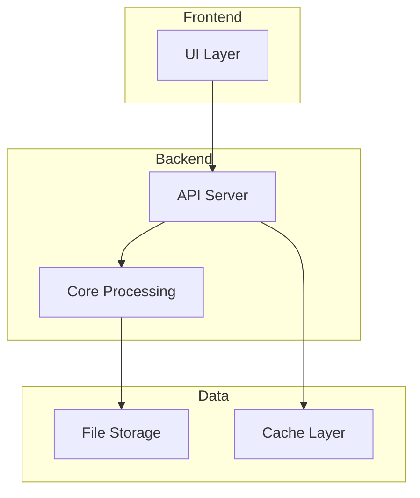

# Architecture Agent Skill

This skill helps analyze, document, and visualize the EdgeWARN project architecture.

## Capabilities

| Capability | Description |
|------------|-------------|
| Structure Analysis | Map project directory structure and file organization |
| Component Mapping | Identify and document major components and their responsibilities |
| Dependency Graphing | Trace import/require relationships between modules |
| API Documentation | Document API endpoints, routes, and handlers |
| Data Flow Analysis | Trace how data moves through the system |
| Architecture Diagrams | Generate Mermaid diagrams for visualization |

## Project Structure Overview

EdgeWARN is organized into the following major components:

```
src/EdgeWARN/
├── api/          # REST API server and routes
├── core/         # Core processing and detection logic
└── ui/           # Frontend interface
```

## Instructions

### 1. Analyze Project Structure

```bash
# List all directories
find src -type d | head -50

# Count files by extension
find src -type f | sed 's/.*\.//' | sort | uniq -c | sort -rn
```

### 2. Map Component Dependencies

For Python files:
```bash
grep -rh "^import\|^from" src/EdgeWARN --include="*.py" | sort | uniq
```

For JavaScript/TypeScript:
```bash
grep -rh "require(\|import " src/EdgeWARN --include="*.js" --include="*.ts" | sort | uniq
```

### 3. Document API Endpoints

Scan for route definitions:
```bash
grep -rn "app\.\(get\|post\|put\|delete\|use\)" src/EdgeWARN/api --include="*.js"
```

### 4. Generate Architecture Diagram

When documenting architecture, create Mermaid diagrams:



### 5. Create Architecture Document

When asked to document architecture, create a markdown file with:

1. **Overview** - High-level system description
2. **Components** - Major components and their responsibilities
3. **Data Flow** - How data moves through the system
4. **API Reference** - Available endpoints
5. **Dependencies** - External libraries and internal dependencies
6. **Diagrams** - Visual representations

## Output Templates

### Component Documentation

```markdown
## [Component Name]

**Location**: `path/to/component`  
**Purpose**: Brief description

### Files
- `file1.py` - Description
- `file2.py` - Description

### Dependencies
- Internal: `module1`, `module2`
- External: `package1`, `package2`

### Key Functions
- `function_name()` - What it does
```

### API Endpoint Documentation

```markdown
## [Endpoint Name]

**Method**: GET/POST/PUT/DELETE  
**Path**: `/api/endpoint`  
**Handler**: `file.js:function`

### Parameters
| Name | Type | Required | Description |
|------|------|----------|-------------|
| param1 | string | Yes | Description |

### Response
```json
{ "example": "response" }
```
```
