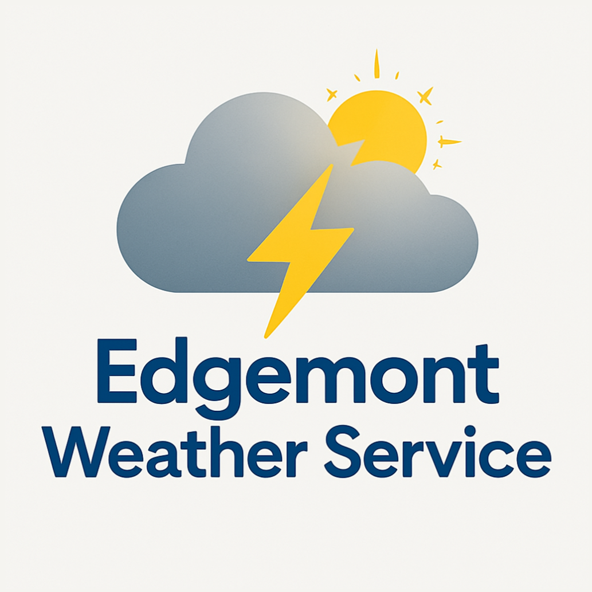

<h1 align="center">EdgeWARN</h1>

<h2 align="center">An Edgemont Weather Service Project</h2>

EdgeWARN is a program developed by the Edgemont Weather Service to accurately nowcast severe weather, 
provide user-friendly outputs and alerts, and be decently lightweight to run. 
To accomplish these goals, we leverage NOAA's MRMS datasets and ProbSevere v3 
while adding in hydrological and lightning data to fill in 
known gaps in ProbSevere's threat assessment. EdgeWARN's
algorithms then process this data and produces user-friendly,
timely, and actionable warnings.

<h2 align="center">Installation Instructions</h2>

#### Current builds are Command Line Interface (CLI) only! We plan to add a GUI later

#### Requirements
1. Conda/Miniconda with Python 3.13+

#### Installation Instructions
1. Clone the repository
2. Run `conda env create -f environment.yml` at the repository's root
3. Navigate to the src directory
4. Run `python run.py --lat_limits lat_min lat_max --lon_limits lon_min lon_max`

- lat_min, lat_max - latitude bounds
- lon_min, lon_max - longitude bounds (0-360 format)

<h2 align="center">Current Build Info</h2>

#### Build Version: 0.4.4

#### Changes Associated With This Build
- Reverted subsetting datasets (ecCodes doesn't support this)
- Removed redundant distance finding code from ProbSevere integration

#### To Do
- Build GUI for initial render

<h2 align="center">Credits</h2>

#### Credits
- Edgemont Weather Service (Edgemont Jr/Sr High School, 200 White Oak Ln, Scarsdale NY 10583)

#### Coders
- Yuchen Wei (Project Lead)
- Asher Kadet (Server Hosting)

#### Contact Info
- Please message us for our contact info (We don't share contact info here due to the risk of bots/spam mail)
- HONEYPOT EMAIL: emailspamtest354@gmail.com (Do NOT email this)
