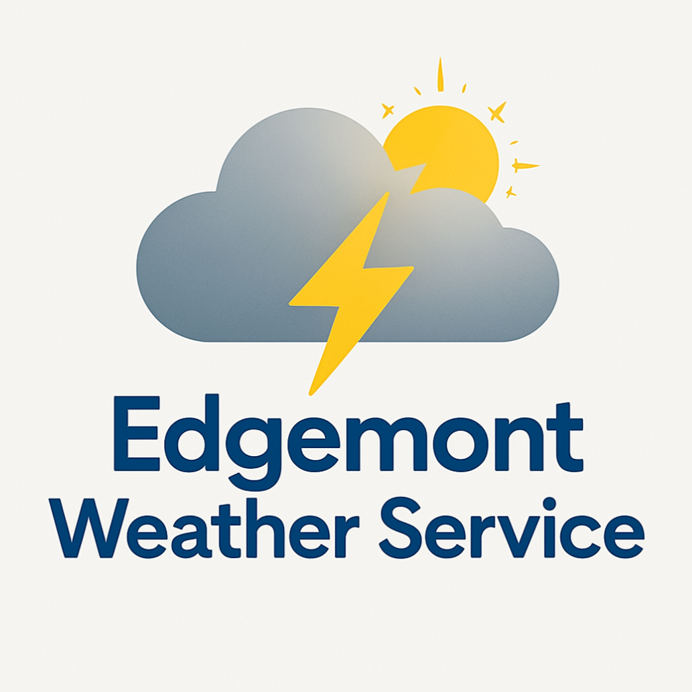

<h1 align="center">EdgeWARN</h1>

<h2 align="center">An Edgemont Weather Service Project</h2>

EdgeWARN is a program developed by the Edgemont Weather Service to accurately nowcast severe weather, provide a user friendly GUI, and the capability to be run on any modern PC. As a high school organization, our goals are to provide accurate and timely weather forecasts and to raise weather awareness across the community. 

<h2 align="center">Installation Instructions</h2>
**EdgeWARN is NOT ready for deployment yet. Code may BREAK or be UNOPTIMIZED.**
**RUN AT YOUR OWN RISK**
 - Clone the repository
 - Run `pip install -r requirements.txt` at the repository root
 - To run scripts, navigate to EdgeWARN/src 
 - Then run `python -B -m path.to.the.script`

#### Current Build Version: 2025.09.01

### Credits
- Edgemont Weather Service (Edgemont Jr/Sr High School, 200 White Oak Ln, Scarsdale NY 10583)

### Coders
- Yuchen Wei (Project Lead)
- Asher Kadet (Server Hosting)
- Sammy Reifel (GUI Design)

### Contact Info
- Please message us for our contact info (We don't share contact info here due to the risk of bots/spam mail)