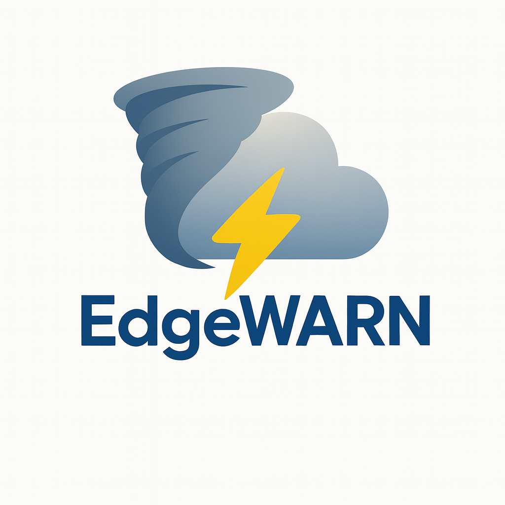

<h1 align="center">EdgeWARN</h1>

<h2 align="center">Severe Weather Nowcasting</h2>

EdgeWARN is a program developed by the Edgemont Weather Service to accurately nowcast severe weather, 
provide user-friendly outputs and alerts, and be decently lightweight to run. 
To accomplish these goals, we leverage NOAA's MRMS datasets, ProbSevere v3, 
NOAA RAP synoptic data, and GOES-19 GLM lightning data while adding in hydrological information to fill in 
known gaps in ProbSevere's threat assessment. This repository serves as 
EdgeWARN's core server that processes raw data and serves it to
the GUI frontend.

<h2 align="center">Installation Instructions</h2>

#### This is the EdgeWARN Core Server! GUIs will be developed separately for web and desktop applications

#### Requirements
1. Conda/Miniconda with Python 3.13+
2. npm

#### Installation Instructions

Check INSTALLATION.md for installation and run instructions

<h2 align="center">Build Info</h2>

## Current Release: **1.5.3**

Check [CHANGELOG.md](CHANGELOG.md) for changes

<h2 align="center">Credits</h2>

#### Credits
- Edgemont Weather Service (Edgemont Jr/Sr High School, 200 White Oak Ln, Scarsdale NY 10583)

#### Coders
- Yuchen Wei (Project Lead)
- Sammy Reifel

#### Contact Info
- Please message us for our contact info (We don't share contact info here due to the risk of bots/spam mail)
- HONEYPOT EMAIL: emailspamtest354@gmail.com (Do NOT email this)
