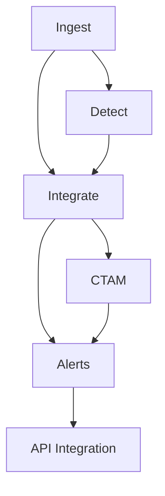

# EdgeWARN Core Modules Documentation

This document summarizes the currently implemented core package layout under `src/EdgeWARN/core`.

## Directory Layout

```
src/EdgeWARN/core/
├── alerts/           # Alert schema + manager
├── api_integration/  # API index and snapshot helpers
├── ctam/             # Convective Threat Analysis Module framework + modules
├── ingest/           # Data ingestion (MRMS, NWS, synoptic, METAR)
├── process/          # Detection + integration pipelines
│   ├── detect/
│   └── integrate/
└── schedule/         # Scheduling orchestration
```

## Module Responsibilities

### 1. Ingest (`core/ingest`)

Collects upstream datasets used by downstream processing:

- MRMS products
- NWS alerts
- RAP/synoptic data
- METAR observations
- GOES-related products via ingestion workflows

### 2. Detection (`core/process/detect`)

Builds and tracks storm cells from radar/model context:

- storm-cell detection
- temporal association/tracking
- Kalman-based motion support
- lineage handling (merge/split/continuity)

### 3. Integration (`core/process/integrate`)

Adds environmental/contextual attributes to detected cells:

- GLM lightning integration
- RAP environmental integration
- multi-stat raster sampling and derived feature fields

### 4. CTAM (`core/ctam`)

Runs modular threat analytics on processed storm cells:

- `MorphoWind`
- `StormCast`
- `FLOHAR`

The CTAM framework provides interfaces, registry, execution engine, and history utilities.

### 5. Alerts (`core/alerts`)

Manages alert payload lifecycle for EdgeWARN outputs:

- schema definition
- publish/update support
- snapshot management for API-serving directories

### 6. API Integration (`core/api_integration`)

Maintains API-facing index/snapshot artifacts used by the Express service.

### 7. Schedule (`core/schedule`)

Coordinates periodic ingestion and processing orchestration.

## High-Level Data Flow



## Notes

- The REST API routes are implemented in `src/EdgeWARN/api`, not under `core`.
- For route-level behavior, see `docs/api/api_endpoints.md`.
- Detailed module references are documented in:
  - `docs/core/ingestion.md`
  - `docs/core/detection.md`
  - `docs/core/integration.md`
  - `docs/ctam/README.md`
