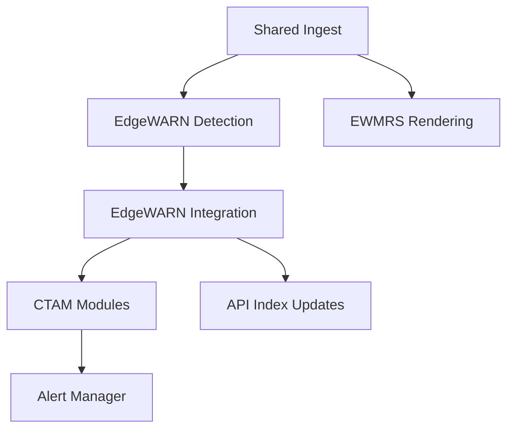

# EdgeWARN Core Runtime Overview

This document summarizes the current runtime architecture implemented under `src/`.

## Runtime Layout

```text
src/
├── run.py                           # Real-time tandem scheduler entry point
├── process_historical.py            # Historical reprocessing entry point
├── common/
│   ├── ingest/                      # Shared ingest implementations (MRMS/NWS/Synoptic/METAR/WPC)
│   └── pipeline/coordinator.py      # Shared staged-ingest coordination
├── EdgeWARN/
│   ├── process/detect/              # Storm-cell detection and tracking
│   ├── process/integrate/           # Per-cell data integration pipeline
│   ├── ctam/                        # CTAM framework + modules
│   ├── alerts/                      # EdgeWARN alert schema + manager
│   ├── api_integration/             # API index management for generated files
│   └── api/                         # EdgeWARN HTTP API service
└── EWMRS/
    ├── pipeline.py                  # Render pipeline orchestration
    ├── render/                      # Layer rendering and tile generation
    └── api/                         # EWMRS HTTP API service
```

## High-Level Flow



## Scheduling Modes

- `run.py` performs a staged shared ingest cycle, then runs EdgeWARN and EWMRS workers in tandem
- `process_historical.py` iterates through a requested UTC time range and runs the historical EdgeWARN flow

## Additional References

- `docs/core/ingestion.md`
- `docs/core/detection.md`
- `docs/core/integration.md`
- `docs/ctam/README.md`
- `docs/api/api_endpoints.md`
