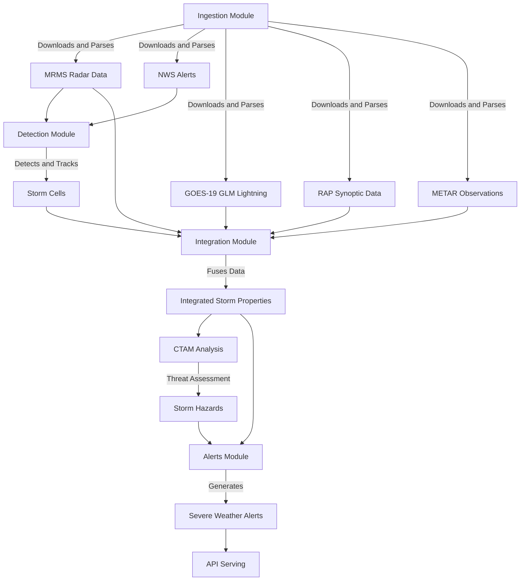
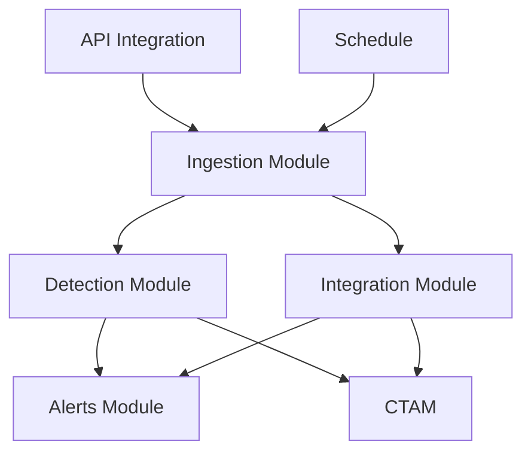

# EdgeWARN Core Modules Documentation

The core directory contains the main processing modules for EdgeWARN. These modules are responsible for data ingestion, storm detection and tracking, and data integration from various meteorological sources. Together, they form the processing pipeline that takes raw meteorological data and transforms it into actionable severe weather information.

## Project Overview

EdgeWARN is a severe weather nowcasting system developed by the Edgemont Weather Service. It combines data from multiple sources to accurately detect, track, and analyze severe weather events in real-time. The core modules work together to process radar data, satellite imagery, lightning data, and model outputs to provide detailed storm cell information and threat assessments.

## Module Collaboration and Data Flow



## Core Module Functions and Final Products

### 1. Ingestion Module (/core/ingest/)

**Purpose**: Collects and processes raw meteorological data from various sources.

**Key Functions**:
- Downloads MRMS radar data from AWS S3
- Fetches NWS alerts from the National Weather Service API
- Downloads GOES-19 GLM lightning data
- Retrieves RAP synoptic model data
- Collects METAR observations from aviation weather sources

**Final Products**:
- Organized raw data files in specified directories
- Cleaned and validated datasets ready for processing
- Cached files for performance optimization

**Output Examples**:
```
EdgeWARN_input/
├── mrms/                      # MRMS radar products
│   ├── reflectivity/          # Merged Reflectivity Composite
│   ├── probsevere/            # ProbSevere v3 data
│   └── precip_type/           # Precipitation Type
├── nws/                       # NWS alerts and warnings
├── goes/                      # GOES-19 satellite data
│   └── glm/                   # GLM lightning data
└── rap/                       # RAP synoptic model data
```

### 2. Detection Module (/core/process/detect/)

**Purpose**: Identifies and tracks storm cells from raw radar and model data.

**Key Functions**:
- Detects storm cells from radar reflectivity data
- Tracks storm movement using Kalman filtering
- Handles storm cell merge and split events
- Manages storm cell lineage and history
- Matches detected storms to NWS alerts

**Final Products**:
- Storm cell detection results with unique identifiers
- Track information including velocity and direction
- Confidence scores for each detection
- Lineage information (evolution history)
- Alert associations

**Output Format**:
```json
{
  "type": "FeatureCollection",
  "features": [
    {
      "id": "12345",
      "type": "Feature",
      "geometry": {
        "type": "Polygon",
        "coordinates": [...]
      },
      "properties": {
        "centroid": [35.0, -97.0],
        "max_refl": 55,
        "num_gates": 25,
        "timestamp": "2023-10-01T12:00:00Z",
        "velocity": {
          "u": 5.0,
          "v": 3.0,
          "speed": 5.83,
          "bearing": 59.0
        },
        "confidence": 0.95,
        "tracking_mode": "active",
        "event_type": "ACTIVE",
        "alerts": ["TOR", "HAIL"]
      }
    }
  ],
  "latest_timestamp": "2023-10-01T12:00:00Z"
}
```

### 3. Integration Module (/core/process/integrate/)

**Purpose**: Fuses data from multiple sources to create comprehensive storm cell properties.

**Key Functions**:
- Integrates GOES-19 GLM lightning data
- Fuses RAP synoptic model data
- Incorporates ProbSevere v3 data
- Calculates integrated storm properties
- Performs quality control and error handling

**Final Products**:
- Comprehensive storm cell properties including:
  - Basic storm information (location, size, intensity)
  - Track information (velocity, direction)
  - Lightning properties (flash rate, density, energy)
  - Environmental parameters (CAPE, CIN, shear)
  - Threat assessment metrics (hail potential, tornado potential)
  - Quality control and uncertainty estimates

**Output Format**:
```json
{
  "type": "FeatureCollection",
  "features": [
    {
      "id": "12345",
      "type": "Feature",
      "geometry": {...},
      "properties": {
        "centroid": [35.0, -97.0],
        "max_refl": 55,
        "num_gates": 25,
        "timestamp": "2023-10-01T12:00:00Z",
        "ProbSevere": 0.85,
        "ProbWind": 0.70,
        "ProbHail": 0.65,
        "ProbTor": 0.40,
        "GLM_FLASH_COUNT": 15,
        "GLM_TOTAL_ENERGY": 1250.5,
        "CAPE": 2500,
        "CIN": -50,
        "EBShear": 35,
        "MESH": 3.5,
        "VIL": 50
      }
    }
  ],
  "latest_timestamp": "2023-10-01T12:00:00Z"
}
```

### 4. Alerts Module (/core/alerts/)

**Purpose**: Manages alert generation and dissemination.

**Key Functions**:
- Generates severe weather alerts based on storm properties
- Manages alert schema definitions
- Handles alert storage and retrieval
- Provides alert matching and verification

### 5. CTAM (Convective Threat Analysis Module) (/core/ctam/)

**Purpose**: Provides advanced convective threat analysis.

**Key Functions**:
- FLOHAR (Flood Hazard Assessment) module for flood threat analysis
- MorphoWind module for wind analysis
- StormCast module for storm prediction
- Region-based analysis capabilities

**Final Products**:
- Flood threat assessments
- Wind damage potential
- Storm forecast predictions
- Region-specific threat information

### 6. API Integration (/core/api_integration/)

**Purpose**: Provides utilities for integrating with external APIs and managing data indices.

**Key Functions**:
- Manages API indices for storm cells and alerts
- Handles API request processing
- Provides data validation and error handling
- Manages API versioning and deprecation

**API Endpoints**:
- `/api/stormcells` - Get current storm cells
- `/api/alerts` - Get active alerts
- `/api/history` - Get storm cell history
- `/api/ctam` - Get CTAM threat assessments

## Technologies Used

- Python 3.13+ with NumPy/SciPy for numerical computations
- Node.js/Express.js for API serving
- AWS S3 for data storage
- NOAA MRMS, ProbSevere, GOES-19 GLM, and RAP datasets
- Shapely for spatial operations
- Pandas for data manipulation
- Xarray for netCDF data handling

## Performance Characteristics

- **Ingestion**: Handles large datasets with parallel downloading and async operations
- **Detection**: Uses vectorized operations for fast storm cell identification
- **Integration**: Optimizes data extraction with lazy loading and spatial indexing
- **API**: Caches frequently accessed data for rapid response times

## Error Handling and Quality Control

- Data validation and consistency checks
- Outlier detection and rejection
- Error propagation and estimation
- Handling of missing or incomplete data
- Quality metrics for each integrated property

## Core Module Structure

```
core/
├── alerts/           # Alert generation and management
├── api_integration/  # API integration utilities
├── ctam/             # Convective Threat Analysis Module
├── ingest/           # Data ingestion from various sources
├── process/          # Data processing pipelines
│   ├── detect/       # Storm cell detection and tracking
│   └── integrate/    # Data integration and fusion
└── schedule/         # Scheduling and automation

```

## Modules Documentation

### 1. Ingestion Module (/core/ingest/)
Responsible for collecting raw meteorological data from various sources including:
- NOAA MRMS (Multi-Radar Multi-Sensor) data
- NWS (National Weather Service) alerts and data
- Synoptic data (e.g., RAP model data)
- METAR observations

### 2. Detection Module (/core/process/detect/)
Handles storm cell detection, tracking, and lineage management using:
- Kalman filter-based tracking
- Lineage buffer management
- Spatial and temporal detection algorithms
- Alert matching and verification

### 3. Integration Module (/core/process/integrate/)
Integrates and fuses data from multiple sources:
- GOES-19 GLM lightning data
- RAP (Rapid Refresh) synoptic data
- MRMS radar data
- ProbSevere v3 data

### 4. Alerts Module (/core/alerts/)
Manages alert generation and dissemination:
- Alert schema definitions
- Alert manager for processing and storing alerts
- Integration with detection module

### 5. CTAM (Convective Threat Analysis Module) (/core/ctam/)
Provides advanced convective threat analysis:
- FLOHAR (Flood Hazard Assessment) module
- MorphoWind module for wind analysis
- StormCast module for storm prediction
- Region-based analysis capabilities

### 6. API Integration (/core/api_integration/)
Provides utilities for integrating with external APIs and managing data indices.

### 7. Schedule (/core/schedule/)
Manages scheduling and automation of data ingestion and processing tasks.

## Inter-Module Relationships



## Data Flow

The typical data flow through the core modules is as follows:

1. **Ingestion**: Raw data is collected from various sources
2. **Detection**: Storm cells are detected and tracked
3. **Integration**: Data from multiple sources is fused
4. **CTAM Analysis**: Advanced threat analysis is performed
5. **Alert Generation**: Alerts are generated based on analysis results
6. **API Serving**: Processed data is served to frontend applications

## Technologies Used

- Python 3.13+ with NumPy/SciPy for numerical computations
- Node.js/Express.js for API serving
- AWS S3 for data storage
- NOAA MRMS, ProbSevere, GOES-19 GLM, and RAP datasets
