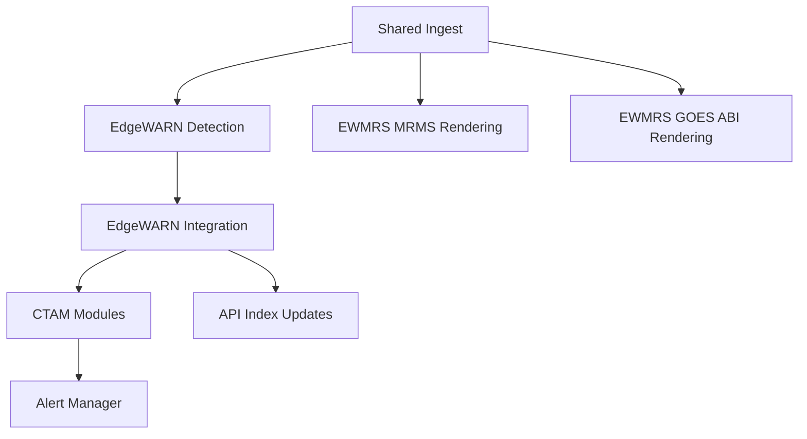

# EdgeWARN Core Runtime Overview

This document summarizes the current runtime architecture implemented under `src/`.

## Runtime Layout

```text
src/
├── run.py                           # Real-time tandem scheduler entry point
├── process_historical.py            # Historical reprocessing entry point
├── util/                            # Shared filesystem, I/O, GRIB, performance, release helpers
├── common/
│   ├── ingest/                      # Shared ingest implementations (MRMS/NWS/Synoptic/METAR/WPC/NEXRAD)
│   │   ├── mrms/                    # MRMS + GOES discovery/download/staging
│   │   ├── nws/                     # NWS active alert ingest + zone sync
│   │   ├── synoptic/                # RAP ingest
│   │   ├── nexrad/                  # NEXRAD Level II ingest + parser
│   │   ├── wpc/                     # WPC surface analysis ingest
│   │   ├── metar.py                 # METAR ingest
│   │   └── aws_async_compat.py      # AWS async/sync compatibility shim
│   └── pipeline/                    # Tandem coordination (coordinator.py, goes_readiness.py)
├── EdgeWARN/
│   ├── pipeline.py                  # Top-level EdgeWARN orchestration
│   ├── process/detect/              # Storm-cell detection and tracking
│   ├── process/integrate/           # Per-cell data integration pipeline
│   ├── ctam/                        # CTAM framework + modules
│   ├── alerts/                      # EdgeWARN alert schema + manager
│   ├── api_integration/             # API index management for generated files
│   ├── api/                         # EdgeWARN HTTP API service
│   ├── ingest/                      # Compatibility re-exports of shared ingest code
│   ├── schedule/                    # Update-checking and scheduling helpers
│   └── ui/                          # UI assets (placeholder package)
└── EWMRS/
    ├── pipeline.py                  # Render pipeline orchestration
    ├── scheduler.py                 # Scheduling helpers
    ├── render/                      # Layer rendering and tile generation
    ├── rap/                         # RAP Uint16 conversion pipeline + config
    ├── api/                         # EWMRS HTTP API service
    ├── colormaps.json               # Colormap source blocks served by /colormaps
    └── mappings.json                # RAP layer/colormap mapping served by /rap/mappings
```

## High-Level Flow



## Tandem Readiness Stages

- Detection inputs ready
- EWMRS MRMS inputs ready
- EWMRS GOES inputs ready
- EdgeWARN integration inputs ready

The GOES EWMRS stage renders the full configured GOES-East ABI set after local ABI readiness is met.
Current outputs include the single-channel GUI products `GOES_ABI_C01` through `GOES_ABI_C16` plus six derived RGB composites built from staged `ABI-L1b-RadC` channels:

- `GOES_RGB_TrueColor`
- `GOES_RGB_Airmass`
- `GOES_RGB_NighttimeMicrophysics`
- `GOES_RGB_DayCloudPhase`
- `GOES_RGB_SimpleWaterVapor`
- `GOES_RGB_Sandwich`

The GOES render path uses a unified cycle that reuses shared channel reprojection work across scalar layers and RGB recipes, then writes the same tiled GUI layout and product-level plus timestamp-level `index.json` contract used by the rest of EWMRS. If a required channel is missing or exceeds the allowed timestamp offset, only the affected layer or recipe is skipped.

## Scheduling Modes

- `run.py` performs a staged shared ingest cycle, then runs EdgeWARN and EWMRS workers in tandem
- `process_historical.py` iterates through a requested UTC time range and runs the historical EdgeWARN flow

Current CLI coverage:

- `run.py`: `--lat_limits`, `--lon_limits`, `--base_dir` / `--base-dir`, `--profile`, `--disable-ctam`, `--disable-tracking`, `--disable-ewmrs`, `--disable-nws`, `--disable-metar`, `--disable-goes`, `--refl-threshold`, `--min-seed-percentage`, `--drop-offset`
- `process_historical.py`: `--start`, `--end`, `--lat`, `--lon`, `--output`, `--base_dir` / `--base-dir`, `--profile`, `--disable-ctam`, `--disable-tracking`, `--refl-threshold`, `--min-seed-percentage`, `--drop-offset`
- `common/ingest/nws/zone_sync.py`: `--assets-dir`, `--zone-types`, `--timeout-seconds`, `--max-retries`, `--max-workers`, `--pause-seconds`, `--no-progress`, `--apply`, `--report-path`

## Additional References

- `docs/core/ingestion.md`
- `docs/core/goes_pipeline.md`
- `docs/core/detection.md`
- `docs/core/integration.md`
- `docs/ctam/README.md`
- `docs/api/api_endpoints.md`
