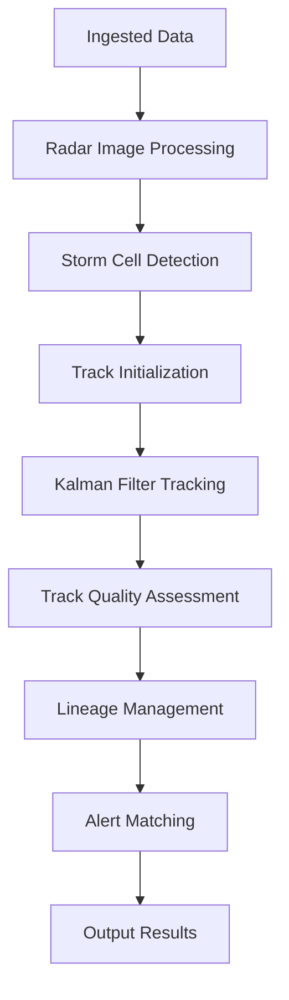

# Detection Module

The detection module is responsible for identifying and tracking storm cells from raw meteorological data. It uses advanced algorithms to detect storm signatures, track their movement, and manage their lineage over time.

## Module Structure

```
process/detect/
├── __init__.py
├── detect.py             # Core storm detection functions
├── main.py               # Main detection entry point
├── track.py              # Storm cell tracking algorithms
├── kalman/               # Kalman filter-based tracking
│   ├── __init__.py
│   ├── assignment.py     # Track assignment algorithms
│   ├── confidence.py     # Confidence scoring for tracks
│   ├── config.py         # Kalman filter configuration
│   ├── filter.py         # Kalman filter implementation
│   └── state.py          # Track state management
├── lineage/              # Storm cell lineage management
│   ├── __init__.py
│   ├── buffer.py         # Lineage buffer management
│   ├── detector.py       # Lineage-based detection
│   ├── events.py         # Lineage event handling
│   └── spatial.py        # Spatial operations for lineage
└── tools/                # Detection utility tools
    ├── __init__.py
    ├── alert_matcher.py  # Alert to storm cell matching
    ├── gatemapper.py     # Gate mapping for radar data
    ├── morphology.py     # Morphological operations
    ├── save.py           # Data saving functions
    ├── utils.py          # General utility functions
    └── vecmath.py        # Vector math operations
```

## Key Features

### Core Detection (/process/detect/detect.py)
- Implements core storm detection algorithms
- Handles storm cell initialization from radar data
- Manages storm cell metadata and properties
- Provides basic storm cell information extraction

### Tracking (/process/detect/track.py)
- Implements storm cell tracking algorithms
- Handles track initialization and termination
- Manages track continuity across time steps
- Provides track quality metrics

### Kalman Filter Tracking (/process/detect/kalman/)
- Kalman filter-based tracking for improved accuracy
- Track state estimation (position, velocity, acceleration)
- Track assignment and association algorithms
- Confidence scoring for track quality

### Lineage Management (/process/detect/lineage/)
- Manages storm cell lineage and history
- Handles storm cell merging and splitting events
- Maintains track of storm cell evolution
- Provides spatial and temporal context for storms

### Detection Tools (/process/detect/tools/)
- **alert_matcher.py**: Matches detected storms to NWS alerts
- **gatemapper.py**: Handles radar gate mapping and coordinate conversions
- **morphology.py**: Morphological operations for radar image processing
- **save.py**: Functions for saving detection results
- **utils.py**: General utility functions for detection
- **vecmath.py**: Vector math operations for spatial calculations

## Configuration

### Kalman Filter Configuration (/process/detect/kalman/config.py)
Defines Kalman filter parameters for tracking:
- Filter initial state and covariance
- Process and measurement noise characteristics
- Track management parameters
- Detection threshold settings

## Detection Process



## Core Classes and Methods

### Main Detection Module (/process/detect/main.py)

```python
def main(radar_old, radar_new, ps_old, ps_new, pt_old, pt_new, lat_bounds: tuple, lon_bounds: tuple, json_output,
         radar_old_obj=None, ps_old_obj=None, pt_old_obj=None):
    """
    Main detection function that handles cell detection and tracking.
    
    Args:
        radar_old, radar_new: Paths to old and new radar files
        ps_old, ps_new: Paths to old and new ProbSevere files
        pt_old, pt_new: Paths to old and new PrecipType files
        lat_bounds, lon_bounds: Latitude and longitude bounds for detection
        json_output: Output JSON file path
        radar_old_obj, ps_old_obj, pt_old_obj: Optional cached dataset objects
        
    Returns:
        Tuple of output file path and (radar_new_obj, ps_new_obj, pt_new_obj) for caching
    """
```

### Storm Cell Tracker (/process/detect/track.py)

```python
class StormCellTracker:
    """
    Tracks storm cells across scans with lineage event detection and Kalman filtering.
    
    This class handles:
    - 1-to-1 cell ID matching and field updates
    - Merge detection (multiple parents -> single child)
    - Split detection (single parent -> multiple children)
    - Hysteresis buffering for false positive prevention
    - Kalman filter-based motion prediction
    - Continuity tracking (Prediction Mode) for dropped detection
    """
    
    def __init__(
        self,
        ps_old: Any,
        ps_new: Any,
        io_manager: Any,
        lineage_buffer: Optional[LineageBuffer] = None,
        overlap_threshold: float = 0.10,
        tracking_config: Optional[TrackingConfig] = None,
        assignment_config: Optional[AssignmentConfig] = None,
        kalman_config: Optional[KalmanConfig] = None
    ):
        """
        Initialize the storm cell tracker.
        
        Args:
            ps_old: Previous scan ProbSevere data
            ps_new: Current scan ProbSevere data
            io_manager: IO manager for logging
            lineage_buffer: Optional pre-loaded LineageBuffer
            overlap_threshold: Minimum overlap ratio for merge/split detection
            tracking_config: Configuration for Kalman tracking
            assignment_config: Configuration for assignment (mostly for hybrid params)
            kalman_config: Configuration for Kalman filter
        """
    
    def detect_lineage_events(
        self,
        old_cells: List[Dict[str, Any]],
        new_cells: List[Dict[str, Any]],
        stormcell_dir: Optional[Path] = None,
    ) -> LineageResult:
        """
        Detect merge and split events between old and new cell sets.
        """
    
    def update_cells(
        self,
        entries: List[Dict[str, Any]],
        updated_data: List[Dict[str, Any]],
        timestamp: Optional[str] = None,
        dt_seconds: float = 120.0,
        lineage: Optional[LineageResult] = None,
    ) -> List[Dict[str, Any]]:
        """
        Updates cells using Lineage Detection + Kalman Continuity.
        
        Args:
            entries: List of cell dicts from previous scan
            updated_data: List of dicts with updated data
            timestamp: Current scan timestamp
            dt_seconds: Time since last scan in seconds
            lineage: Optional pre-calculated lineage result
            
        Returns:
            Updated list of cell entries
        """
```

### Kalman Filter (/process/detect/kalman/filter.py)

```python
@dataclass
class KalmanObservation:
    """Observation data for Kalman filter update."""
    
    lat: float
    lon: float
    timestamp: Optional[datetime] = None
    
    # Optional velocity observation (from StormCast or historical motion)
    u: Optional[float] = None
    v: Optional[float] = None


@dataclass
class KalmanFilter:
    """
    6-dimensional Kalman Filter for storm cell tracking.
    
    State vector: [lat, lon, u, v, a_lat, a_lon]^T
    - lat, lon: Position in degrees
    - u, v: Velocity in m/s
    - a_lat, a_lon: Acceleration in m/s²
    
    The filter uses a constant acceleration model for state transition.
    """
    
    def initialize(self, lat: float, lon: float, 
                   u: float = 0.0, v: float = 0.0,
                   position_std_km: float = 1.0,
                   timestamp: Optional[datetime] = None) -> None:
        """
        Initialize the Kalman filter with an initial state.
        """
    
    def initialize_from_cell(self, cell: Dict[str, Any], 
                             timestamp: Optional[datetime] = None) -> None:
        """
        Initialize the Kalman filter from a storm cell entry.
        """
    
    def predict(self, dt: float, 
                control_u: Optional[float] = None,
                control_v: Optional[float] = None) -> StateVector:
        """
        Perform prediction step of Kalman filter.
        
        Uses constant acceleration model to predict state forward.
        
        Args:
            dt: Time step in seconds
            control_u: Optional control input for velocity (from StormCast)
            control_v: Optional control input for velocity (from StormCast)
        
        Returns:
            Predicted state vector
        """
    
    def update(self, observation: KalmanObservation) -> StateVector:
        """
        Perform update step of Kalman filter with observation.
        
        Args:
            observation: Observation with lat/lon position
        
        Returns:
            Updated state vector
        """
    
    def get_predicted_position(self, dt: float) -> Tuple[float, float]:
        """
        Get predicted position after dt seconds without updating state.
        """
    
    def get_position_uncertainty_km(self) -> Tuple[float, float]:
        """
        Get current position uncertainty in km.
        """
    
    def get_mahalanobis_distance(self, lat: float, lon: float) -> float:
        """
        Calculate Mahalanobis distance to a measurement.
        """
```

### State Vector and Covariance Matrix (/process/detect/kalman/state.py)

```python
@dataclass
class StateVector:
    """
    6-dimensional state vector for Kalman filter.
    
    State components:
        lat: Latitude position (degrees)
        lon: Longitude position (degrees, 0-360 format)
        u: Eastward velocity (m/s)
        v: Northward velocity (m/s)
        a_lat: Latitude acceleration (m/s²)
        a_lon: Longitude acceleration (m/s²)
    """
    
    def to_array(self) -> np.ndarray:
        """Convert state vector to numpy array."""
    
    @classmethod
    def from_array(cls, arr: np.ndarray) -> "StateVector":
        """Create state vector from numpy array."""
    
    def get_position(self) -> Tuple[float, float]:
        """Get position as (lat, lon) tuple."""
    
    def get_velocity(self) -> Tuple[float, float]:
        """Get velocity as (u, v) tuple in m/s."""
    
    def get_speed(self) -> float:
        """Get speed magnitude in m/s."""
    
    def get_bearing(self) -> float:
        """Get bearing in degrees (0=North, 90=East)."""


@dataclass
class CovarianceMatrix:
    """
    6x6 covariance matrix for Kalman filter state uncertainty.
    
    The covariance matrix represents the uncertainty in the state estimate.
    Diagonal elements are variances of each state component.
    Off-diagonal elements are covariances between state components.
    """
    
    @classmethod
    def from_diagonal(cls, variances: List[float]) -> "CovarianceMatrix":
        """
        Create covariance matrix from diagonal variances.
        """
    
    @classmethod
    def from_position_uncertainty(cls, position_std_km: float, ref_lat: float = 35.0) -> "CovarianceMatrix":
        """
        Create covariance matrix with position uncertainty only.
        """
    
    def get_position_std_km(self, ref_lat: float = 35.0) -> Tuple[float, float]:
        """
        Get position standard deviations in km.
        """
```

## Usage Examples

### Running Detection

```python
from EdgeWARN.core.process.detect.main import main
from datetime import datetime

# Run detection with file paths
result = main(
    radar_old="/path/to/radar_old.grib",
    radar_new="/path/to/radar_new.grib",
    ps_old="/path/to/ps_old.json",
    ps_new="/path/to/ps_new.json",
    pt_old="/path/to/pt_old.grib",
    pt_new="/path/to/pt_new.grib",
    lat_bounds=(30, 40),
    lon_bounds=(-100, -90),
    json_output="/path/to/output.json"
)
```

### Kalman Filter Example

```python
from EdgeWARN.core.process.detect.kalman.filter import KalmanFilter
from EdgeWARN.core.process.detect.kalman.state import StateVector
from datetime import datetime

# Initialize Kalman filter
kf = KalmanFilter()

# Initialize with initial state
kf.initialize(
    lat=35.0,
    lon=-97.0,
    u=5.0,  # m/s
    v=3.0,  # m/s
    position_std_km=1.0,
    timestamp=datetime.now()
)

# Predict next state (30 seconds later)
predicted_state = kf.predict(dt=30.0)

# Create observation
from EdgeWARN.core.process.detect.kalman.filter import KalmanObservation
observation = KalmanObservation(lat=35.01, lon=-96.99, timestamp=datetime.now())

# Update with observation
updated_state = kf.update(observation)

# Print results
print(f"Predicted: {predicted_state.get_position()}")
print(f"Updated: {updated_state.get_position()}")
```

## Detection Algorithms

### Radar-Based Detection
- Uses radar reflectivity data to detect storm cells
- Implements thresholding and morphological operations
- Handles noise reduction and clutter filtering
- Detects storm cell boundaries and centers

### Track Assignment
- Uses Hungarian algorithm for track assignment
- Handles track initialization and termination
- Manages track-to-measurement association
- Handles track merging and splitting events

### Lineage Management
- Tracks storm cell evolution through time
- Manages cell birth, death, split, and merge events
- Maintains spatial and temporal continuity
- Provides historical context for storm cells

## Performance Optimization

- Vectorized operations using NumPy
- Efficient track assignment algorithms
- Spatial indexing for fast proximity queries
- Memory optimized data structures

## Error Handling

- Track quality assessment and filtering
- Outlier detection and rejection
- Data validation and error checking
- Track initialization and termination logic

## Output Format

The detection module produces structured results including:
- Storm cell properties (size, intensity, location)
- Track information (velocity, direction, history)
- Confidence scores for detections
- Lineage information (evolution history)
- Alert associations

## Dependencies

- **numpy**: For numerical computations
- **scipy**: For scientific computing
- **shapely**: For spatial operations
- **pandas**: For data manipulation
- **scikit-image**: For image processing operations
