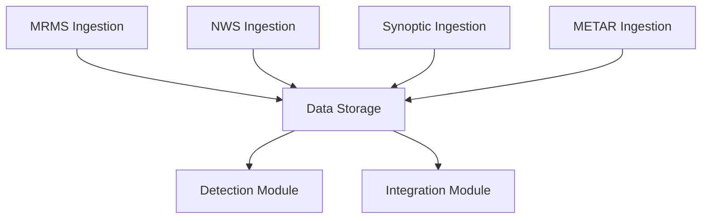

# Ingestion Module

The ingestion module is responsible for collecting and processing raw meteorological data from various sources. It handles downloading, parsing, and organizing data for use by other EdgeWARN modules.

## Module Structure

```
ingest/
├── __init__.py
├── metar.py              # METAR observations ingestion
├── mrms/                 # NOAA MRMS data ingestion
│   ├── __init__.py
│   ├── config.py         # MRMS configuration
│   ├── downloader.py     # MRMS data downloader
│   ├── https_client.py   # HTTPS client for MRMS data
│   ├── main.py           # Main MRMS ingestion entry point
│   ├── parse.py          # MRMS data parser
│   ├── s3_async.py       # Async S3 operations for MRMS data
│   ├── s3_sync.py        # Sync S3 operations for MRMS data
│   ├── timestamp_utils.py # MRMS timestamp handling
│   └── utils.py          # MRMS utility functions
├── nws/                  # NWS (National Weather Service) data ingestion
│   ├── __init__.py
│   ├── geomapper.py      # NWS zone geomapping
│   ├── main.py           # Main NWS ingestion entry point
│   └── registry.py       # NWS data registry
└── synoptic/             # Synoptic data ingestion (RAP model data)
    ├── __init__.py
    ├── config.py         # Synoptic configuration
    ├── downloader.py     # Synoptic data downloader
    ├── main.py           # Main synoptic ingestion entry point
    ├── s3_async.py       # Async S3 operations for synoptic data
    └── s3_sync.py        # Sync S3 operations for synoptic data
```

## Key Features

### MRMS Ingestion (/ingest/mrms/)
- Downloads MRMS data from NOAA servers and AWS S3 bucket
- Handles both real-time and historical MRMS data
- Supports parallel downloading for improved performance
- Manages data integrity checks and retries
- Handles timestamp synchronization

### NWS Ingestion (/ingest/nws/)
- Collects NWS alerts and warning data
- Manages NWS zone geomapping for spatial data integration
- Handles alert parsing and validation
- Maintains registry of NWS data sources

### Synoptic Ingestion (/ingest/synoptic/)
- Downloads RAP (Rapid Refresh) model data
- Handles synoptic weather data processing
- Supports both real-time and historical data collection
- Manages data storage and retrieval

### METAR Ingestion (/ingest/metar.py)
- Collects METAR observations from aviation weather sources
- Parses raw METAR reports into structured data
- Handles quality control and validation of METAR data
- Provides current weather conditions for locations

## Configuration

### MRMS Configuration (/ingest/mrms/config.py)
Defines MRMS dataset parameters, including:
- Data source URLs and S3 bucket information
- Dataset types and variables
- Download and storage settings
- Quality control parameters

### Synoptic Configuration (/ingest/synoptic/config.py)
Defines synoptic data sources and parameters:
- RAP model data sources
- Data resolution and format settings
- Download and storage preferences

## Data Flow



## Core Classes and Methods

### MRMS Ingestion

#### Main Module (/ingest/mrms/main.py)

```python
# Download all MRMS files asynchronously
async def download_all_files_async(dt, max_entries=10, remove_old_files=True):
    """
    Async version of download_all_files. Cleans up old files and downloads MRMS and GOES data.
    """

# Download only detection phase files
async def download_detection_files_async(dt, max_entries=10, remove_old_files=True):
    """Downloads only files strictly required for detection phase."""

# Download integration phase files (excluding detection)
async def download_integration_files_async(dt, max_entries=10, remove_old_files=True):
    """Downloads MRMS integration products, excluding detection products."""

# Synchronous wrapper with fallback
def download_all_files(dt, max_entries=10, remove_old_files=True):
    """
    Main function for downloading all MRMS files.
    This operates synchronously as a wrapper/fallback or for legacy calls.
    It catches exceptions and falls back to synchronous downloads if async fails.
    """
```

#### Downloader Module (/ingest/mrms/downloader.py)

```python
async def download_all_files_async_internal(dt, max_entries, target_modifiers=None):
    """Internal async function that handles the actual download operations"""

async def download_modifier_async(region, modifier, outdir, dt, max_entries, s3_client, parent_trace_id=None):
    """Internal async version of download_modifier using aioboto3 for non-blocking S3 operations"""

def download_all_files_sync_fallback(dt, max_entries):
    """Sync fallback for downloading all MRMS files"""

def download_modifier_sync(region, modifier, outdir, dt, max_entries):
    """Internal sync version of download_modifier for fallback"""

def download_goes_product(product, outdir, dt, max_entries=10, hour_lookback=3):
    """
    Download a specific GOES-19 product.
    
    Args:
        product (str): GOES product name (e.g., "GLM-L2-LCFA", "ABI-L2-ACHAC")
        outdir (Path): Output directory for downloaded files
        dt (datetime): Target datetime (UTC, timezone-aware)
        max_entries (int): Maximum number of file entries to retrieve (default: 10)
        hour_lookback (int): Number of hours to look back (default: 3).
    """

async def _download_goes_product_async(product, outdir, dt, max_entries, hour_lookback, s3_client, parent_trace_id=None):
    """Async version of download_goes_product using aioboto3"""
```

### NWS Ingestion

#### Main Module (/ingest/nws/main.py)

```python
def download_alerts(dt: datetime):
    """
    Download active NWS alerts, filter them by event type, Apply GeoMapper,
    and update the alerts registry with deduplication.
    
    Args:
        dt: Current datetime (used for timestamp tracking)
    """

async def download_alerts_async(dt: datetime):
    """
    Async version of download_alerts.
    Downloads active NWS alerts using aiohttp, processes with deduplication,
    and updates the alerts registry.
    """

def _process_nws_file_with_registry(
    input_path: str, 
    registry: AlertRegistry, 
    current_time: datetime
) -> Tuple[int, int]:
    """
    Process the raw NWS JSON file and update the registry.
    
    Filters events, applies GeoMapper logic, and adds/updates alerts in registry.
    
    Args:
        input_path: Path to the downloaded NWS JSON file
        registry: AlertRegistry instance to update
        current_time: Current timestamp for tracking
        
    Returns:
        Tuple of (new_count, updated_count)
    """
```

### Synoptic Ingestion

#### Main Module (/ingest/synoptic/main.py)

```python
async def download_rap_async(dt: datetime):
    """
    Async version of download_rap.
    Cleans up old RAP files before downloading.
    """

def download_rap(dt: datetime):
    """
    Public API to download a RAP file for a given datetime.
    Handles the async loop if necessary.
    Enforces a 10-file limit using clean_old_files.
    """
```

## Usage Examples

### MRMS Ingestion Example

```python
from EdgeWARN.core.ingest.mrms.main import download_all_files
from datetime import datetime

# Download all MRMS files for a specific time
dt = datetime(2023, 10, 1, 12, 0)
download_all_files(dt)
```

### NWS Ingestion Example

```python
from EdgeWARN.core.ingest.nws.main import download_alerts_async
from datetime import datetime, timezone
import asyncio

async def main():
    dt = datetime.now(timezone.utc)
    await download_alerts_async(dt)

asyncio.run(main())
```

### Synoptic (RAP) Ingestion Example

```python
from EdgeWARN.core.ingest.synoptic.main import download_rap
from datetime import datetime

dt = datetime(2023, 10, 1, 12, 0)
result = download_rap(dt)
if result:
    print(f"Successfully downloaded RAP file: {result}")
```

## Dependencies

- **requests**: For HTTP data downloads
- **aiohttp**: For async HTTP operations
- **boto3**: For AWS S3 operations
- **numpy**: For numerical data handling
- **pandas**: For data manipulation
- **shapely**: For spatial geometry operations

## Performance Optimization

- Parallel downloading for large datasets
- Caching mechanisms to avoid redundant downloads
- Compression handling for efficient storage
- Asynchronous operations for improved throughput

## Error Handling

- Retry mechanisms for failed downloads
- Data validation and quality checks
- Error logging and reporting
- Fallback mechanisms for unavailable data sources
