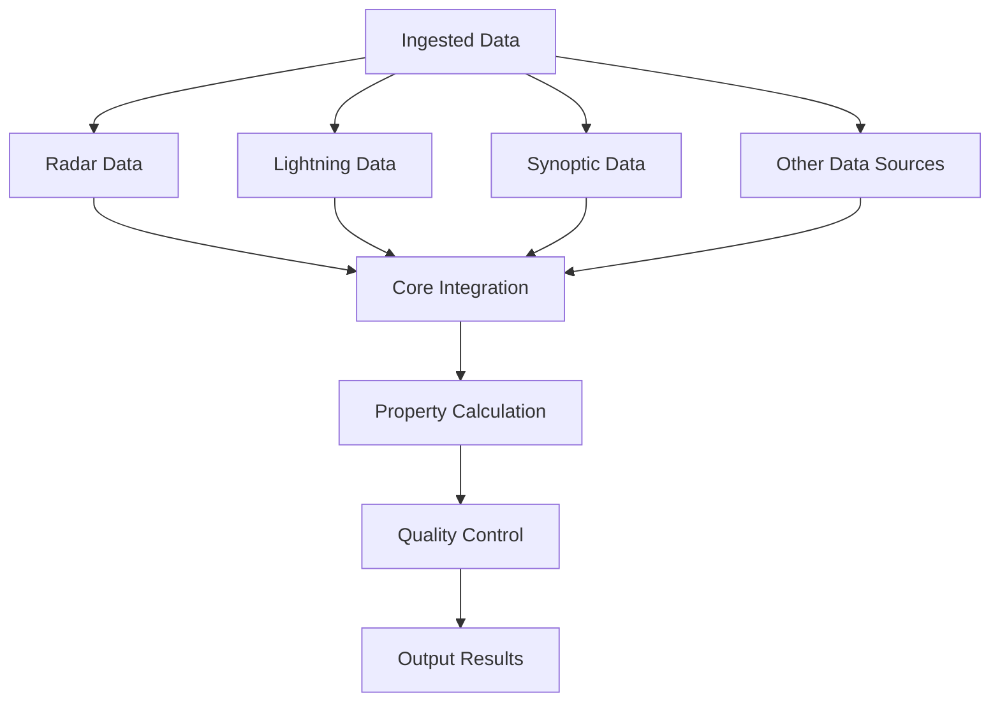
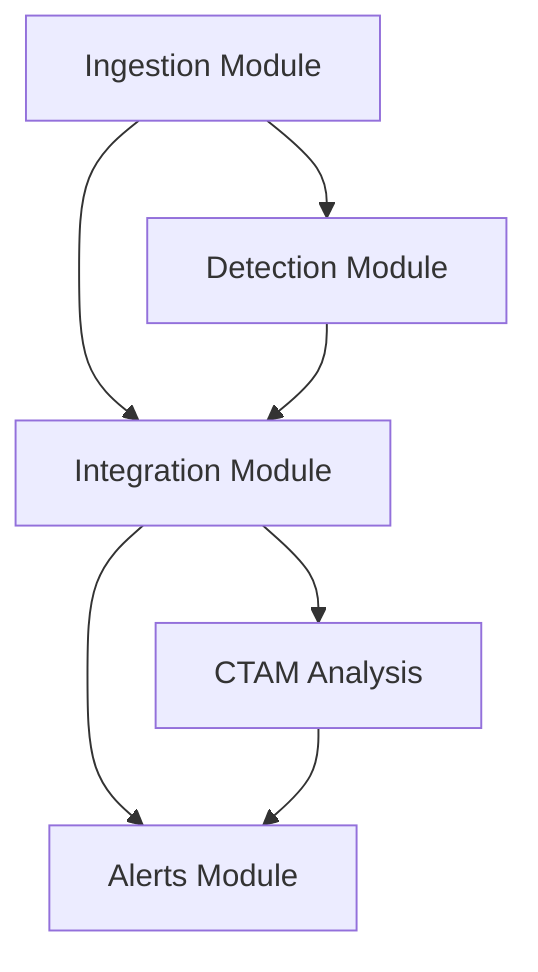

# Integration Module

The integration module is responsible for fusing data from multiple meteorological sources to create a comprehensive view of severe weather events. It combines radar data, satellite imagery, lightning data, and model outputs to enhance storm cell characterization and threat assessment.

## Module Structure

```
process/integrate/
├── __init__.py
├── config.py             # Integration configuration
├── grid_index.py         # Grid indexing for spatial data
├── history.py            # Integration history management
├── integrate.py          # Core integration algorithms
├── integrate_azshear.py  # Derived AzShear morphology/alignment features
├── integrate_glm.py      # GOES-19 GLM lightning integration
├── integrate_rap.py      # RAP synoptic data integration
├── main.py               # Main integration entry point
└── utils.py              # Integration utility functions
```

## Key Features

### Core Integration (/process/integrate/integrate.py)
- Implements core data fusion algorithms
- Handles integration of multiple data sources
- Manages integration of storm cell properties
- Provides unified storm cell characterization

### GLM Lightning Integration (/process/integrate/integrate_glm.py)
- Integrates GOES-19 GLM (Geostationary Lightning Mapper) data
- Handles lightning flash density and rate calculations
- Correlates lightning data with storm cells
- Enhances storm severity assessment

### AzShear Feature Integration (/process/integrate/integrate_azshear.py)
- Extracts thresholded low- and mid-level AzShear components around each storm cell
- Uses 8.0 low-level and 6.0 mid-level thresholds before component summarization
- Returns per-level grouped metrics for core structure, dominance, linearity, persistence, and distribution
- Returns cross-layer LL-ML relationship metrics including overlap, centroid alignment, and strength ratios

### RAP Synoptic Integration (/process/integrate/integrate_rap.py)
- Integrates RAP (Rapid Refresh) model data
- Handles synoptic weather parameters
- Provides environmental context for storm cells
- Enhances storm cell characterization

### Grid Indexing (/process/integrate/grid_index.py)
- Manages spatial grid indexing for fast data access
- Handles grid cell assignment and lookup
- Optimizes spatial query performance
- Manages grid-based data aggregation

### Integration History (/process/integrate/history.py)
- Tracks integration history for storm cells
- Manages time series of integrated properties
- Handles property interpolation and extrapolation
- Provides historical context for storm cells

### Integration Utilities (/process/integrate/utils.py)
- General utility functions for integration
- Handles data type conversions and validation
- Provides spatial and temporal data operations
- Implements quality control checks

## Configuration

### Integration Configuration (/process/integrate/config.py)
Defines integration parameters and settings:
- Data source priorities and weights
- Integration algorithms and methods
- Property calculation parameters
- Spatial and temporal resolution settings

## Integration Process



## Core Classes and Methods

### Main Integration Module (/process/integrate/main.py)

```python
def main(json_path=None, remove_old_cells=True):
    """
    Main integration function that coordinates data integration from multiple sources.
    
    Args:
        json_path: Path to the storm cells JSON file to integrate
        remove_old_cells: Whether to remove old cells from the API index
        
    Returns:
        None
    """
```

### Storm Cell Integrator (/process/integrate/integrate.py)

```python
class StormCellIntegrator:
    def __init__(self, io_manager):
        self.io_manager = io_manager
    
    @staticmethod
    def _lat_slice_indices(lat_vals, miny, maxy):
        """Return start/end indices for latitude bounds on ascending or descending grids."""
    
    def integrate_ds_via_max(self, dataset_path, storm_cells, output_key):
        """
        Integrate a single dataset by taking the maximum value within each cell.
        
        Args:
            dataset_path: Path to the GRIB/NetCDF file to integrate
            storm_cells: List of storm cell dictionaries
            output_key: Key to store the integrated value
            
        Returns:
            Updated list of storm cells
        """
    
    def integrate_multi_stats(self, dataset_path, storm_cells, stats_config_list):
        """
        Integrate a dataset by calculating multiple statistics in a single pass.
        
        Args:
            dataset_path (str): Path to the GRIB/NetCDF file.
            storm_cells (list): List of storm cell dictionaries.
            stats_config_list (list): List of dicts, each containing:
                                      {'key': str, 'method': str, 'percentile': int}
                                      
        Returns:
            Updated list of storm cells
        """

    def integrate_azshear_features(self, low_dataset_path, mid_dataset_path, storm_cells):
        """
        Derive thresholded AzShear component summaries for each storm cell.

        Adds `properties["azshear"]` with grouped low/mid metrics and
        a cross-layer relationship block.
        """

    def integrate_probsevere(self, probsevere_data, storm_cells):
        """
        Integrate ProbSevere probability data with storm cells by matching IDs.
        Flattens all ProbSevere variables directly into each storm history entry.
        
        Args:
            probsevere_data: ProbSevere data as a dictionary
            storm_cells: List of storm cell dictionaries
            
        Returns:
            Updated list of storm cells
        """
```

### GLM Integration (/process/integrate/integrate_glm.py)

```python
def integrate_glm(storm_cells, glm_file_path=None):
    """
    Integrate GOES GLM flash count and total flash energy into storm cells.
    
    Args:
        storm_cells (list): List of storm cell dictionaries.
        glm_file_path (str, optional): Path to the GLM L2 LCFA NetCDF file. 
                                       REQUIRED. If None, logs error and returns.
                                       
    Returns:
        list: Updated storm cells with GLM_FLASH_COUNT and GLM_TOTAL_ENERGY.
    """
```

### RAP Integration (/process/integrate/integrate_rap.py)

```python
def integrate_rap(storm_cells, rap_file_path, io_manager):
    """
    Integrate RAP data into storm cells.
    Uses RAPPointExtractor for efficient point-based data extraction.
    
    Args:
        storm_cells: List of storm cell dictionaries
        rap_file_path: Path to the RAP GRIB file
        io_manager: IO manager for logging
        
    Returns:
        Updated list of storm cells
    """
```

## Usage Examples

### Running Integration

```python
from EdgeWARN.core.process.integrate.main import main

# Run integration on a storm cells JSON file
main("/path/to/stormcells_20231001-120000.json")
```

### GLM Integration Example

```python
from EdgeWARN.core.process.integrate.integrate_glm import integrate_glm
import json

# Load storm cells from JSON
with open("/path/to/stormcells_20231001-120000.json", "r") as f:
    storm_cells = json.load(f)["features"]

# Integrate GLM data
integrated_cells = integrate_glm(
    storm_cells=storm_cells,
    glm_file_path="/path/to/glm_data.nc"
)

# Print lightning properties
for cell in integrated_cells:
    props = cell.get("properties", {})
    cell_id = cell.get("id")
    flash_count = props.get("GLM_FLASH_COUNT")
    total_energy = props.get("GLM_TOTAL_ENERGY")
    print(f"Cell {cell_id}: {flash_count} flashes, {total_energy:.2f} J")
```

### RAP Integration Example

```python
from EdgeWARN.core.process.integrate.integrate_rap import integrate_rap
import json
from util.io import IOManager

# Initialize IO manager
io_manager = IOManager("[Integration Test]")

# Load storm cells from JSON
with open("/path/to/stormcells_20231001-120000.json", "r") as f:
    storm_cells = json.load(f)["features"]

# Integrate RAP data
integrated_cells = integrate_rap(
    storm_cells=storm_cells,
    rap_file_path="/path/to/rap_data.grib2",
    io_manager=io_manager
)

# Print integrated properties
for cell in integrated_cells:
    props = cell.get("properties", {})
    cell_id = cell.get("id")
    temperature = props.get("TMP:2 m above ground")
    dewpoint = props.get("DPT:2 m above ground")
    print(f"Cell {cell_id}: Temp {temperature:.1f}°C, Dewpoint {dewpoint:.1f}°C")
```

## Integration Algorithms

### Data Fusion
- Combines data from multiple sources using weighted average
- Handles data quality and reliability assessment
- Implements uncertainty propagation
- Manages conflicting measurements

### Property Calculation
- Calculates integrated storm cell properties
- Handles spatial and temporal aggregation
- Implements interpolation and extrapolation
- Manages property normalization

### Quality Control
- Validates integrated properties
- Handles outlier detection and rejection
- Manages data consistency checks
- Implements error estimation

## Data Sources

### GOES-19 GLM Lightning Data
- Lightning flash locations and times
- Flash rate and density calculations
- Group and energy information
- Temporal and spatial coverage

### RAP Synoptic Data
- Atmospheric pressure, temperature, humidity
- Wind speed and direction profiles
- Stability indices (CAPE, CIN, LI)
- Precipitable water and other parameters

### MRMS Radar Data
- Reflectivity and composite reflectivity
- Echo tops and vertically integrated liquid
- Hail size and tornado signatures
- Storm cell tracks and movement

### Other Data Sources
- METAR observations
- NWS alerts and warnings
- ProbSevere v3 data
- Hydrological information

## Output Format

The integration module produces comprehensive storm cell properties including:
- Basic storm information (location, size, intensity)
- Track information (velocity, direction)
- Lightning properties (flash rate, density, energy)
- Environmental parameters (CAPE, CIN, shear)
- Threat assessment metrics (hail potential, tornado potential)
- Quality control and uncertainty estimates

## Performance Optimization

- Vectorized operations using NumPy
- Spatial indexing for fast data access
- Efficient grid-based data aggregation
- Parallel processing for large datasets

## Error Handling

- Data validation and quality checks
- Outlier detection and rejection
- Handling missing or incomplete data
- Error propagation and estimation

## Dependencies

- **numpy**: For numerical computations
- **scipy**: For scientific computing
- **shapely**: For spatial operations
- **pandas**: For data manipulation
- **xarray**: For netCDF data handling
- **pyproj**: For coordinate system transformations

## Integration with Other Modules



## Quality Control

The integration module implements robust quality control:
- Data validation and consistency checks
- Outlier detection and rejection
- Error estimation and propagation
- Handling of missing or incomplete data
- Quality metrics for each integrated property
