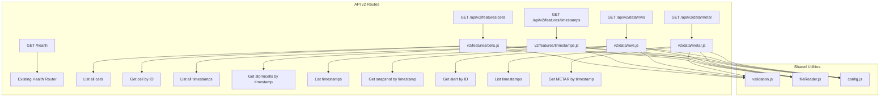

# EdgeWARN API v2 Implementation Plan

## Overview

This document outlines the implementation plan for the new EdgeWARN API v2 design. The new API provides a more RESTful and intuitive endpoint structure while maintaining backward compatibility with the existing v1 API.

## Architecture Diagram



## Route Mapping: v1 to v2

| v1 Endpoint | v2 Endpoint | Notes |
|-------------|-------------|-------|
| `GET /health` | `GET /health` | Unchanged |
| `GET /features/fetch/resources?type=cell` | `GET /api/v2/features/cells` | Returns cell IDs list |
| `GET /features/download/resources?type=cell&id={int}` | `GET /api/v2/features/cells?id={int}` | Returns specific cell data |
| `GET /features/fetch/resources?type=list` | `GET /api/v2/features/timestamps` | Returns timestamps list |
| `GET /features/download/resources?type=list&timestamp={ts}` | `GET /api/v2/features/timestamps?timestamp={ts}` | Returns stormcells at timestamp |
| `GET /data/fetch?type=nws` | `GET /api/v2/data/nws` | Returns alert IDs (breaking change: now returns timestamps) |
| `GET /data/download?type=nws&timestamp={ts}` | `GET /api/v2/data/nws?timestamp={ts}` | Returns NWS snapshot |
| `GET /data/download?type=nws&alert_id={id}` | `GET /api/v2/data/nws?id={id}` | Returns specific alert |
| `GET /data/fetch?type=metar` | `GET /api/v2/data/metar` | Returns timestamps list |
| `GET /data/download?type=metar&timestamp={ts}` | `GET /api/v2/data/metar?timestamp={ts}` | Returns METAR data |

**Note:** The v1 endpoints remain functional for backward compatibility.

## New Endpoint Specifications

### 1. Health Check (Unchanged)

**GET** `/health`

Returns server health status, uptime, and system resource usage.

**Response:**
```json
{
  "status": "OK",
  "uptimeSeconds": 3600,
  "cpu": {
    "cores": 8,
    "usagePercent": 45.23,
    "loadAverage": [2.1, 1.9, 1.7]
  },
  "memory": {
    "rss": 52428800,
    "heapTotal": 10485760,
    "heapUsed": 8388608,
    "external": 1048576,
    "systemTotal": 17179869184,
    "rssPercentOfSystem": 0.31
  }
}
```

---

### 2. Features - Cells

**GET** `/api/v2/features/cells`

Returns a list of available cells or a specific cell's data.

**Query Parameters:**

| Parameter | Type | Required | Description |
|-----------|------|----------|-------------|
| `id` | integer | No | Cell ID to fetch specific cell data |

**Responses:**

- **Without `id`** - Returns list of available cell IDs:
```json
[1, 2, 3, 5, 8, 13, 21, 34]
```

- **With `id`** - Returns specific cell data:
```json
{
  "id": 123,
  "first_seen": "20260123-120000",
  "last_seen": "20260123-143000",
  "history": [...]
}
```

---

### 3. Features - Timestamps

**GET** `/api/v2/features/timestamps`

Returns a list of available timestamps or stormcell data for a specific timestamp.

**Query Parameters:**

| Parameter | Type | Required | Description |
|-----------|------|----------|-------------|
| `timestamp` | string | No | Format: `YYYYMMDD-HHMMSS`. Returns stormcell list for this timestamp |

**Responses:**

- **Without `timestamp`** - Returns list of timestamps:
```json
[
  "20260123-150000",
  "20260123-143000",
  "20260123-140000"
]
```

- **With `timestamp`** - Returns stormcell list:
```json
{
  "timestamp": "20260123-150000",
  "cells": [
    {
      "id": 123,
      "lat": 35.4676,
      "lon": 240.1234,
      "intensity": 65.5,
      "lineage_status": "ACTIVE"
    }
  ]
}
```

---

### 4. Data - NWS

**GET** `/api/v2/data/nws`

Returns NWS alert data. Supports three modes of operation based on query parameters.

**Query Parameters:**

| Parameter | Type | Required | Description |
|-----------|------|----------|-------------|
| `timestamp` | string | Conditional | Format: `YYYYMMDD-HHMMSS`. Returns snapshot at this time. Mutually exclusive with `id` |
| `id` | string | Conditional | Alert ID to fetch specific alert. Mutually exclusive with `timestamp` |

**Validation Rules:**
- `timestamp` and `id` cannot be present at the same time
- If neither is provided, returns list of available timestamps

**Responses:**

- **No parameters** - Returns list of timestamps:
```json
[
  "20260123-150000",
  "20260123-143000",
  "20260123-140000"
]
```

- **With `timestamp`** - Returns snapshot at that time:
```json
{
  "timestamp": "20260123-150000",
  "count": 5,
  "alerts": [
    {
      "id": "urn:oid:2.49.0.1.840.0.2406210827.1",
      "event": "Severe Thunderstorm Warning",
      "headline": "..."
    }
  ]
}
```

- **With `id`** - Returns specific alert:
```json
{
  "id": "urn:oid:2.49.0.1.840.0.2406210827.1",
  "first_seen": "2026-02-23T02:00:00Z",
  "last_seen": "2026-02-23T03:40:00Z",
  "expires": "2026-02-23T04:00:00Z",
  "feature": { ... }
}
```

**Error Responses:**
- `400 Bad Request`: Both `timestamp` and `id` provided
- `404 Not Found`: Timestamp or alert ID not found

---

### 5. Data - METAR

**GET** `/api/v2/data/metar`

Returns METAR data timestamps or specific METAR data.

**Query Parameters:**

| Parameter | Type | Required | Description |
|-----------|------|----------|-------------|
| `timestamp` | string | No | Format: `YYYYMMDD-HHMMSS`. Returns METAR data for this timestamp |

**Responses:**

- **Without `timestamp`** - Returns list of timestamps:
```json
[
  "20260123-150000",
  "20260123-140000",
  "20260123-130000"
]
```

- **With `timestamp`** - Returns METAR data:
```json
{
  "timestamp": "20260123-150000",
  "data": {
    "stations": [...],
    "observations": [...]
  }
}
```

---

## File Structure

```
src/EdgeWARN/api/
├── server.js                    # Add v2 routes mounting
├── routes/
│   ├── health.js               # Existing - unchanged
│   ├── features/
│   │   ├── index.js            # Existing - unchanged
│   │   ├── fetch.js            # Existing - unchanged
│   │   └── download.js         # Existing - unchanged
│   ├── data/
│   │   ├── index.js            # Existing - unchanged
│   │   ├── fetch.js            # Existing - unchanged
│   │   └── download.js         # Existing - unchanged
│   └── v2/                     # NEW: v2 API routes
│       ├── index.js            # NEW: v2 router aggregator
│       ├── features/
│       │   ├── cells.js        # NEW: /api/v2/features/cells
│       │   └── timestamps.js   # NEW: /api/v2/features/timestamps
│       └── data/
│           ├── nws.js          # NEW: /api/v2/data/nws
│           └── metar.js        # NEW: /api/v2/data/metar
```

---

## Implementation Details

### Step 1: Create v2 Route Structure

Create new directories and files for v2 routes:
- `src/EdgeWARN/api/routes/v2/index.js` - Main v2 router
- `src/EdgeWARN/api/routes/v2/features/cells.js` - Cells endpoint
- `src/EdgeWARN/api/routes/v2/features/timestamps.js` - Timestamps endpoint
- `src/EdgeWARN/api/routes/v2/data/nws.js` - NWS data endpoint
- `src/EdgeWARN/api/routes/v2/data/metar.js` - METAR data endpoint

### Step 2: Update Validation Utilities

Extend `src/EdgeWARN/api/utils/validation.js` with v2-specific validators:
- `validateTimestampV2()` - Validates `YYYYMMDD-HHMMSS` format
- `validateMutualExclusion()` - Validates that two params are not both present

### Step 3: Update Server Configuration

Modify `src/EdgeWARN/api/server.js`:
```javascript
import v2Router from './routes/v2/index.js';
// ...
app.use('/api/v2', v2Router);
```

### Step 4: Implement Route Handlers

Each route handler follows the existing patterns:
1. Import dependencies (express, config, utils)
2. Define router
3. Implement GET handler with:
   - Parameter validation
   - File reading via `fileReader.js` utilities
   - Appropriate caching headers
   - Error handling (ENOENT, EINVAL, EACCES)
4. Export router

### Step 5: Error Handling Strategy

All v2 endpoints use consistent error responses:

```json
{
  "error": "Human-readable error message",
  "code": "ERROR_CODE",
  "details": {} // Optional additional context
}
```

**HTTP Status Codes:**
- `200 OK` - Success
- `400 Bad Request` - Invalid parameters
- `404 Not Found` - Resource not found
- `500 Internal Server Error` - Server error

### Step 6: Caching Strategy

- **List endpoints** (`/cells`, `/timestamps`, `/nws`, `/metar` without params): `Cache-Control: public, max-age=5`
- **Specific resource endpoints** (with id/timestamp): `Cache-Control: public, max-age=60`
- **Immutable data** (stormcell files): `Cache-Control: public, max-age=3600`

---

## Testing Strategy

### Unit Tests

Create test files mirroring the route structure:
- `tests/api/v2/features/cells.test.js`
- `tests/api/v2/features/timestamps.test.js`
- `tests/api/v2/data/nws.test.js`
- `tests/api/v2/data/metar.test.js`

**Test Coverage:**
1. **Success cases:**
   - List all resources
   - Get specific resource by ID/timestamp
   
2. **Validation cases:**
   - Invalid ID format
   - Invalid timestamp format
   - Missing required parameters
   - Mutual exclusion violations (NWS endpoint)
   
3. **Error cases:**
   - Resource not found (404)
   - File access errors (500)
   - Path traversal attempts (400)

### Integration Tests

Test the full request/response cycle:
```javascript
describe('API v2 Integration', () => {
  test('GET /api/v2/features/cells returns cell IDs', async () => {
    const res = await request(app).get('/api/v2/features/cells');
    expect(res.status).toBe(200);
    expect(Array.isArray(res.body)).toBe(true);
  });
});
```

---

## Migration Guide

### For API Consumers

**Migrating from v1 to v2:**

1. Update base path from `/features` to `/api/v2/features`
2. Update base path from `/data` to `/api/v2/data`
3. Replace `?type=cell` with `/cells`
4. Replace `?type=list` with `/timestamps`
5. Move parameters from query string to path where applicable
6. Update NWS data fetching to use timestamps instead of alert IDs for listing

**Backward Compatibility:**
- v1 endpoints continue to function
- No breaking changes to existing consumers
- v2 provides cleaner, more RESTful interface for new development

---

## Future Considerations

1. **Version Negotiation:** Consider adding `Accept-Version` header support
2. **Pagination:** Add pagination for large lists (`?limit=100&offset=0`)
3. **Filtering:** Add query parameters for filtering (`?status=active`)
4. **WebSocket Support:** Real-time updates for cell/timestamp changes
5. **Rate Limiting:** v2-specific rate limits if needed

---

## Summary

The API v2 implementation provides:
- More intuitive RESTful URL structure
- Cleaner separation of concerns
- Consistent response formats
- Better error handling
- Maintained backward compatibility with v1

Estimated implementation effort: Medium
- 5 new route files
- Minor updates to validation utilities
- Minor updates to server.js
- Comprehensive test suite
- Updated documentation
