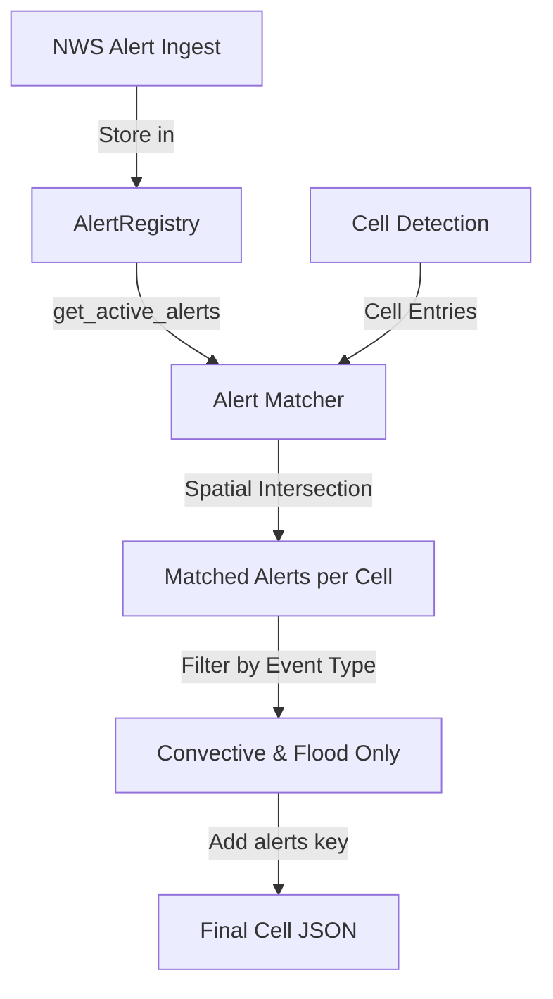

# Plan: Add "alerts" Key to Storm Cells

## Overview
Add an `alerts` key to each storm cell's JSON entry that lists active NWS alerts (convective and flood-related only) whose polygons intersect with or contain the cell.

## Architecture



## Implementation Steps

### 1. Define Alert Event Type Filter

Create a whitelist of convective and flood-related alert events in [`src/EdgeWARN/core/ingest/nws/main.py`](src/EdgeWARN/core/ingest/nws/main.py:45):

**Convective Events:**
- Tornado Warning
- Severe Thunderstorm Warning
- Tornado Watch
- Severe Thunderstorm Watch
- Special Weather Statement (convective-related)

**Flood Events:**
- Flash Flood Warning
- Flood Warning
- Flash Flood Watch
- Flood Watch
- Flood Advisory
- Flash Flood Emergency

These will be defined as `CONVECTIVE_FLOOD_EVENTS` set to filter alerts when assigning to cells.

### 2. Create Alert-to-Cell Spatial Matching Module

Create new file: [`src/EdgeWARN/core/process/detect/tools/alert_matcher.py`](src/EdgeWARN/core/process/detect/tools)

**Key Functions:**
- `load_active_alerts(registry_path)` - Load alerts from AlertRegistry
- `filter_convective_flood_alerts(alerts)` - Filter by event type whitelist
- `cell_intersects_alert(cell_bbox, alert_polygon)` - Check spatial intersection using shapely
- `match_alerts_to_cell(cell_entry, alerts)` - Return list of matching alert IDs/events

**Spatial Matching Strategy:**
1. For each cell, extract its `bbox` (list of [lat, lon] points)
2. For each active alert, extract its `Polygon` (from GeoMapper processing)
3. Use shapely to check if cell bbox intersects alert polygon
4. Alternative optimization: Check if cell centroid is within alert polygon (faster)

### 3. Integrate Alert Matching into Detection Pipeline

Modify [`src/EdgeWARN/core/process/detect/main.py`](src/EdgeWARN/core/process/detect/main.py:1):

**Integration Points:**
- After cell entries are created/tracked in dual-frame mode
- After single-frame mode creates entries
- Before saving to JSON file

**Code Flow:**
```python
# In main.py after entries are prepared
from EdgeWARN.core.process.detect.tools.alert_matcher import match_alerts_to_cells

# Add alerts to each cell
entries_with_alerts = match_alerts_to_cells(entries, fs.NWS_REGISTRY_PATH)
```

### 4. Update Cell Entry Structure

Modify [`src/EdgeWARN/core/process/detect/tools/save.py`](src/EdgeWARN/core/process/detect/tools/save.py:214) or apply in main.py:

**New Cell Entry Format:**
```json
{
  "id": 123,
  "num_gates": 456,
  "centroid": [35.5, -97.3],
  "bbox": [[35.4, -97.4], [35.4, -97.2], [35.6, -97.2], [35.6, -97.4]],
  "alerts": [
    "urn:oid:2.49.0.1.840.0.2406210827.1",
    "urn:oid:2.49.0.1.840.0.2406210828.1"
  ],
  ...
}
```

**Empty Case:**
```json
"alerts": []
```

### 5. Update Documentation

Update [`docs/EdgeWARN_Data_Keys.md`](docs/EdgeWARN_Data_Keys.md:14) with new field:

| Key | Type | Description |
|-----|------|-------------|
| alerts | List[string] | List of alert IDs (urn:oid:...) for active NWS convective/flood alerts intersecting this cell |

### 6. Testing Strategy

**Unit Tests** ([`tests/core/process/detect/test_alert_matcher.py`](tests/core/process/detect)):
- Test event type filtering
- Test spatial intersection logic with known geometries
- Test empty alert registry handling
- Test cell with multiple alerts

**Integration Tests:**
- Test end-to-end in detection pipeline
- Verify alerts appear in output JSON
- Verify non-convective alerts (e.g., "Gale Watch") are excluded

## Files to Modify

1. **New:** `src/EdgeWARN/core/process/detect/tools/alert_matcher.py`
2. **Modify:** `src/EdgeWARN/core/process/detect/main.py` - Integration point
3. **Modify:** `src/EdgeWARN/core/ingest/nws/main.py` - Add `CONVECTIVE_FLOOD_EVENTS` whitelist
4. **Modify:** `docs/EdgeWARN_Data_Keys.md` - Document new field
5. **New:** `tests/core/process/detect/test_alert_matcher.py`

## Dependencies

- `shapely` - Already used in geomapper.py for polygon operations
- Existing AlertRegistry from `src/EdgeWARN/core/ingest/nws/registry.py`

## Edge Cases to Handle

1. **No Active Alerts:** Return empty `alerts: []` list
2. **No Alert Registry:** Gracefully handle missing registry file (return empty)
3. **Malformed Alert Polygons:** Skip alerts with invalid geometry
4. **Cell Outside All Alerts:** Empty alerts list
5. **Multiple Alerts Same Cell:** Include all matching alerts
6. **Expired Alerts:** Registry cleanup handles this, but double-check expires field

## Performance Considerations

1. Use shapely's prepared geometries for repeated intersection tests
2. Cache active alerts lookup (registry already cached)
3. Consider bounding-box pre-filter before expensive polygon intersection
4. Alert matching should add <100ms to detection pipeline
