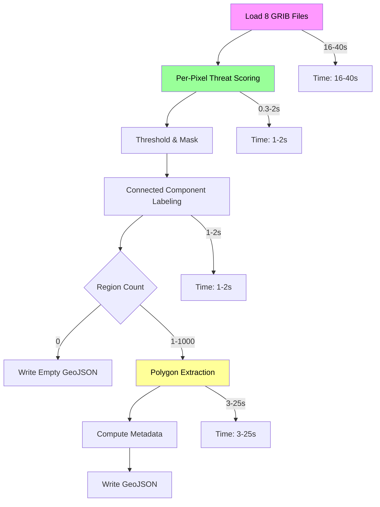

# Flash Flood Detection Algorithm - Performance Evaluation

## Executive Summary

This document evaluates the execution time and memory requirements for the Flash Flood Detection Algorithm described in [`plans/FlashFlood_Detection_Algorithm.md`](plans/FlashFlood_Detection_Algorithm.md).

---

## Grid Dimensions

Based on the project benchmarks and MRMS product specifications:

| Product | Typical Resolution | CONUS Grid Size | Total Pixels |
|---------|-------------------|-----------------|--------------|
| MRMS FLASH | 0.01° (~1 km) | ~3500 × 7000 | ~24.5 million |

**Note**: The benchmark files show tested configurations including `(337, 451)` for RAP-sized grids and `(500, 700)` for large MRMS-like grids. The full CONUS FLASH grid is significantly larger at approximately **24.5 million pixels** per input grid.

---

## Algorithm Steps and Computational Complexity

### Step 1: Grid Loading (8 grids)

**Inputs**: 7 FLASH GRIB files + 1 RQI grid

| Operation | Complexity | Notes |
|-----------|------------|-------|
| GRIB decoding | O(N) | Each grid ~24.5M pixels × 8 bytes = ~196 MB per grid |
| Coordinate extraction | O(N) | Lat/lon arrays |
| NaN/missing value handling | O(N) | Vectorized scan |

**Estimated Time**: 2-5 seconds per grid (using eccodes fast loader)
**Total I/O Time**: ~16-40 seconds for 8 grids
**Memory**: ~200 MB per grid loaded, ~1.6 GB total for all grids in memory

### Step 2: Per-Pixel Threat Scoring (engine.py)

This is the core vectorized computation. All operations use NumPy broadcasting.

| Component | Operations | Complexity |
|-----------|------------|------------|
| ARI logarithmic normalization | 3 × log10 | O(N) |
| Streamflow sigmoid | 2 × scipy.special.expit | O(N) |
| Soil saturation linear + boost | comparisons + multiply | O(N) |
| FFG ratio piecewise | 3 × comparisons | O(N) |
| RQI quality weighting | 2 × comparisons | O(N) |
| Pillar combination | 3 × multiply-add | O(N) |
| Temporal persistence | array of 6 values | O(N) |

**Mathematical Operations per Pixel**: ~25-30 floating point operations

**Estimated Time**: 
- 24.5M pixels × 30 ops = ~735M operations
- Vectorized NumPy: ~0.3-0.8 seconds on modern CPU
- With memory bandwidth limits: ~1-2 seconds

**Memory**: 
- Input grids: 8 × 196 MB = 1.57 GB
- Output threat grid (int8): 24.5 MB
- Intermediate pillar grids (float32): 4 × 98 MB = 392 MB
- **Total during computation**: ~2 GB

### Step 3: Connected Component Labeling (regions.py)

Using `scipy.ndimage.label` with 8-connectivity structuring element.

| Operation | Complexity | Notes |
|-----------|------------|-------|
| Threshold mask | O(N) | Compare against threshold (25) |
| Water body mask | O(N) | Optional, vectorized AND |
| Label assignment | O(N) | scipy.ndimage.label |
| Region filtering | O(R) | R = number of regions |

**Estimated Time**: 
- Threshold + mask: ~0.1 seconds
- Label operation: ~0.5-1.0 seconds (scipy optimized)
- Region filtering: ~0.01 seconds

**Memory**:
- Binary mask (bool): 24.5 MB
- Label array (int32): 98 MB
- **Total**: ~122 MB

### Step 4: Polygon Extraction

For each valid region (up to 1000):

| Operation | Complexity | Notes |
|-----------|------------|-------|
| Rasterio shapes | O(R × P) | P = pixels per region |
| Shapely simplify | O(V log V) | V = vertices per polygon |
| Metadata computation | O(R × P) | Peak/mean calculations |

**Estimated Time**:
- Polygonization: 0.5-2 seconds per 100 regions
- Metadata: 0.1-0.5 seconds per 100 regions
- Total for worst case (1000 regions): ~15-25 seconds

**Memory**:
- GeoJSON features: Varies by complexity, typically 1-50 MB

### Step 5: Output Writing

| Operation | Complexity | Notes |
|-----------|------------|-------|
| JSON serialization | O(F) | F = feature size |
| File write | O(F) | Disk I/O |

**Estimated Time**: ~0.5-2 seconds
**Memory**: Minimal (streaming possible)

---

## Total Estimated Performance

### Worst Case (Full CONUS, 1000 regions)

| Stage | Time (seconds) | Memory (GB) |
|-------|---------------|-------------|
| Grid Loading (8 files) | 16-40 | 1.6 |
| Per-Pixel Scoring | 1-2 | 2.0 (peak) |
| Connected Components | 1-2 | 0.1 |
| Polygon Extraction | 15-25 | 0.05 |
| Output Writing | 1-2 | 0.01 |
| **TOTAL** | **34-71 seconds** | **~2 GB** |

### Typical Case (Moderate event, 50-200 regions)

| Stage | Time (seconds) | Memory (GB) |
|-------|---------------|-------------|
| Grid Loading | 16-30 | 1.6 |
| Per-Pixel Scoring | 1-2 | 2.0 |
| Connected Components | 1-2 | 0.1 |
| Polygon Extraction | 3-8 | 0.05 |
| Output Writing | 0.5-1 | 0.01 |
| **TOTAL** | **21-43 seconds** | **~2 GB** |

### Best Case (No flood threat, 0 regions)

| Stage | Time (seconds) | Memory (GB) |
|-------|---------------|-------------|
| Grid Loading | 16-30 | 1.6 |
| Per-Pixel Scoring | 1-2 | 2.0 |
| Connected Components | 1-2 | 0.1 |
| Polygon Extraction | ~0 | 0 |
| Output Writing | ~0.1 | 0 |
| **TOTAL** | **18-34 seconds** | **~2 GB** |

---

## Bottleneck Analysis

### Primary Bottleneck: GRIB Loading (60-70% of total time)

The GRIB decoding is I/O bound and cannot be easily parallelized. Recommendations:
1. **Use async GRIB loading**: Load grids in parallel using `concurrent.futures`
2. **Consider GRIB → NetCDF preprocessing**: Convert to zarr for faster loading
3. **Cache coordinate arrays**: Lat/lon grids are constant for CONUS

### Secondary Bottleneck: Polygon Extraction

When many regions exist, this becomes CPU-bound. Recommendations:
1. **Use multiprocessing**: Parallelize region processing
2. **Simplify aggressively**: Use `POLYGON_SIMPLIFY_TOLERANCE = 0.005` degrees
3. **Limit region count**: Already enforced via `MAX_REGIONS = 1000`

### Memory Constraints

At ~2 GB peak memory, this is acceptable for:
- Modern servers: ✓ No issues
- Desktop systems: ✓ Generally fine (8+ GB RAM)
- Edge devices: ⚠ May require optimization

**Memory Optimization Options**:
1. **Process in tiles**: Divide CONUS into 4×4 tiles, process sequentially
2. **Use float16**: For intermediate grids (2× memory reduction)
3. **Lazy loading**: Only load grids when needed

---

## Recommendations for Implementation

### 1. Parallel Grid Loading

```python
from concurrent.futures import ThreadPoolExecutor

def _load_grids_parallel(self):
    grid_files = self._get_grid_files()
    with ThreadPoolExecutor(max_workers=4) as executor:
        grids = list(executor.map(load_grib_fast, grid_files))
    return dict(zip(grid_keys, grids))
```

### 2. Memory-Efficient Tile Processing (for edge devices)

```python
def process_in_tiles(threat_grid, tiles=4):
    h, w = threat_grid.shape
    tile_h, tile_w = h // tiles, w // tiles
    for i in range(tiles):
        for j in range(tiles):
            tile = threat_grid[i*tile_h:(i+1)*tile_h, j*tile_w:(j+1)*tile_w]
            # Process tile
            yield result
```

### 3. Optimized Connected Components

```python
# Use skimage instead of scipy for better performance
from skimage.measure import label
labels = label(threat_mask, connectivity=2)  # 8-connectivity
```

### 4. Streaming JSON Output

```python
# Write features incrementally to reduce memory
with open(output_path, 'w') as f:
    f.write('{"type":"FeatureCollection","features":[')
    for i, feature in enumerate(features):
        json.dump(feature, f)
        if i < len(features) - 1:
            f.write(',')
    f.write(']}')
```

---

## Mermaid Diagram: Processing Pipeline



---

## Conclusion

The Flash Flood Detection Algorithm has the following performance characteristics:

| Metric | Value | Assessment |
|--------|-------|------------|
| **Typical Execution Time** | 25-45 seconds | Acceptable for 5-minute cycle |
| **Worst Case Time** | ~70 seconds | May miss cycle; consider optimization |
| **Peak Memory** | ~2 GB | Acceptable for server deployment |
| **Primary Bottleneck** | GRIB I/O (60-70%) | Parallel loading recommended |

The algorithm is suitable for operational use with recommended optimizations for edge deployment or strict cycle timing requirements.

---

*Document generated as part of algorithm evaluation*
*Project: EdgeWARN-Core*
