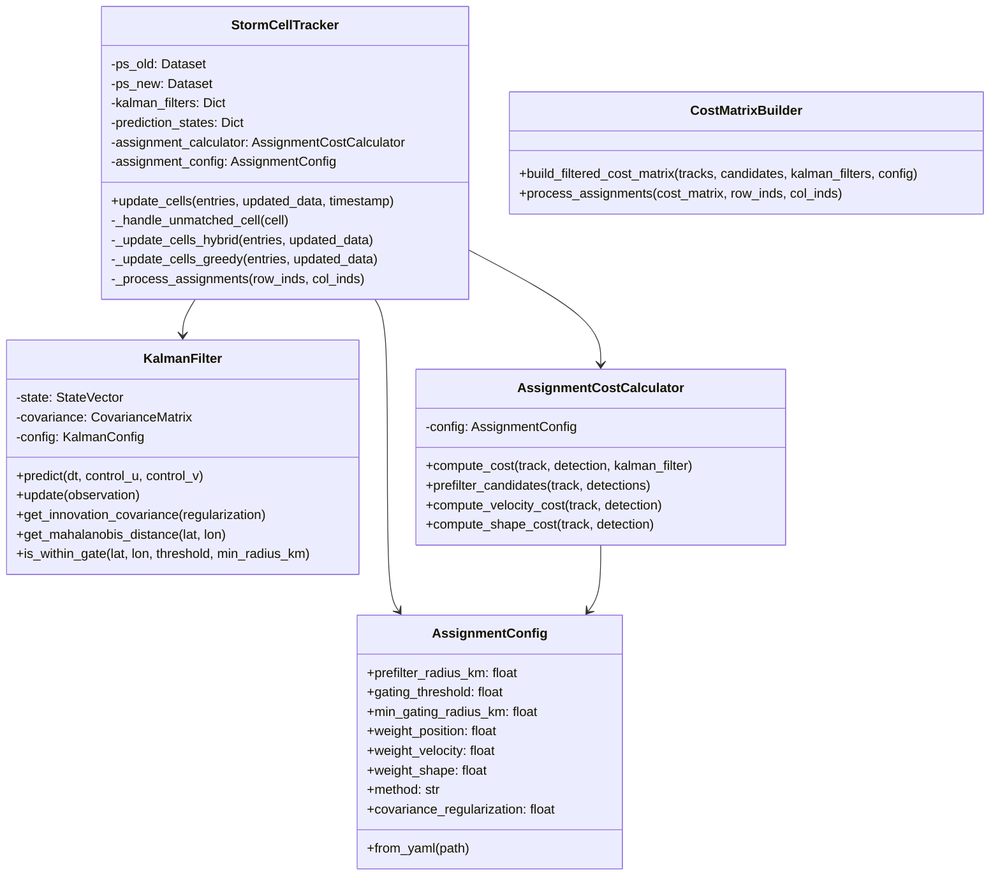

# Implementation Plan: Storm Cell Kalman Tracking System

## Overview

This document outlines the implementation plan for the Storm Cell Kalman Tracking System as described in PRD_Kalman_Tracking_System.md. The system consists of two major components:

1. **Kalman Filter Continuity Tracking** - Already partially implemented
2. **Advanced Measurement Assignment** - New implementation required

## Current State Analysis

### Already Implemented

| Component | File | Status |
|-----------|------|--------|
| KalmanFilter core | [`filter.py`](src/EdgeWARN/core/process/detect/kalman/filter.py) | ✅ Complete |
| StateVector | [`state.py`](src/EdgeWARN/core/process/detect/kalman/state.py) | ✅ Complete |
| CovarianceMatrix | [`state.py`](src/EdgeWARN/core/process/detect/kalman/state.py) | ✅ Complete |
| KalmanConfig | [`config.py`](src/EdgeWARN/core/process/detect/kalman/config.py) | ✅ Complete |
| TrackingConfig | [`config.py`](src/EdgeWARN/core/process/detect/kalman/config.py) | ✅ Complete |
| ConfidenceCalculator | [`confidence.py`](src/EdgeWARN/core/process/detect/kalman/confidence.py) | ✅ Complete |
| PredictionState | [`confidence.py`](src/EdgeWARN/core/process/detect/kalman/confidence.py) | ✅ Complete |
| StormCellTracker | [`track.py`](src/EdgeWARN/core/process/detect/track.py) | ⚠️ Needs update |
| haversine_distance | [`state.py`](src/EdgeWARN/core/process/detect/kalman/state.py) | ✅ Complete |

### Missing Components

| Component | Description | Priority |
|-----------|-------------|----------|
| Mahalanobis distance methods | `get_innovation_covariance()`, `get_mahalanobis_distance()`, `is_within_gate()` | High |
| AssignmentConfig | Configuration for measurement assignment | High |
| AssignmentCostCalculator | Cost function computation | High |
| Pre-filtering logic | Stage 1 of hybrid approach | High |
| Hungarian algorithm integration | Stage 2 of hybrid approach | High |
| Updated StormCellTracker | Integration of hybrid assignment | High |

---

## Implementation Architecture

### File Structure

```
src/EdgeWARN/core/process/detect/
├── kalman/
│   ├── __init__.py          # Updated exports
│   ├── filter.py            # Extended with Mahalanobis methods
│   ├── state.py             # No changes needed
│   ├── config.py            # Add AssignmentConfig
│   ├── confidence.py        # No changes needed
│   └── assignment.py        # NEW: Assignment module
├── track.py                 # Updated with hybrid assignment
└── main.py                  # No changes needed
```

### Class Diagram



---

## Detailed Implementation Steps

### Step 1: Extend KalmanFilter with Mahalanobis Methods

**File:** [`filter.py`](src/EdgeWARN/core/process/detect/kalman/filter.py)

Add three new methods to the `KalmanFilter` class:

```python
def get_innovation_covariance(self, regularization: float = 1e-6) -> np.ndarray:
    """
    Compute innovation covariance S = H * P * H^T + R.
    
    The innovation covariance represents the uncertainty in the measurement
    prediction, combining state uncertainty and measurement noise.
    """
    P = self.covariance.to_array()
    S = self._H @ P @ self._H.T + self._R
    # Add regularization for numerical stability
    S += np.eye(2) * regularization
    return S

def get_mahalanobis_distance(self, lat: float, lon: float) -> float:
    """
    Calculate Mahalanobis distance to a measurement.
    
    The Mahalanobis distance measures how many standard deviations away
    a point is from the predicted distribution, accounting for covariance.
    """
    x = self.state.to_array()
    z_pred = self._H @ x  # Predicted measurement
    z = np.array([lat, lon])
    y = z - z_pred  # Innovation
    S = self.get_innovation_covariance()
    d_m = np.sqrt(y.T @ np.linalg.inv(S) @ y)
    return float(d_m)

def is_within_gate(self, lat: float, lon: float, 
                   threshold: float = 6.0,
                   min_radius_km: float = 2.0) -> bool:
    """
    Check if measurement is within validation gate.
    
    Uses Mahalanobis distance with minimum radius fallback for
    collapsed covariance scenarios.
    """
    d_m = self.get_mahalanobis_distance(lat, lon)
    if d_m <= threshold:
        return True
    
    # Fallback for collapsed covariance
    pred_lat, pred_lon = self.state.get_position()
    euclidean_dist = haversine_distance(lat, lon, pred_lat, pred_lon)
    return euclidean_dist <= min_radius_km
```

### Step 2: Add AssignmentConfig to config.py

**File:** [`config.py`](src/EdgeWARN/core/process/detect/kalman/config.py)

Add a new dataclass for assignment configuration:

```python
@dataclass
class AssignmentConfig:
    """Configuration for measurement assignment algorithm."""
    
    # Pre-filtering (Stage 1)
    prefilter_radius_km: float = 16.0  # 10 miles
    
    # Gating parameters (Stage 2)
    gating_threshold: float = 6.0  # Chi-squared 95% confidence
    min_gating_radius_km: float = 2.0  # Floor for collapsed covariance
    
    # Cost function weights
    weight_position: float = 1.0
    weight_velocity: float = 2.0
    weight_shape: float = 0.5
    
    # Algorithm selection
    method: str = "hybrid"  # hybrid, hungarian, or greedy
    
    # Numerical stability
    covariance_regularization: float = 1e-6
    
    @classmethod
    def from_yaml(cls, path: Optional[Path] = None) -> "AssignmentConfig":
        """Load configuration from YAML file."""
        # Implementation similar to other config classes
```

### Step 3: Create assignment.py Module

**File:** [`assignment.py`](src/EdgeWARN/core/process/detect/kalman/assignment.py) (NEW)

This module contains:

1. **AssignmentCostCalculator** - Computes cost for track-detection pairs
2. **CostMatrixBuilder** - Builds and processes cost matrices
3. **Helper functions** for velocity and shape cost computation

Key methods:

```python
class AssignmentCostCalculator:
    def compute_cost(self, track: Dict, detection: Dict, 
                     kalman_filter: KalmanFilter) -> float:
        """Compute total assignment cost."""
        d_pos = kalman_filter.get_mahalanobis_distance(...)
        d_vel = self._compute_velocity_cost(track, detection)
        d_shape = self._compute_shape_cost(track, detection)
        return (self.config.weight_position * d_pos +
                self.config.weight_velocity * d_vel +
                self.config.weight_shape * d_shape)
    
    def prefilter_candidates(self, track: Dict, 
                             detections: List[Dict]) -> List[Dict]:
        """Stage 1: Filter detections within prefilter_radius_km."""
```

```python
def build_filtered_cost_matrix(tracks: List[Dict], 
                               track_candidates: Dict[int, List[Dict]],
                               kalman_filters: Dict[int, KalmanFilter],
                               config: AssignmentConfig) -> np.ndarray:
    """Build cost matrix for pre-filtered candidates."""
```

### Step 4: Update StormCellTracker

**File:** [`track.py`](src/EdgeWARN/core/process/detect/track.py)

Modify the `update_cells` method to support hybrid assignment:

```python
def update_cells(self, entries, updated_data, timestamp=None, dt_seconds=120.0):
    method = self.assignment_config.method
    if method == 'hybrid':
        return self._update_cells_hybrid(entries, updated_data, ...)
    elif method == 'hungarian':
        return self._update_cells_hungarian(entries, updated_data, ...)
    else:
        return self._update_cells_greedy(entries, updated_data, ...)
```

Add new methods:

```python
def _update_cells_hybrid(self, entries, updated_data, timestamp, dt_seconds):
    """Hybrid pre-filter + Hungarian assignment."""
    # 1. Separate Active vs. Predicted tracks
    # 2. Stage 1: Pre-filter candidates for each track
    # 3. Stage 2: Build reduced cost matrix and solve
    # 4. Process Assignments
```

### Step 5: Update Configuration File

**File:** [`config/kalman.yaml`](config/kalman.yaml)

Add assignment parameters:

```yaml
assignment:
  # Pre-filtering (Stage 1)
  prefilter_radius_km: 16.0       # 10 miles - spatial pre-filter radius
  
  # Gating parameters (Stage 2)
  gating_threshold: 6.0           # Chi-squared 95% confidence
  min_gating_radius_km: 2.0       # Floor for collapsed covariance
  
  # Cost function weights
  weights:
    position: 1.0                 # Mahalanobis distance
    velocity_direction: 2.0       # High penalty for backward motion
    size_similarity: 0.5          # Lower weight - more variable
  
  # Algorithm selection (for A/B testing)
  method: hybrid                  # hybrid, hungarian, or greedy
  
  # Numerical stability
  covariance_regularization: 1e-6
```

### Step 6: Update __init__.py

**File:** [`__init__.py`](src/EdgeWARN/core/process/detect/kalman/__init__.py)

Add exports for new classes:

```python
from .config import (
    # ... existing ...
    AssignmentConfig,
    DEFAULT_ASSIGNMENT_CONFIG,
)

from .assignment import (
    AssignmentCostCalculator,
    build_filtered_cost_matrix,
)
```

---

## Testing Plan

### Unit Tests

Create test file: [`tests/unit/test_kalman_assignment.py`](tests/unit/test_kalman_assignment.py)

| Test Case | Description |
|-----------|-------------|
| `test_get_innovation_covariance` | Verify S = H * P * H^T + R |
| `test_get_mahalanobis_distance` | Verify distance calculation |
| `test_is_within_gate_accept` | Point inside gate accepted |
| `test_is_within_gate_reject` | Point outside gate rejected |
| `test_is_within_gate_fallback` | Min radius fallback works |
| `test_prefilter_candidates` | Only nearby detections returned |
| `test_compute_cost` | Cost function weights applied |
| `test_velocity_cost` | Angular deviation penalty |
| `test_shape_cost` | Reflectivity/size difference |

### Integration Tests

Create test file: [`tests/integration/test_tracking_assignment.py`](tests/integration/test_tracking_assignment.py)

| Test Case | Description |
|-----------|-------------|
| `test_hungarian_assignment_crossed_paths` | Crossed storm paths handled correctly |
| `test_hybrid_assignment_single_candidate` | Direct assignment for single candidate |
| `test_hybrid_assignment_multiple_candidates` | Hungarian for multiple candidates |
| `test_storm_split_scenario` | One track, two detections |
| `test_storm_merge_scenario` | Two tracks, one detection |
| `test_tracking_continuity` | Storm tracked through temporary drop |
| `test_reacquisition_merge` | Merge when cell re-detected |
| `test_termination_after_timeout` | Removal after max scans |

---

## Migration Strategy

### Feature Flag Approach

The `method` parameter in `AssignmentConfig` allows switching between:
- `hybrid` (recommended) - Pre-filter + Hungarian
- `hungarian` - Full Hungarian without pre-filtering
- `greedy` - Legacy nearest-neighbor (fallback)

### Rollback Procedure

1. Change `method: greedy` in config
2. No data migration required
3. Kalman filter state is method-agnostic

---

## Dependencies

### Internal
- StormCast module - Motion prediction for velocity initialization
- CellDataSaver - Data persistence

### External
- `numpy` - Matrix operations (already used)
- `scipy.optimize.linear_sum_assignment` - Hungarian algorithm (NEW)

---

## Estimated File Changes

| File | Lines Added | Lines Modified | Complexity |
|------|-------------|----------------|------------|
| filter.py | ~50 | ~5 | Medium |
| config.py | ~40 | ~5 | Low |
| assignment.py | ~200 | 0 | High |
| track.py | ~100 | ~50 | High |
| kalman.yaml | ~20 | 0 | Low |
| __init__.py | ~10 | ~5 | Low |
| test_kalman_assignment.py | ~300 | 0 | Medium |
| test_tracking_assignment.py | ~250 | 0 | High |

**Total:** ~970 new lines of code

---

## Implementation Order

1. **KalmanFilter extensions** - Foundation for gating
2. **AssignmentConfig** - Configuration support
3. **assignment.py module** - Core assignment logic
4. **StormCellTracker update** - Integration
5. **Configuration file** - Runtime parameters
6. **Unit tests** - Verify components
7. **Integration tests** - End-to-end validation

---

## Success Criteria

| Metric | Target |
|--------|--------|
| False positive rate | < 5% |
| Re-acquisition rate | > 80% |
| Mean position error | < 3 km |
| Warning continuity | > 90% |
| ID switching | < 5% |
| Performance | < 200ms for 100 tracks |
