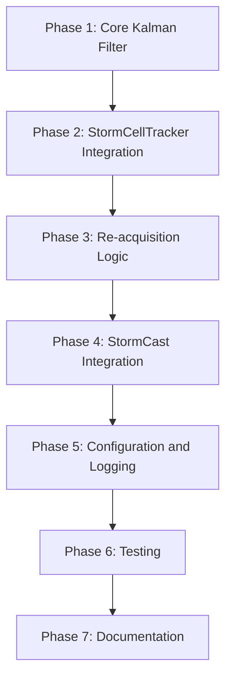

# Implementation Plan: Storm Cell Kalman Filter

## Overview

This implementation plan breaks down the Storm Cell Kalman Filter feature into actionable tasks based on the PRD at [`PRD_StormCell_KalmanFilter.md`](PRD_StormCell_KalmanFilter.md).

---

## Phase 1: Core Kalman Filter Implementation

### 1.1 Create Kalman Filter Module Structure

- [ ] Create directory `src/EdgeWARN/core/process/detect/kalman/`
- [ ] Create `__init__.py` with module exports
- [ ] Create `config.py` with configuration parameters

### 1.2 Implement State Vector and Covariance Classes

- [ ] Create `state.py` with `StateVector` class
  - [ ] Implement 6-dimensional state (lat, lon, u, v, a_lat, a_lon)
  - [ ] Add `to_array()` and `from_array()` methods
  - [ ] Add coordinate conversion utilities (lat/lon to meters and back)

- [ ] Create `state.py` with `CovarianceMatrix` class
  - [ ] Implement 6x6 covariance matrix management
  - [ ] Add initialization methods for position/velocity uncertainty

### 1.3 Implement Kalman Filter Core

- [ ] Create `filter.py` with `KalmanFilter` class
  - [ ] Implement `__init__()` with configurable noise parameters
  - [ ] Implement `predict(dt)` method with state transition matrix
  - [ ] Implement `update(observation)` method with Kalman gain calculation
  - [ ] Implement `get_state()` and `get_covariance()` getters
  - [ ] Add StormCast velocity integration as control input

### 1.4 Implement Confidence Calculator

- [ ] Create `confidence.py` with `ConfidenceCalculator` class
  - [ ] Implement confidence decay formula
  - [ ] Add motion consistency factor calculation
  - [ ] Implement `should_terminate()` method

---

## Phase 2: Integration with StormCellTracker

### 2.1 Extend Storm Cell Data Structure

- [ ] Add `tracking_mode` field to cell entries
- [ ] Add `prediction_count` field to cell entries
- [ ] Add `confidence` field to cell entries
- [ ] Add `kalman_state` object to cell entries
- [ ] Add `kalman_history` array to cell entries

### 2.2 Modify StormCellTracker Class

- [ ] Update [`track.py`](src/EdgeWARN/core/process/detect/track.py) to import Kalman filter
- [ ] Add `KalmanFilter` instance to `StormCellTracker.__init__()`
- [ ] Add `_initialize_kalman(cell)` method for new cells
- [ ] Add `_update_with_observation(cell, observation)` method
- [ ] Add `_predict_step(cell, dt)` method

### 2.3 Implement Prediction Mode Logic

- [ ] Modify `update_cells()` to handle unmatched cells:
  - [ ] Check if cell has Kalman state
  - [ ] Enter prediction mode instead of removing
  - [ ] Increment `prediction_count`
  - [ ] Update confidence
  - [ ] Check termination conditions (time limit, confidence threshold)

---

## Phase 3: Re-acquisition Logic

### 3.1 Implement Re-acquisition Detection

- [ ] Add `_check_reacquisition(predicted_cell, new_cells)` method
  - [ ] Calculate distance to all new cells
  - [ ] Check if within 5km radius
  - [ ] Check motion consistency (velocity within 2σ)

### 3.2 Implement Merge Logic

- [ ] Add `_merge_cells(predicted_cell, new_cell)` method
  - [ ] Assign old cell ID to new cell
  - [ ] Preserve `storm_history` from predicted cell
  - [ ] Reset `tracking_mode` to "active"
  - [ ] Reset `confidence` to 1.0
  - [ ] Update Kalman state with observation

### 3.3 Update Main Tracking Loop

- [ ] Modify `update_cells()` to check for re-acquisition before adding new cells
- [ ] Log re-acquisition events for debugging

---

## Phase 4: StormCast Integration

### 4.1 Use StormCast for Velocity Initialization

- [ ] Extract StormCast `u`, `v` from `modules.StormCast` in cell data
- [ ] Use StormCast velocity as initial Kalman velocity state
- [ ] Fallback to historical `dx`, `dy`, `dt` if StormCast unavailable

### 4.2 Use StormCast for Prediction Mode

- [ ] During prediction mode, use StormCast motion vectors
- [ ] Update Kalman state with StormCast velocity as control input
- [ ] Handle StormCast module failures gracefully

---

## Phase 5: Configuration and Logging

### 5.1 Create Configuration File

- [ ] Create `config/kalman.yaml` with all parameters
- [ ] Add configuration loading in `config.py`

### 5.2 Add Logging

- [ ] Add logging for mode transitions (active → predicted → terminated)
- [ ] Add logging for re-acquisition events
- [ ] Add logging for confidence updates
- [ ] Add performance timing for Kalman operations

---

## Phase 6: Testing

### 6.1 Unit Tests

- [ ] Create `tests/unit/test_kalman_filter.py`
  - [ ] `test_state_vector_initialization()`
  - [ ] `test_covariance_initialization()`
  - [ ] `test_predict_step()`
  - [ ] `test_update_step()`
  - [ ] `test_confidence_decay()`
  - [ ] `test_termination_conditions()`

### 6.2 Integration Tests

- [ ] Create `tests/integration/test_kalman_tracking.py`
  - [ ] `test_tracking_continuity_through_drop()`
  - [ ] `test_reacquisition_merge()`
  - [ ] `test_termination_after_timeout()`
  - [ ] `test_termination_after_low_confidence()`
  - [ ] `test_stormcast_velocity_integration()`

### 6.3 Validation Tests

- [ ] Create test dataset with known ProbSevere drop scenarios
- [ ] Validate position error against actual re-detections
- [ ] Measure false positive rate

---

## Phase 7: Documentation

### 7.1 Update Documentation

- [ ] Update [`Process_Detection.md`](docs/Process_Detection.md) with Kalman filter section
- [ ] Update [`EdgeWARN_Data_Keys.md`](docs/EdgeWARN_Data_Keys.md) with new fields
- [ ] Add inline code documentation

### 7.2 Create Usage Examples

- [ ] Add example configuration
- [ ] Add example output with Kalman fields

---

## File Changes Summary

| File | Action | Description |
|------|--------|-------------|
| `src/EdgeWARN/core/process/detect/kalman/__init__.py` | Create | Module exports |
| `src/EdgeWARN/core/process/detect/kalman/config.py` | Create | Configuration parameters |
| `src/EdgeWARN/core/process/detect/kalman/state.py` | Create | StateVector and CovarianceMatrix classes |
| `src/EdgeWARN/core/process/detect/kalman/filter.py` | Create | KalmanFilter class |
| `src/EdgeWARN/core/process/detect/kalman/confidence.py` | Create | ConfidenceCalculator class |
| `src/EdgeWARN/core/process/detect/track.py` | Modify | Add Kalman integration |
| `src/EdgeWARN/core/process/detect/main.py` | Modify | Initialize Kalman for new cells |
| `config/kalman.yaml` | Create | Configuration file |
| `docs/Process_Detection.md` | Modify | Add Kalman documentation |
| `docs/EdgeWARN_Data_Keys.md` | Modify | Add new data keys |

---

## Dependencies

- `numpy` - Matrix operations (already in project)
- `scipy` - Optional, for optimized Kalman implementation
- StormCast module - For velocity prediction

---

## Execution Order

