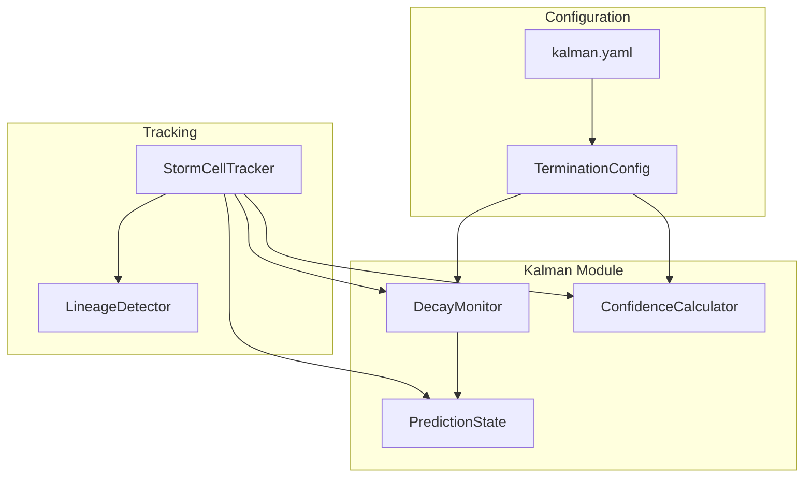

# Implementation Plan: Storm Cell Termination Handling

## Overview

This document provides a detailed implementation plan for the storm cell termination handling feature, building upon the PRD specifications. The implementation adds reflectivity-based decay detection with hysteresis to improve termination accuracy.

---

## 1. Architecture Changes

### 1.1 New Module: `decay.py`

Create a new module at [`src/EdgeWARN/core/process/detect/kalman/decay.py`](src/EdgeWARN/core/process/detect/kalman/decay.py) to handle reflectivity decay monitoring.

```
src/EdgeWARN/core/process/detect/kalman/
├── __init__.py          # Updated exports
├── config.py            # Extended with TerminationConfig
├── filter.py            # No changes
├── state.py             # No changes
├── confidence.py        # Extended PredictionState
├── assignment.py        # No changes
└── decay.py             # NEW: DecayMonitor class
```

### 1.2 Component Diagram



---

## 2. Detailed Specifications

### 2.1 Configuration Schema

#### File: [`config/kalman.yaml`](config/kalman.yaml)

Add new `termination` section:

```yaml
# Termination Configuration
# Controls when storm cells are removed from tracking
termination:
  # Reflectivity-based decay detection
  # Cells with max_refl below this threshold enter decay monitoring
  reflectivity_threshold_dbz: 30
  
  # Number of consecutive scans below threshold before decay is confirmed
  # At 2-minute scans, 3 scans = 6 minutes of observation
  decay_hysteresis_scans: 3
  
  # Dual-criterion termination mode
  # When true: BOTH reflectivity decay AND prediction exhaustion required
  # When false: Either criterion alone can trigger termination
  require_both_criteria: true
  
  # Maximum reflectivity history to retain for analysis
  max_refl_history_length: 10
```

#### File: [`src/EdgeWARN/core/process/detect/kalman/config.py`](src/EdgeWARN/core/process/detect/kalman/config.py)

Add `TerminationConfig` dataclass:

```python
@dataclass
class TerminationConfig:
    """
    Configuration for storm cell termination criteria.
    
    Attributes:
        reflectivity_threshold_dbz: Maximum reflectivity threshold for decay detection
        decay_hysteresis_scans: Consecutive scans below threshold to confirm decay
        require_both_criteria: Whether both decay and prediction must fail for termination
        max_refl_history_length: Number of recent max_refl values to retain
    """
    reflectivity_threshold_dbz: float = 30.0
    decay_hysteresis_scans: int = 3
    require_both_criteria: bool = True
    max_refl_history_length: int = 10
```

### 2.2 DecayMonitor Class

#### File: [`src/EdgeWARN/core/process/detect/kalman/decay.py`](src/EdgeWARN/core/process/detect/kalman/decay.py)

```python
"""
Reflectivity Decay Monitor for Storm Cell Termination

Monitors maximum reflectivity values to detect convective decay signatures
with hysteresis to prevent premature termination from transient fluctuations.
"""

from dataclasses import dataclass, field
from typing import List, Optional, Tuple
from enum import Enum


class DecayState(Enum):
    """
    Enumeration of decay monitoring states.
    
    States:
        HEALTHY: max_refl >= threshold, cell is convectively active
        DECAYING: max_refl < threshold, monitoring for hysteresis
        DECAY_CONFIRMED: max_refl < threshold for N consecutive scans
    """
    HEALTHY = "HEALTHY"
    DECAYING = "DECAYING"
    DECAY_CONFIRMED = "DECAY_CONFIRMED"


@dataclass
class DecayMonitor:
    """
    Monitors reflectivity decay for a single storm cell.
    
    Tracks consecutive scans below reflectivity threshold and provides
    decay state determination with hysteresis filtering.
    
    Attributes:
        threshold_dbz: Reflectivity threshold for decay detection
        hysteresis_scans: Required consecutive scans below threshold
        max_history: Maximum reflectivity history length
    """
    
    # Configuration
    threshold_dbz: float = 30.0
    hysteresis_scans: int = 3
    max_history: int = 10
    
    # State
    _decay_scan_count: int = field(default=0, repr=False)
    _max_refl_history: List[float] = field(default_factory=list, repr=False)
    _state: DecayState = field(default=DecayState.HEALTHY, repr=False)
    _last_max_refl: Optional[float] = field(default=None, repr=False)
    
    def update(self, max_refl: float) -> DecayState:
        """
        Update decay state with new reflectivity observation.
        
        Args:
            max_refl: Current maximum reflectivity in dBZ
            
        Returns:
            Current DecayState after processing the observation
        """
        # Store in history
        self._last_max_refl = max_refl
        self._max_refl_history.append(max_refl)
        if len(self._max_refl_history) > self.max_history:
            self._max_refl_history.pop(0)
        
        # Check threshold
        if max_refl >= self.threshold_dbz:
            # Reset - cell is healthy
            self._decay_scan_count = 0
            self._state = DecayState.HEALTHY
        else:
            # Below threshold - increment decay count
            self._decay_scan_count += 1
            
            if self._decay_scan_count >= self.hysteresis_scans:
                self._state = DecayState.DECAY_CONFIRMED
            else:
                self._state = DecayState.DECAYING
        
        return self._state
    
    def reset(self) -> None:
        """Reset decay monitoring state."""
        self._decay_scan_count = 0
        self._state = DecayState.HEALTHY
    
    @property
    def state(self) -> DecayState:
        """Current decay state."""
        return self._state
    
    @property
    def decay_scan_count(self) -> int:
        """Number of consecutive scans below threshold."""
        return self._decay_scan_count
    
    @property
    def is_decaying(self) -> bool:
        """True if cell is in DECAYING state."""
        return self._state == DecayState.DECAYING
    
    @property
    def is_decay_confirmed(self) -> bool:
        """True if decay has been confirmed via hysteresis."""
        return self._state == DecayState.DECAY_CONFIRMED
    
    @property
    def is_healthy(self) -> bool:
        """True if cell reflectivity is above threshold."""
        return self._state == DecayState.HEALTHY
    
    @property
    def last_max_refl(self) -> Optional[float]:
        """Most recent max_refl observation."""
        return self._last_max_refl
    
    @property
    def max_refl_history(self) -> List[float]:
        """Recent max_refl values."""
        return self._max_refl_history.copy()
    
    def to_dict(self) -> dict:
        """Serialize to dictionary."""
        return {
            'state': self._state.value,
            'decay_scan_count': self._decay_scan_count,
            'threshold_dbz': self.threshold_dbz,
            'hysteresis_scans': self.hysteresis_scans,
            'last_max_refl': self._last_max_refl,
            'max_refl_history': self._max_refl_history,
        }
    
    @classmethod
    def from_dict(cls, data: dict) -> 'DecayMonitor':
        """Deserialize from dictionary."""
        monitor = cls(
            threshold_dbz=data.get('threshold_dbz', 30.0),
            hysteresis_scans=data.get('hysteresis_scans', 3),
            max_history=data.get('max_history', 10),
        )
        monitor._decay_scan_count = data.get('decay_scan_count', 0)
        monitor._max_refl_history = data.get('max_refl_history', [])
        monitor._last_max_refl = data.get('last_max_refl')
        if 'state' in data:
            monitor._state = DecayState(data['state'])
        return monitor
```

### 2.3 Extended PredictionState

#### File: [`src/EdgeWARN/core/process/detect/kalman/confidence.py`](src/EdgeWARN/core/process/detect/kalman/confidence.py)

Extend `PredictionState` to include decay monitoring:

```python
@dataclass
class PredictionState:
    """
    Tracks the state of a storm cell in prediction mode.
    Extended to include reflectivity decay monitoring.
    """
    
    # Existing fields...
    scan_count: int = 0
    total_time_seconds: float = 0.0
    confidence: float = 1.0
    start_timestamp: Optional[str] = None
    last_update_timestamp: Optional[str] = None
    predicted_positions: List[Tuple[float, float]] = None
    
    # NEW: Decay monitoring fields
    decay_scan_count: int = 0
    decay_start_timestamp: Optional[str] = None
    max_refl_history: List[float] = field(default_factory=list)
    
    # ... existing methods ...
    
    def increment_decay(self, max_refl: float, timestamp: Optional[str] = None) -> None:
        """
        Increment decay state for a new scan below threshold.
        
        Args:
            max_refl: Current maximum reflectivity
            timestamp: Optional timestamp for decay start
        """
        if self.decay_scan_count == 0 and timestamp:
            self.decay_start_timestamp = timestamp
        
        self.decay_scan_count += 1
        self.max_refl_history.append(max_refl)
        
        # Limit history length
        if len(self.max_refl_history) > 10:
            self.max_refl_history.pop(0)
    
    def reset_decay(self) -> None:
        """Reset decay monitoring when reflectivity recovers."""
        self.decay_scan_count = 0
        self.decay_start_timestamp = None
        self.max_refl_history = []
    
    def reset(self) -> None:
        """Reset all prediction state including decay."""
        self.scan_count = 0
        self.total_time_seconds = 0.0
        self.confidence = 1.0
        self.start_timestamp = None
        self.last_update_timestamp = None
        self.predicted_positions = []
        # Reset decay
        self.decay_scan_count = 0
        self.decay_start_timestamp = None
        self.max_refl_history = []
```

### 2.4 Termination Decision Logic

#### File: [`src/EdgeWARN/core/process/detect/kalman/decay.py`](src/EdgeWARN/core/process/detect/kalman/decay.py)

Add termination decision function:

```python
@dataclass
class TerminationDecision:
    """
    Result of termination evaluation.
    
    Attributes:
        should_terminate: Whether the cell should be terminated
        reason: Human-readable reason for the decision
        decay_criterion_met: Whether reflectivity decay criterion is satisfied
        prediction_criterion_met: Whether prediction exhaustion criterion is satisfied
    """
    should_terminate: bool
    reason: str
    decay_criterion_met: bool = False
    prediction_criterion_met: bool = False


def evaluate_termination(
    decay_monitor: DecayMonitor,
    prediction_state: PredictionState,
    confidence: float,
    tracking_config: 'TrackingConfig',
    termination_config: 'TerminationConfig',
) -> TerminationDecision:
    """
    Evaluate whether a storm cell should be terminated.
    
    Implements dual-criterion termination logic:
    - If require_both_criteria=True: BOTH decay and prediction must fail
    - If require_both_criteria=False: Either criterion alone triggers termination
    
    Args:
        decay_monitor: Current decay monitoring state
        prediction_state: Current prediction mode state
        confidence: Current Kalman confidence score
        tracking_config: Tracking configuration
        termination_config: Termination configuration
        
    Returns:
        TerminationDecision with termination verdict and reasoning
    """
    # Evaluate individual criteria
    decay_criterion_met = decay_monitor.is_decay_confirmed
    
    # Prediction criterion: confidence below threshold OR time limit exceeded
    max_time_seconds = tracking_config.max_prediction_time_minutes * 60
    time_exceeded = prediction_state.total_time_seconds >= max_time_seconds
    confidence_exhausted = confidence < tracking_config.confidence_threshold
    prediction_criterion_met = time_exceeded or confidence_exhausted
    
    # Apply dual-criterion logic
    if termination_config.require_both_criteria:
        should_terminate = decay_criterion_met and prediction_criterion_met
    else:
        should_terminate = decay_criterion_met or prediction_criterion_met
    
    # Build reason string
    reasons = []
    if decay_criterion_met:
        reasons.append(
            f"reflectivity decay confirmed ({decay_monitor.decay_scan_count} scans below "
            f"{termination_config.reflectivity_threshold_dbz} dBZ)"
        )
    if prediction_criterion_met:
        if time_exceeded:
            reasons.append(
                f"prediction time exceeded ({prediction_state.total_time_seconds/60:.1f} min > "
                f"{tracking_config.max_prediction_time_minutes} min limit)"
            )
        else:
            reasons.append(
                f"confidence exhausted ({confidence:.2f} < "
                f"{tracking_config.confidence_threshold} threshold)"
            )
    
    reason = "; ".join(reasons) if reasons else "criteria not met"
    
    return TerminationDecision(
        should_terminate=should_terminate,
        reason=reason,
        decay_criterion_met=decay_criterion_met,
        prediction_criterion_met=prediction_criterion_met,
    )
```

---

## 3. Integration Changes

### 3.1 StormCellTracker Modifications

#### File: [`src/EdgeWARN/core/process/detect/track.py`](src/EdgeWARN/core/process/detect/track.py)

#### 3.1.1 Constructor Changes

```python
def __init__(
    self,
    ps_old: Any,
    ps_new: Any,
    io_manager: Any,
    lineage_buffer: Optional[LineageBuffer] = None,
    overlap_threshold: float = 0.30,
    tracking_config: Optional[TrackingConfig] = None,
    assignment_config: Optional[AssignmentConfig] = None,
    termination_config: Optional[TerminationConfig] = None,  # NEW
):
    # ... existing initialization ...
    
    # NEW: Termination configuration
    self.termination_config = termination_config or TerminationConfig()
    
    # NEW: Decay monitors (cell_id -> DecayMonitor)
    self._decay_monitors: Dict[int, DecayMonitor] = {}
```

#### 3.1.2 Update Cell Fields

Add decay state update to `_update_cell_fields`:

```python
def _update_cell_fields(self, cell: Dict, updated: Dict, timestamp: Optional[str]) -> None:
    """Update cell fields from new observation."""
    # ... existing field updates ...
    
    # NEW: Update decay monitoring
    cell_id = int(cell['id'])
    max_refl = updated.get('max_refl', cell.get('max_refl', 0))
    
    if cell_id in self._decay_monitors:
        self._decay_monitors[cell_id].update(max_refl)
    
    # NEW: Add decay state to cell
    if cell_id in self._decay_monitors:
        dm = self._decay_monitors[cell_id]
        cell['decay_state'] = dm.state.value
        cell['decay_scan_count'] = dm.decay_scan_count
```

#### 3.1.3 Handle Unmatched Cell

Modify `_handle_unmatched_cell` to incorporate decay:

```python
def _handle_unmatched_cell(self, cell: Dict, cell_id: int,
                           timestamp: Optional[str],
                           dt_seconds: float) -> bool:
    """
    Handle a cell that was not found in updated_data.
    Enters prediction mode if within time/confidence limits.
    Incorporates reflectivity decay monitoring.
    
    Returns: True if cell should continue tracking, False if terminated.
    """
    # Ensure KF exists
    if cell_id not in self._kalman_filters:
        return False
    
    kf = self._kalman_filters[cell_id]
    
    # Initialize prediction state if not exists
    if cell_id not in self._prediction_states:
        self._prediction_states[cell_id] = PredictionState(
            start_timestamp=timestamp
        )
    
    # NEW: Ensure decay monitor exists
    if cell_id not in self._decay_monitors:
        self._decay_monitors[cell_id] = DecayMonitor(
            threshold_dbz=self.termination_config.reflectivity_threshold_dbz,
            hysteresis_scans=self.termination_config.decay_hysteresis_scans,
        )
    
    pred_state = self._prediction_states[cell_id]
    decay_monitor = self._decay_monitors[cell_id]
    
    # Update decay monitor with current max_refl
    max_refl = cell.get('max_refl', 0)
    decay_monitor.update(max_refl)
    
    # Get StormCast velocity and perform Kalman prediction
    control_u, control_v = self._get_stormcast_velocity(cell)
    predicted_state = kf.predict(dt_seconds, control_u, control_v)
    
    # Update prediction state
    pred_state.increment(
        dt_seconds=dt_seconds,
        new_confidence=0.0,
        predicted_position=(predicted_state.lat, predicted_state.lon)
    )
    if timestamp: 
        pred_state.last_update_timestamp = timestamp
    
    # Calculate confidence
    vel_var = kf.covariance.get_velocity_variance()
    pos_unc = kf.covariance.get_position_std_km(kf.ref_lat)
    
    confidence = self.confidence_calc.calculate(
        scans_predicted=pred_state.scan_count,
        time_predicted_seconds=pred_state.total_time_seconds,
        velocity_variance=vel_var,
        position_uncertainty_km=pos_unc
    )
    pred_state.confidence = confidence
    
    # NEW: Evaluate termination with dual criteria
    from .kalman.decay import evaluate_termination
    decision = evaluate_termination(
        decay_monitor=decay_monitor,
        prediction_state=pred_state,
        confidence=confidence,
        tracking_config=self.tracking_config,
        termination_config=self.termination_config,
    )
    
    if decision.should_terminate:
        self.io_manager.write_info(
            f"Cell {cell_id} terminated: {decision.reason}"
        )
        # Clean up
        if cell_id in self._kalman_filters: 
            del self._kalman_filters[cell_id]
        if cell_id in self._prediction_states: 
            del self._prediction_states[cell_id]
        if cell_id in self._decay_monitors:
            del self._decay_monitors[cell_id]
        return False
    
    # Update cell with predicted position
    cell['centroid'] = [predicted_state.lat, predicted_state.lon]
    cell['tracking_mode'] = 'predicted'
    cell['prediction_count'] = pred_state.scan_count
    cell['confidence'] = confidence
    cell['kalman_predicted_centroid'] = [predicted_state.lat, predicted_state.lon]
    
    # NEW: Add decay state
    cell['decay_state'] = decay_monitor.state.value
    cell['decay_scan_count'] = decay_monitor.decay_scan_count
    
    if timestamp: 
        cell['timestamp'] = timestamp
    
    # Store Kalman state
    cell['kalman_state'] = kf.get_state_dict()
    
    return True
```

### 3.2 Module Exports

#### File: [`src/EdgeWARN/core/process/detect/kalman/__init__.py`](src/EdgeWARN/core/process/detect/kalman/__init__.py)

Add new exports:

```python
from .decay import (
    DecayState,
    DecayMonitor,
    TerminationDecision,
    evaluate_termination,
)

__all__ = [
    # ... existing exports ...
    
    # Decay monitoring
    'DecayState',
    'DecayMonitor',
    'TerminationDecision',
    'evaluate_termination',
]
```

---

## 4. Configuration Changes

### 4.1 Config Loading

#### File: [`src/EdgeWARN/core/process/detect/kalman/config.py`](src/EdgeWARN/core/process/detect/kalman/config.py)

Add configuration loading:

```python
def load_termination_config(config_path: str = "config/kalman.yaml") -> TerminationConfig:
    """
    Load termination configuration from YAML file.
    
    Args:
        config_path: Path to configuration file
        
    Returns:
        TerminationConfig with loaded values
    """
    import yaml
    from pathlib import Path
    
    config_file = Path(config_path)
    if not config_file.exists():
        return TerminationConfig()
    
    with open(config_file, 'r') as f:
        config = yaml.safe_load(f)
    
    term_config = config.get('termination', {})
    
    return TerminationConfig(
        reflectivity_threshold_dbz=term_config.get('reflectivity_threshold_dbz', 30.0),
        decay_hysteresis_scans=term_config.get('decay_hysteresis_scans', 3),
        require_both_criteria=term_config.get('require_both_criteria', True),
        max_refl_history_length=term_config.get('max_refl_history_length', 10),
    )
```

---

## 5. Testing Strategy

### 5.1 Unit Tests

#### File: [`tests/core/process/detect/kalman/test_decay.py`](tests/core/process/detect/kalman/test_decay.py)

```python
"""
Unit tests for decay monitoring module.
"""

import pytest
from EdgeWARN.core.process.detect.kalman.decay import (
    DecayState,
    DecayMonitor,
    TerminationDecision,
    evaluate_termination,
)
from EdgeWARN.core.process.detect.kalman.config import (
    TrackingConfig,
    TerminationConfig,
)
from EdgeWARN.core.process.detect.kalman.confidence import PredictionState


class TestDecayMonitor:
    """Tests for DecayMonitor class."""
    
    def test_healthy_state_above_threshold(self):
        """Cell with reflectivity above threshold should be HEALTHY."""
        monitor = DecayMonitor(threshold_dbz=30.0, hysteresis_scans=3)
        
        state = monitor.update(35.0)
        
        assert state == DecayState.HEALTHY
        assert monitor.is_healthy
        assert monitor.decay_scan_count == 0
    
    def test_decaying_state_single_scan(self):
        """Single scan below threshold should be DECAYING."""
        monitor = DecayMonitor(threshold_dbz=30.0, hysteresis_scans=3)
        
        state = monitor.update(25.0)
        
        assert state == DecayState.DECAYING
        assert monitor.is_decaying
        assert monitor.decay_scan_count == 1
    
    def test_decay_confirmed_after_hysteresis(self):
        """Decay should be confirmed after hysteresis scans."""
        monitor = DecayMonitor(threshold_dbz=30.0, hysteresis_scans=3)
        
        monitor.update(25.0)  # scan 1
        monitor.update(28.0)  # scan 2
        state = monitor.update(22.0)  # scan 3
        
        assert state == DecayState.DECAY_CONFIRMED
        assert monitor.is_decay_confirmed
        assert monitor.decay_scan_count == 3
    
    def test_reset_on_recovery(self):
        """Decay count should reset when reflectivity recovers."""
        monitor = DecayMonitor(threshold_dbz=30.0, hysteresis_scans=3)
        
        monitor.update(25.0)  # below threshold
        monitor.update(28.0)  # below threshold
        state = monitor.update(35.0)  # above threshold - recovery
        
        assert state == DecayState.HEALTHY
        assert monitor.decay_scan_count == 0
    
    def test_history_tracking(self):
        """Monitor should track reflectivity history."""
        monitor = DecayMonitor(threshold_dbz=30.0, max_history=5)
        
        for refl in [35.0, 32.0, 28.0, 25.0, 22.0]:
            monitor.update(refl)
        
        assert monitor.max_refl_history == [35.0, 32.0, 28.0, 25.0, 22.0]
    
    def test_history_truncation(self):
        """History should be truncated to max_history length."""
        monitor = DecayMonitor(threshold_dbz=30.0, max_history=3)
        
        for refl in [35.0, 32.0, 28.0, 25.0, 22.0]:
            monitor.update(refl)
        
        assert len(monitor.max_refl_history) == 3
        assert monitor.max_refl_history == [28.0, 25.0, 22.0]


class TestEvaluateTermination:
    """Tests for termination evaluation."""
    
    def test_no_termination_when_healthy(self):
        """Should not terminate when cell is healthy."""
        monitor = DecayMonitor(threshold_dbz=30.0, hysteresis_scans=3)
        monitor.update(35.0)  # healthy
        
        pred_state = PredictionState()
        tracking_config = TrackingConfig()
        term_config = TerminationConfig(require_both_criteria=True)
        
        decision = evaluate_termination(
            monitor, pred_state, 1.0, tracking_config, term_config
        )
        
        assert not decision.should_terminate
        assert not decision.decay_criterion_met
    
    def test_no_termination_decay_only(self):
        """With require_both_criteria, decay alone should not terminate."""
        monitor = DecayMonitor(threshold_dbz=30.0, hysteresis_scans=3)
        monitor.update(25.0)
        monitor.update(28.0)
        monitor.update(22.0)  # decay confirmed
        
        pred_state = PredictionState()
        tracking_config = TrackingConfig()
        term_config = TerminationConfig(require_both_criteria=True)
        
        decision = evaluate_termination(
            monitor, pred_state, 1.0, tracking_config, term_config
        )
        
        assert not decision.should_terminate
        assert decision.decay_criterion_met
        assert not decision.prediction_criterion_met
    
    def test_termination_both_criteria(self):
        """Should terminate when both criteria are met."""
        monitor = DecayMonitor(threshold_dbz=30.0, hysteresis_scans=3)
        monitor.update(25.0)
        monitor.update(28.0)
        monitor.update(22.0)  # decay confirmed
        
        pred_state = PredictionState()
        pred_state.total_time_seconds = 600  # 10 minutes
        tracking_config = TrackingConfig(max_prediction_time_minutes=10)
        term_config = TerminationConfig(require_both_criteria=True)
        
        decision = evaluate_termination(
            monitor, pred_state, 0.3, tracking_config, term_config
        )
        
        assert decision.should_terminate
        assert decision.decay_criterion_met
        assert decision.prediction_criterion_met
    
    def test_termination_either_criterion(self):
        """Without require_both_criteria, either criterion should terminate."""
        monitor = DecayMonitor(threshold_dbz=30.0, hysteresis_scans=3)
        monitor.update(25.0)
        monitor.update(28.0)
        monitor.update(22.0)  # decay confirmed
        
        pred_state = PredictionState()
        tracking_config = TrackingConfig()
        term_config = TerminationConfig(require_both_criteria=False)
        
        decision = evaluate_termination(
            monitor, pred_state, 1.0, tracking_config, term_config
        )
        
        assert decision.should_terminate
        assert decision.decay_criterion_met
```

### 5.2 Integration Tests

#### File: [`tests/integration/test_termination_integration.py`](tests/integration/test_termination_integration.py)

```python
"""
Integration tests for storm cell termination handling.
"""

import pytest
from EdgeWARN.core.process.detect.track import StormCellTracker
from EdgeWARN.core.process.detect.kalman.config import (
    TrackingConfig,
    AssignmentConfig,
    TerminationConfig,
)


class TestTerminationIntegration:
    """Integration tests for termination with full tracking pipeline."""
    
    @pytest.fixture
    def tracker(self, mock_io_manager):
        """Create tracker with termination config."""
        return StormCellTracker(
            ps_old=None,
            ps_new=None,
            io_manager=mock_io_manager,
            tracking_config=TrackingConfig(
                max_prediction_time_minutes=10,
                confidence_threshold=0.4,
            ),
            termination_config=TerminationConfig(
                reflectivity_threshold_dbz=30.0,
                decay_hysteresis_scans=3,
                require_both_criteria=True,
            ),
        )
    
    def test_transient_reflectivity_drop_no_termination(self, tracker):
        """Cell should not terminate from brief reflectivity drop."""
        # Setup: Active cell with good reflectivity
        entries = [{
            'id': 1,
            'centroid': [33.5, -97.2],
            'max_refl': 45.0,
            'num_gates': 100,
        }]
        
        # Scan 1: Reflectivity drops briefly
        updated_1 = [{
            'id': 1,
            'centroid': [33.51, -97.19],
            'max_refl': 28.0,  # Below threshold
            'num_gates': 80,
        }]
        
        result_1 = tracker.update_cells(entries, updated_1, timestamp='2024-01-01T12:02:00')
        
        # Should still be tracked (decay count = 1)
        assert len(result_1) == 1
        assert result_1[0]['decay_state'] == 'DECAYING'
        
        # Scan 2: Reflectivity recovers
        updated_2 = [{
            'id': 1,
            'centroid': [33.52, -97.18],
            'max_refl': 42.0,  # Recovered
            'num_gates': 90,
        }]
        
        result_2 = tracker.update_cells(result_1, updated_2, timestamp='2024-01-01T12:04:00')
        
        # Should be healthy again
        assert result_2[0]['decay_state'] == 'HEALTHY'
        assert result_2[0]['decay_scan_count'] == 0
    
    def test_true_dissipation_termination(self, tracker):
        """Cell should terminate after confirmed decay + prediction exhaustion."""
        # Setup: Active cell
        entries = [{
            'id': 1,
            'centroid': [33.5, -97.2],
            'max_refl': 45.0,
            'num_gates': 100,
        }]
        
        # Simulate gradual dissipation over multiple scans
        # Scan 1: ProbSevere lost, reflectivity dropping
        result_1 = tracker.update_cells(
            entries, [],  # Empty updated_data = no ProbSevere match
            timestamp='2024-01-01T12:02:00',
            dt_seconds=120.0
        )
        
        # Should enter prediction mode
        assert len(result_1) == 1
        assert result_1[0]['tracking_mode'] == 'predicted'
        
        # Continue prediction with low reflectivity
        for i in range(5):  # 5 more scans
            result_1[0]['max_refl'] = 25.0  # Simulate low reflectivity
            result_1 = tracker.update_cells(
                result_1, [],
                timestamp=f'2024-01-01T12:{(i+2)*2:02d}:00',
                dt_seconds=120.0
            )
        
        # After 6 scans (12 minutes) with low reflectivity:
        # - Decay confirmed (3+ scans below threshold)
        # - Prediction time exceeded (10 min limit)
        # Should be terminated
        assert len(result_1) == 0
```

---

## 6. Implementation Checklist

### Phase 1: Core Implementation

- [ ] Create [`decay.py`](src/EdgeWARN/core/process/detect/kalman/decay.py) with `DecayMonitor` class
- [ ] Add `TerminationConfig` to [`config.py`](src/EdgeWARN/core/process/detect/kalman/config.py)
- [ ] Extend `PredictionState` in [`confidence.py`](src/EdgeWARN/core/process/detect/kalman/confidence.py)
- [ ] Update [`__init__.py`](src/EdgeWARN/core/process/detect/kalman/__init__.py) exports

### Phase 2: Integration

- [ ] Modify [`track.py`](src/EdgeWARN/core/process/detect/track.py) constructor
- [ ] Add decay monitoring to `_update_cell_fields`
- [ ] Integrate decay evaluation into `_handle_unmatched_cell`
- [ ] Update [`kalman.yaml`](config/kalman.yaml) with termination section

### Phase 3: Testing

- [ ] Create unit tests for `DecayMonitor`
- [ ] Create unit tests for `evaluate_termination`
- [ ] Create integration tests for termination scenarios
- [ ] Validate against historical storm data

### Phase 4: Documentation

- [ ] Update [`Process_Detection.md`](docs/Process_Detection.md)
- [ ] Add termination section to documentation
- [ ] Update inline code documentation

---

## 7. Risk Assessment

| Risk | Impact | Mitigation |
|------|--------|------------|
| Premature termination | False negative warnings | Hysteresis + dual-criterion requirement |
| Delayed termination | Stale warnings | Configurable thresholds for tuning |
| Performance overhead | Processing latency | Lightweight state tracking, no heavy computation |
| Configuration errors | Unexpected behavior | Validation on config load, sensible defaults |

---

*Document Version: 1.0*
*Last Updated: 2026-02-24*
