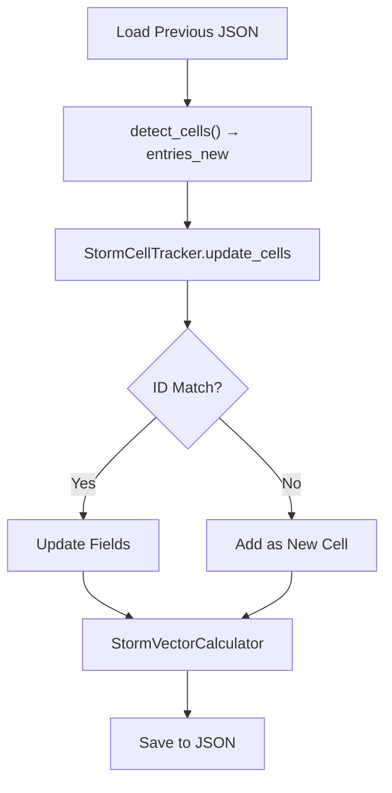
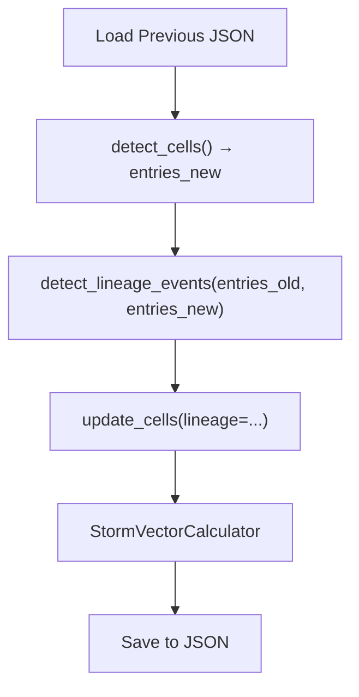
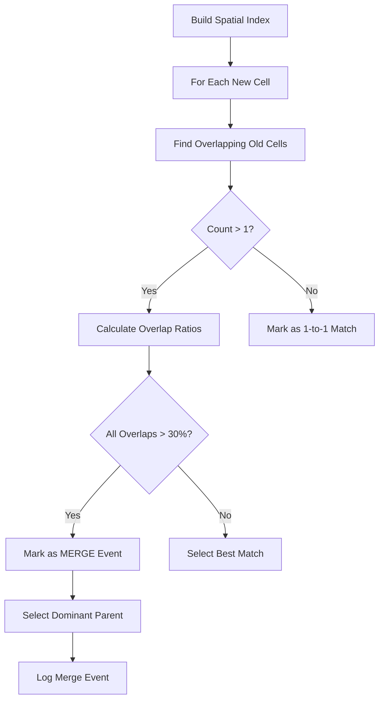
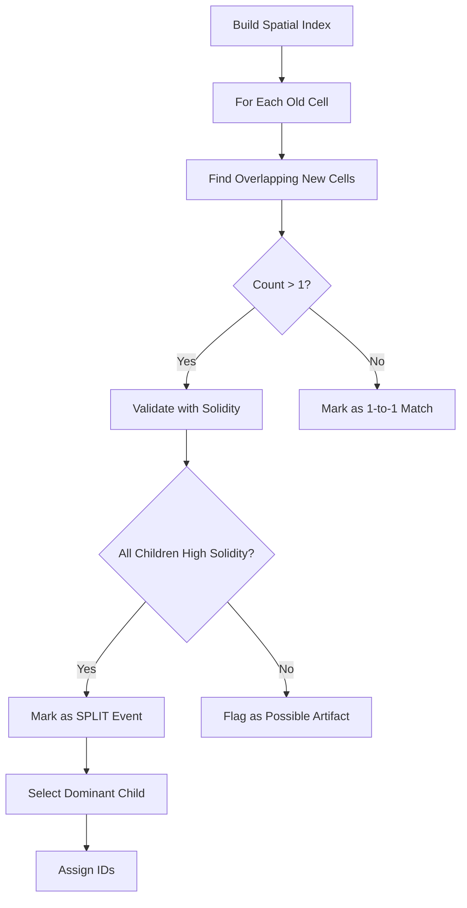

# Implementation Plan: Storm Merger/Split Handling

**Version:** 1.1  
**Date:** February 17, 2026  
**Target Release:** EdgeWARN v1.6.0  
**PRD Reference:** Storm Merger/Split Handling PRD v1.1

---

## 1. Executive Summary

This implementation plan outlines the technical approach for adding storm merger and split detection capabilities to EdgeWARN Core. The feature extends the existing [`StormCellTracker`](src/EdgeWARN/core/process/detect/track.py:1) class to recognize complex storm evolution events, maintain identity continuity, and provide actionable lineage data for the frontend GUI.

---

## 2. Current Architecture Analysis

### 2.1 Existing Components

| Component | Location | Current Role |
|-----------|----------|--------------|
| [`StormCellTracker`](src/EdgeWARN/core/process/detect/track.py:1) | `track.py` | 1-to-1 ID-based cell updates |
| [`CellDataSaver`](src/EdgeWARN/core/process/detect/tools/save.py:5) | `save.py` | JSON output generation (`create_entry`, `create_json_structure`) |
| [`MorphologyEngine`](src/EdgeWARN/core/process/detect/tools/morphology.py:17) | `morphology.py` | Cell shape analysis (solidity, linearity, aspect ratio) |
| [`StormVectorCalculator`](src/EdgeWARN/core/process/detect/tools/vecmath.py:6) | `vecmath.py` | Motion vectors from per-cell history in `CELL_DIR` |
| Detection Pipeline | [`main.py`](src/EdgeWARN/core/process/detect/main.py:60) | Orchestrates detection flow (dual-frame tracking) |

### 2.2 Current Tracking Flow



**Proposed flow with lineage:**



### 2.3 Gap Analysis

The current [`update_cells()`](src/EdgeWARN/core/process/detect/track.py:7) method:
- Performs simple 1-to-1 ID matching via `updated_map = {int(cell['id']): cell for cell in updated_data}`
- Treats unmatched cells as removed (logged via `io_manager`)
- Treats new IDs as entirely new cells (no lineage reference)
- **Missing:** Many-to-one (merge) and one-to-many (split) association logic

> [!NOTE]
> `storm_history` is **not embedded** in the `stormcells_*.json` output. Per-cell history is persisted as individual JSON files in `CELL_DIR` (e.g., `{cell_id}.json`), loaded by [`StormVectorCalculator`](src/EdgeWARN/core/process/detect/tools/vecmath.py:12) for motion vector calculation. The lineage feature must be compatible with this pattern.

---

## 3. Technical Design

### 3.1 New Data Structures

#### 3.1.1 Lineage Event Types

```python
# Enum for event classification
class LineageEvent:
    MERGE = "MERGE"        # Multiple parents -> single child
    SPLIT = "SPLIT"        # Single parent -> multiple children
    ACTIVE = "ACTIVE"      # Normal continuation
    DISSIPATED = "DISSIPATED"  # Cell removed without merge
```

#### 3.1.2 Extended Cell Schema

New fields added to the cell entry dict produced by `CellDataSaver.create_entry()` and enriched by `StormCellTracker`:

```json
{
  "id": 405,
  "num_gates": 150,
  "centroid": [35.2, 262.5],
  "bbox": [[35.1, 262.4], [35.1, 262.6], [35.3, 262.6], [35.3, 262.4]],
  "max_refl": 65.0,
  "event_type": "MERGE",
  "parent_ids": [405, 408],
  "split_from": null,
  "hail_core": [],
  "properties": { "morphology": { "solidity": 0.87, "..." : "..." } }
}
```

> [!IMPORTANT]
> `bbox` is a **list of [lat, lon] coordinate pairs** defining the cell polygon boundary (not an axis-aligned bounding box). Longitudes are stored as 0–360° (east-positive). This is critical for the overlap calculation in §3.4.

| Field | Type | Description |
|-------|------|-------------|
| `event_type` | string | One of: `MERGE`, `SPLIT`, `ACTIVE`, `DISSIPATED` |
| `parent_ids` | List[int] | IDs of storms that merged into this cell (empty if none) |
| `split_from` | int \| null | ID of parent storm this cell split from |

### 3.2 Algorithm Design

#### 3.2.1 Lineage Detection Method

New method [`detect_lineage_events()`](src/EdgeWARN/core/process/detect/track.py) to be added to `StormCellTracker`:

```python
def detect_lineage_events(self, old_cells, new_cells) -> dict:
    """
    Detect merge and split events between old and new cell sets.
    
    Returns:
        {
            'merges': [{child_id, parent_ids, dominant_parent}],
            'splits': [{parent_id, child_ids, dominant_child}],
            'unmatched_old': [ids],  # Dissipated cells
            'unmatched_new': [ids]   # Truly new cells
        }
    """
```

#### 3.2.2 Merge Detection Algorithm



**Merge Criteria (FR1.2):**
1. **Spatial Overlap:** >30% of parent bbox overlaps with child extent
2. **Centroid Proximity:** Parents' centroids moving toward common point
3. **Dominant Parent Selection:** Highest `max_refl` or largest `num_gates`

#### 3.2.3 Split Detection Algorithm



**Split Criteria (FR2.2):**
1. Single parent overlaps multiple new cells
2. **No Morphology Check:** Per user request, we accept all splits to maximize sensitivity. Noise filtering relies entirely on the Hysteresis Buffer.
3. Dominant child inherits parent ID; secondary children get new integer IDs with `split_from` reference

### 3.3 Hysteresis Buffer (Risk Mitigation)

To prevent false positives from ProbSevere ID instability:

> [!WARNING]
> `StormCellTracker` is **re-instantiated every scan** in `main.py` L269. The `LineageBuffer` must therefore persist state externally — either as a JSON file in `STORMCELL_DIR` (e.g., `lineage_buffer.json`) or by passing the buffer object through the pipeline caller.

```python
class LineageBuffer:
    """Tracks potential merge/split events across scans.
    
    Must be loaded from / saved to disk since StormCellTracker
    is re-instantiated each scan cycle.
    """
    BUFFER_FILE = "lineage_buffer.json"  # Stored in STORMCELL_DIR
    
    def __init__(self, min_confirmations: int = 2):
        self.pending_merges = {}  # {child_id: {parent_ids, count}}
        self.pending_splits = {}  # {parent_id: {child_ids, count}}
        self.min_confirmations = min_confirmations
    
    @classmethod
    def load(cls, stormcell_dir) -> 'LineageBuffer':
        """Load buffer state from disk."""
    
    def save(self, stormcell_dir):
        """Persist buffer state to disk."""
    
    def record_potential_merge(self, child_id, parent_ids) -> bool:
        """Record and return True if merge should be confirmed (count >= min_confirmations)."""
        
    def record_potential_split(self, parent_id, child_ids) -> bool:
        """Record and return True if split should be confirmed (count >= min_confirmations)."""
```

### 3.4 Spatial Analysis Implementation

Using existing `shapely` dependency (already in [`environment.yml`](environment.yml:15)):

```python
from shapely.geometry import Polygon

def calculate_overlap_ratio(parent_bbox, child_bbox) -> float:
    """
    Calculate overlap ratio of parent polygon area covered by child.
    
    bbox format: list of [lat, lon] coordinate pairs (polygon vertices).
    Longitudes are 0-360° east-positive.
    """
    # Build shapely Polygons from coordinate pair lists
    # Use (lon, lat) ordering for shapely's x,y convention
    parent_poly = Polygon([(lon, lat) for lat, lon in parent_bbox])
    child_poly = Polygon([(lon, lat) for lat, lon in child_bbox])
    
    if not parent_poly.is_valid or not child_poly.is_valid:
        return 0.0
    
    intersection = parent_poly.intersection(child_poly)
    if intersection.is_empty:
        return 0.0
    
    # Ratio of parent area that overlaps with child (per FR1.2)
    return intersection.area / parent_poly.area
```

> [!NOTE]
> This uses planar geometry on lat/lon coordinates, which is acceptable for the small spatial extents of individual storm cells. For cells near the antimeridian (lon ~360°/0°), a normalization guard should be added.

---

## 4. Implementation Tasks

### Phase 1: Prototype Lineage Logic

| Task | Description | Files |
|------|-------------|-------|
| 1.1 | Create test file with mock polygon data | `tests/core/process/detect/test_lineage.py` |
| 1.2 | Implement mock cell generators for merge scenarios | Test file |
| 1.3 | Implement mock cell generators for split scenarios | Test file |
| 1.4 | Write unit tests for overlap calculation | Test file |
| 1.5 | Write unit tests for dominant parent selection | Test file |

### Phase 2: Update Tracker

| Task | Description | Files |
|------|-------------|-------|
| 2.1 | Add `LineageEvent` constants/enum | `track.py` |
| 2.2 | Implement `calculate_overlap_ratio()` | `track.py` |
| 2.3 | Implement `detect_lineage_events()` | `track.py` |
| 2.4 | Implement `LineageBuffer` with disk persistence (`load`/`save`) | `track.py` |
| 2.5 | Integrate lineage detection into `update_cells()` | `track.py` |
| 2.6 | Add logging per PRD TR4 format: `[INFO] [CellDetection] Event Detected: Merge (IDs: X, Y -> Z)` | `track.py` |

### Phase 3: Schema Migration

| Task | Description | Files |
|------|-------------|-------|
| 3.1 | Add `event_type` default (`"ACTIVE"`) to entry dict in `create_entry()` | `save.py` |
| 3.2 | Add `parent_ids` default (`[]`) to entry dict in `create_entry()` | `save.py` |
| 3.3 | Add `split_from` default (`null`) to entry dict in `create_entry()` | `save.py` |
| 3.4 | Update [`create_json_structure()`](src/EdgeWARN/core/process/detect/tools/save.py:14) version `"1.5.3"` → `"1.6.0"` | `save.py` |
| 3.5 | Update [`EdgeWARN_Data_Keys.md`](docs/EdgeWARN_Data_Keys.md:1) documentation | Docs |

### Phase 4: Integration Testing

| Task | Description | Files |
|------|-------------|-------|
| 4.1 | Create integration test with historical dual-frame data | `tests/integration/test_lineage_integration.py` |
| 4.2 | Verify merge detection with real storm data | Test file |
| 4.3 | Verify split detection with real storm data | Test file |
| 4.4 | Performance benchmark (<500ms overhead) | Test file |
| 4.5 | End-to-end test via [`main.py`](src/EdgeWARN/core/process/detect/main.py:60) | Test file |

### Phase 5: Documentation

| Task | Description | Files |
|------|-------------|-------|
| 5.1 | Document new lineage fields in API docs | `docs/API.md` |
| 5.2 | Frontend: draw lineage connector lines between centroids (PRD UI2) | Frontend repo (out of scope for Core) |

---

## 5. File Changes Summary

### Modified Files

| File | Changes |
|------|---------|
| [`track.py`](src/EdgeWARN/core/process/detect/track.py:1) | Add `detect_lineage_events()`, `LineageBuffer`, and `LineageEvent` |
| [`save.py`](src/EdgeWARN/core/process/detect/tools/save.py:5) | Add `event_type`, `parent_ids`, `split_from` defaults in `create_entry()` |
| [`main.py`](src/EdgeWARN/core/process/detect/main.py:60) | Call `detect_lineage_events()` between tracker init (L269) and `update_cells()` (L272) |
| [`EdgeWARN_Data_Keys.md`](docs/EdgeWARN_Data_Keys.md:1) | Document new lineage fields |

### New Files

| File | Purpose |
|------|---------|
| `tests/core/process/detect/test_lineage.py` | Unit tests for lineage logic |
| `tests/integration/test_lineage_integration.py` | Integration tests |

---

## 6. Performance Considerations

### 6.1 Target: <500ms Overhead

Current pipeline timing (from [`perf_tracker`](src/EdgeWARN/core/process/detect/main.py:268)):
- Detection - Tracking: ~50ms typical
- Total pipeline: ~2-5 seconds

**Optimization Strategies:**

1. **Spatial Indexing:** Use R-tree or grid-based spatial index for O(log n) overlap queries
2. **Early Bailout:** Skip lineage detection if cell counts match and IDs match
3. **Lazy Polygon Construction:** Only create shapely `Polygon` objects when ID mismatch detected

```python
# Integration point in main.py (between L268-L273):
perf_tracker.start("Detection - Tracking")
tracker = StormCellTracker(ps_old_data, ps_new_data, io_manager)

# NEW: Lineage detection before update_cells
perf_tracker.start("Detection - Lineage")
lineage = tracker.detect_lineage_events(entries_old, entries_new)
perf_tracker.stop("Detection - Lineage")

# Pass lineage context into update_cells
entries = tracker.update_cells(entries_old, entries_new, timestamp=json_ts, lineage=lineage)
perf_tracker.stop("Detection - Tracking")
```

```python
# Fast-path optimization inside update_cells:
def update_cells(self, entries, updated_data, timestamp=None, lineage=None):
    old_ids = {int(c['id']) for c in entries}
    new_ids = {int(c['id']) for c in updated_data}
    
    # Fast path: No ID changes AND no pending lineage events
    if old_ids == new_ids and (lineage is None or lineage.is_empty()):
        return self._simple_update(entries, updated_data, timestamp)
    
    # Slow path: ID mismatch or active lineage events
    return self._apply_lineage_updates(entries, updated_data, lineage, timestamp)
```

### 6.2 Memory Considerations

- `LineageBuffer` should have max size limit (e.g., 100 pending events)
- Old buffer entries pruned after 5 scans of inactivity

---

## 7. Testing Strategy

### 7.1 Unit Tests

```python
# tests/core/process/detect/test_lineage.py

class TestOverlapCalculation:
    def test_no_overlap_returns_zero(self): ...
    def test_partial_overlap_returns_ratio(self): ...
    def test_full_overlap_returns_one(self): ...

class TestMergeDetection:
    def test_single_parent_no_merge(self): ...
    def test_two_parents_merge_detected(self): ...
    def test_dominant_parent_selection_by_refl(self): ...
    def test_dominant_parent_selection_by_gates(self): ...
    def test_hysteresis_requires_two_scans(self): ...

class TestSplitDetection:
    def test_single_child_no_split(self): ...
    def test_two_children_split_detected(self): ...
    def test_low_solidity_rejects_split(self): ...
    def test_dominant_child_inherits_id(self): ...
    def test_secondary_child_gets_split_from(self): ...
```

### 7.2 Integration Tests

```python
# tests/integration/test_lineage_integration.py

class TestLineageIntegration:
    def test_merge_with_historical_data(self):
        """Use recorded storm merge event from archive."""
        
    def test_split_with_historical_data(self):
        """Use recorded storm split event from archive."""
        
    def test_performance_under_load(self):
        """Verify <500ms overhead with 50+ cells."""
```

---

## 8. Risk Mitigation

| Risk | Mitigation | Implementation |
|------|------------|----------------|
| ProbSevere ID instability | Hysteresis buffer (2-scan confirmation) | `LineageBuffer` class with disk persistence |
| Watershed expansion false splits | **None (Accepted Risk)** | Rely on Hysteresis Buffer to filter transient noise |
| Performance degradation | Spatial indexing, early bailout | R-tree or grid index |
| History loss during merge | Preserve dominant parent's per-cell history | Copy/merge `CELL_DIR/{id}.json` files |
| `LineageBuffer` lost across scans | Persist to `STORMCELL_DIR/lineage_buffer.json` | `LineageBuffer.load()` / `.save()` |

---

## 9. Dependencies

### 9.1 Existing Dependencies (No Changes Needed)

- `shapely` - Already in [`environment.yml`](environment.yml:15)
- `numpy` - Already in [`environment.yml`](environment.yml:11)
- `scipy` - Already in [`environment.yml`](environment.yml:14)

### 9.2 No New Dependencies Required

All functionality can be implemented with existing libraries.

---

## 10. Rollout Plan

### 10.1 Feature Flags

Consider adding configuration option to disable lineage detection:

```yaml
# config/lineage.yaml (optional)
lineage_detection:
  enabled: true
  hysteresis_scans: 2
  overlap_threshold: 0.3
  solidity_threshold: 0.6
```

### 10.2 Backward Compatibility

- New JSON fields (`event_type`, `parent_ids`, `split_from`) are optional
- Old clients will ignore unknown fields
- Version bump to 1.6.0 in output JSON

---

## 11. Acceptance Criteria

- [ ] Merge detection correctly identifies 2+ parents merging into 1 child
- [ ] Split detection correctly identifies 1 parent splitting into 2+ children
- [ ] Dominant parent/child selection follows PRD criteria
- [ ] Hysteresis prevents false positives from ID swaps
- [ ] Solidity check prevents false splits from segmentation artifacts
- [ ] JSON output includes all new lineage fields
- [ ] Performance overhead <500ms per scan
- [ ] All unit and integration tests pass
- [ ] Documentation updated

---

## 12. Questions for Clarification

Before implementation, please confirm:

1. **UUID Generation:** Should secondary children in splits receive completely new integer IDs (next available), or should they derive from parent ID (e.g., `405-1`, `405-2`)? Integer IDs are consistent with the current `int(poly_id)` pattern in `save.py`.

2. **History Preservation:** For merge events, should the child cell's per-cell JSON in `CELL_DIR` inherit only the dominant parent's history file, or should histories from all parents be concatenated?

3. **Dissipation Handling:** Should `DISSIPATED` cells be included in the current `stormcells_*.json` with `event_type: "DISSIPATED"`, or simply removed (current behavior)?

4. **JSON Version Bump:** The current JSON version is `1.5.3` (in `create_json_structure`). Should this bump to `1.6.0` to signal schema changes to consumers, or remain as-is since new fields are additive?

5. **Centroid Proximity (FR1.2):** The PRD requires centroids "moving towards a common point" as a merge criterion. Should this be implemented as a velocity-vector convergence check using `dx`/`dy` from `StormVectorCalculator`, or as a simple distance threshold?

---

*Document revised after codebase audit on February 17, 2026. Do not proceed with implementation until approval is given.*