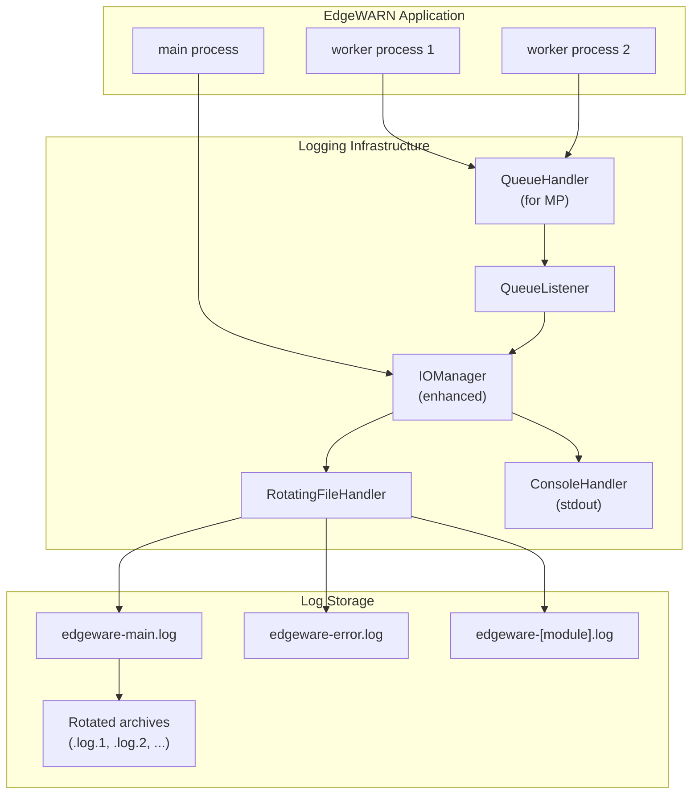

# EdgeWARN File-Based Logging Implementation Plan

## Overview

This plan outlines the introduction of a comprehensive file-based logging system for EdgeWARN. Currently, logs are only output ephemerally to the console via the custom [`IOManager`](src/util/io.py:31) class. This plan proposes a robust logging infrastructure that persists logs to files while maintaining backward compatibility with the existing console output.

## Current State Analysis

### Existing Logging Infrastructure

1. **IOManager Class** ([`src/util/io.py`](src/util/io.py:31))
   - Provides `write_info()`, `write_debug()`, `write_warning()`, `write_error()`, `write_perf()` methods
   - Outputs to stdout via `print()` statements
   - Used throughout the codebase with module-specific headers (e.g., `[Ingest]`, `[CellDetection]`)

2. **TimestampedOutput** ([`src/util/io.py`](src/util/io.py:5))
   - Wraps stdout/stderr to add ISO 8601 timestamps
   - Applied globally in [`run.py`](src/run.py:32)

3. **QueueWriter** ([`src/util/io.py`](src/util/io.py:19))
   - For multiprocessing support
   - Writes to a multiprocessing queue instead of stdout

4. **LogWatcher** ([`src/EdgeWARN/ui/log_watcher.py`](src/EdgeWARN/ui/log_watcher.py:8))
   - UI component for tailing log files
   - Already supports file-based log reading via `LogTailer` class

5. **Fragmented Logging Usage**
   - Some modules use Python's standard `logging` module (e.g., [`kalman/config.py`](src/EdgeWARN/core/process/detect/kalman/config.py:13))
   - Most modules use the custom `IOManager`

## Proposed Architecture



## Implementation Steps

### 1. Create Logging Configuration System

**File**: `config/logging.yaml`

Create a YAML configuration file for logging settings:

```yaml
logging:
  # Base configuration
  version: 1
  disable_existing_loggers: false
  
  # Log directory (relative to BASE_DIR or absolute)
  log_dir: "logs"
  
  # Log level: DEBUG, INFO, WARNING, ERROR, CRITICAL
  level: "INFO"
  
  # Console output settings
  console:
    enabled: true
    level: "INFO"
    format: "short"  # short, detailed, json
  
  # File output settings
  file:
    enabled: true
    level: "DEBUG"
    format: "detailed"
    
    # Rotation settings
    rotation:
      enabled: true
      max_bytes: 10485760  # 10 MB
      backup_count: 5
    
    # Retention settings
    retention:
      enabled: true
      max_age_days: 30
  
  # Per-module log levels (optional overrides)
  modules:
    "EdgeWARN.core.ingest": "DEBUG"
    "EdgeWARN.core.process.detect": "INFO"
    "EdgeWARN.core.process.integrate": "INFO"
```

### 2. Create Enhanced Logging Utility Module

**File**: `src/util/logging_config.py`

A new module to centralize logging configuration and setup:

```python
"""
Centralized logging configuration for EdgeWARN.

This module provides file-based logging capabilities while maintaining
compatibility with the existing IOManager interface.
"""

import logging
import logging.handlers
import sys
from pathlib import Path
from datetime import datetime, timezone
from typing import Optional, Dict, Any
import yaml
import json
import os

# Import file utilities for path resolution
try:
    import util.file as fs
except ImportError:
    fs = None


class EdgeWARNFormatter(logging.Formatter):
    """Custom formatter with module headers and timestamps."""
    
    # Format strings for different output styles
    FORMATS = {
        'short': '[{header}] {levelname}: {message}',
        'detailed': '[{asctime}] [{header}] {levelname}: {message}',
        'json': None  # Special handling for JSON format
    }
    
    def __init__(self, fmt_style: str = 'detailed', header: str = 'EdgeWARN'):
        super().__init__()
        self.fmt_style = fmt_style
        self.header = header
        self._style = logging.PercentStyle(self.FORMATS.get(fmt_style, self.FORMATS['detailed']))
    
    def format(self, record: logging.LogRecord) -> str:
        # Add header to record
        record.header = getattr(record, 'header', self.header)
        
        if self.fmt_style == 'json':
            return self._format_json(record)
        
        # Use ISO format for timestamps
        if self.fmt_style == 'detailed':
            record.asctime = datetime.fromtimestamp(record.created, tz=timezone.utc).isoformat()
        
        return self._style.format(record)
    
    def _format_json(self, record: logging.LogRecord) -> str:
        log_data = {
            'timestamp': datetime.fromtimestamp(record.created, tz=timezone.utc).isoformat(),
            'level': record.levelname,
            'header': getattr(record, 'header', self.header),
            'message': record.getMessage(),
            'module': record.module,
            'function': record.funcName,
            'line': record.lineno
        }
        if record.exc_info:
            log_data['exception'] = self.formatException(record.exc_info)
        return json.dumps(log_data)


class LoggingManager:
    """Centralized logging manager for EdgeWARN."""
    
    _instance: Optional['LoggingManager'] = None
    _initialized: bool = False
    
    def __new__(cls):
        if cls._instance is None:
            cls._instance = super().__new__(cls)
        return cls._instance
    
    def __init__(self):
        if LoggingManager._initialized:
            return
        
        self.config: Dict[str, Any] = {}
        self.log_dir: Optional[Path] = None
        self.main_logger: Optional[logging.Logger] = None
        self.file_handler: Optional[logging.Handler] = None
        self.console_handler: Optional[logging.Handler] = None
        LoggingManager._initialized = True
    
    def initialize(self, config_path: Optional[Path] = None, 
                   log_dir: Optional[Path] = None,
                   base_dir: Optional[Path] = None) -> None:
        """
        Initialize the logging system.
        
        Args:
            config_path: Path to logging.yaml configuration file
            log_dir: Override log directory from config
            base_dir: Base directory for relative log paths
        """
        # Load configuration
        self.config = self._load_config(config_path)
        
        # Determine log directory
        self.log_dir = self._resolve_log_dir(log_dir, base_dir)
        self.log_dir.mkdir(parents=True, exist_ok=True)
        
        # Configure root logger
        self._setup_root_logger()
        
        # Setup handlers
        if self.config.get('file', {}).get('enabled', True):
            self._setup_file_handler()
        
        if self.config.get('console', {}).get('enabled', True):
            self._setup_console_handler()
        
        self.main_logger = logging.getLogger('EdgeWARN')
        self.main_logger.info(f"Logging initialized. Log directory: {self.log_dir}")
    
    def _load_config(self, config_path: Optional[Path]) -> Dict[str, Any]:
        """Load logging configuration from YAML file."""
        default_config = {
            'logging': {
                'level': 'INFO',
                'log_dir': 'logs',
                'console': {'enabled': True, 'level': 'INFO', 'format': 'short'},
                'file': {
                    'enabled': True,
                    'level': 'DEBUG',
                    'format': 'detailed',
                    'rotation': {'enabled': True, 'max_bytes': 10485760, 'backup_count': 5},
                    'retention': {'enabled': True, 'max_age_days': 30}
                }
            }
        }
        
        if config_path and config_path.exists():
            try:
                with open(config_path) as f:
                    user_config = yaml.safe_load(f)
                    # Merge with defaults
                    return {**default_config, **user_config}
            except Exception as e:
                print(f"Warning: Failed to load logging config: {e}", file=sys.stderr)
        
        return default_config
    
    def _resolve_log_dir(self, override_dir: Optional[Path], base_dir: Optional[Path]) -> Path:
        """Resolve the log directory path."""
        if override_dir:
            return Path(override_dir)
        
        config_dir = Path(self.config.get('logging', {}).get('log_dir', 'logs'))
        
        if config_dir.is_absolute():
            return config_dir
        
        # Try to use file system base directory
        if fs and hasattr(fs, 'BASE_DIR'):
            return fs.BASE_DIR / config_dir
        
        if base_dir:
            return Path(base_dir) / config_dir
        
        # Fallback to current working directory
        return Path.cwd() / config_dir
    
    def _setup_root_logger(self) -> None:
        """Configure the root logger with base settings."""
        level_name = self.config.get('logging', {}).get('level', 'INFO')
        level = getattr(logging, level_name.upper(), logging.INFO)
        
        root_logger = logging.getLogger()
        root_logger.setLevel(level)
        
        # Clear existing handlers
        root_logger.handlers = []
    
    def _setup_file_handler(self) -> None:
        """Setup the rotating file handler."""
        file_config = self.config.get('logging', {}).get('file', {})
        level_name = file_config.get('level', 'DEBUG')
        level = getattr(logging, level_name.upper(), logging.DEBUG)
        fmt_style = file_config.get('format', 'detailed')
        
        # Main log file
        main_log_path = self.log_dir / 'edgeware.log'
        
        rotation_config = file_config.get('rotation', {})
        if rotation_config.get('enabled', True):
            handler = logging.handlers.RotatingFileHandler(
                main_log_path,
                maxBytes=rotation_config.get('max_bytes', 10485760),
                backupCount=rotation_config.get('backup_count', 5),
                encoding='utf-8'
            )
        else:
            handler = logging.FileHandler(main_log_path, encoding='utf-8')
        
        handler.setLevel(level)
        handler.setFormatter(EdgeWARNFormatter(fmt_style))
        
        root_logger = logging.getLogger()
        root_logger.addHandler(handler)
        self.file_handler = handler
        
        # Separate error log
        error_log_path = self.log_dir / 'edgeware-error.log'
        error_handler = logging.handlers.RotatingFileHandler(
            error_log_path,
            maxBytes=rotation_config.get('max_bytes', 10485760),
            backupCount=rotation_config.get('backup_count', 5),
            encoding='utf-8'
        )
        error_handler.setLevel(logging.ERROR)
        error_handler.setFormatter(EdgeWARNFormatter(fmt_style))
        root_logger.addHandler(error_handler)
    
    def _setup_console_handler(self) -> None:
        """Setup the console output handler."""
        console_config = self.config.get('logging', {}).get('console', {})
        level_name = console_config.get('level', 'INFO')
        level = getattr(logging, level_name.upper(), logging.INFO)
        fmt_style = console_config.get('format', 'short')
        
        handler = logging.StreamHandler(sys.stdout)
        handler.setLevel(level)
        handler.setFormatter(EdgeWARNFormatter(fmt_style))
        
        root_logger = logging.getLogger()
        root_logger.addHandler(handler)
        self.console_handler = handler
    
    def get_logger(self, header: str = 'EdgeWARN') -> logging.Logger:
        """Get a logger instance with the specified header."""
        logger = logging.getLogger(f'EdgeWARN.{header}')
        # Store header for formatter use
        logger.header = header
        return logger
    
    def cleanup_old_logs(self) -> None:
        """Remove log files older than retention period."""
        retention_config = self.config.get('logging', {}).get('file', {}).get('retention', {})
        if not retention_config.get('enabled', True):
            return
        
        max_age_days = retention_config.get('max_age_days', 30)
        cutoff = datetime.now() - timedelta(days=max_age_days)
        
        for log_file in self.log_dir.glob('*.log*'):
            try:
                mtime = datetime.fromtimestamp(log_file.stat().st_mtime)
                if mtime < cutoff:
                    log_file.unlink()
                    print(f"Removed old log file: {log_file}")
            except Exception as e:
                print(f"Failed to remove old log {log_file}: {e}", file=sys.stderr)


# Global instance
logging_manager = LoggingManager()


def setup_logging(config_path: Optional[Path] = None,
                  log_dir: Optional[Path] = None,
                  base_dir: Optional[Path] = None) -> LoggingManager:
    """Convenience function to initialize logging."""
    logging_manager.initialize(config_path, log_dir, base_dir)
    return logging_manager
```

### 3. Enhance IOManager with File Logging

**File**: `src/util/io.py` (modifications)

Enhance the existing [`IOManager`](src/util/io.py:31) class to support file logging:

```python
from util.logging_config import logging_manager, EdgeWARNFormatter
import logging

class IOManager:
    """Enhanced I/O manager with file logging support."""
    
    def __init__(self, header: str, use_file_logging: bool = True):
        self.header = header
        self.use_file_logging = use_file_logging
        
        if use_file_logging and logging_manager._initialized:
            self.logger = logging_manager.get_logger(header)
        else:
            self.logger = None
    
    def write_info(self, msg: str) -> None:
        """Write an INFO level message."""
        if self.logger:
            self.logger.info(msg, extra={'header': self.header})
        print(f"{self.header} INFO: {msg}")
    
    def write_debug(self, msg: str) -> None:
        """Write a DEBUG level message."""
        if self.logger:
            self.logger.debug(msg, extra={'header': self.header})
        print(f"{self.header} DEBUG: {msg}")
    
    def write_warning(self, msg: str) -> None:
        """Write a WARNING level message."""
        if self.logger:
            self.logger.warning(msg, extra={'header': self.header})
        print(f"{self.header} WARN: {msg}")
    
    def write_error(self, msg: str) -> None:
        """Write an ERROR level message."""
        if self.logger:
            self.logger.error(msg, extra={'header': self.header})
        print(f"{self.header} ERROR: {msg}")
    
    def write_perf(self, msg: str) -> None:
        """Write a performance metric."""
        if self.logger:
            self.logger.info(f"[PERF] {msg}", extra={'header': self.header})
        print(f"{self.header} [PERF] {msg}")
```

### 4. Add Log Directory to File Utilities

**File**: `src/util/file.py` (modifications)

Add log directory to the path definitions:

```python
def _define_paths(base_path):
    global BASE_DIR, DATA_DIR, LOGS_DIR, ...  # Add LOGS_DIR
    
    BASE_DIR = base_path
    
    # ... existing paths ...
    
    # Add log directory
    LOGS_DIR = BASE_DIR / "logs"
    LOGS_DIR.mkdir(parents=True, exist_ok=True)
```

### 5. Multiprocessing Support

**File**: `src/util/logging_config.py` (additions)

Add queue-based logging for multiprocessing:

```python
import multiprocessing
from logging.handlers import QueueHandler, QueueListener

class MPLoggingManager:
    """Manages logging in multiprocessing environments."""
    
    def __init__(self):
        self.log_queue: Optional[multiprocessing.Queue] = None
        self.queue_listener: Optional[QueueListener] = None
    
    def setup_mp_logging(self) -> multiprocessing.Queue:
        """Setup logging queue for multiprocessing."""
        self.log_queue = multiprocessing.Queue(-1)
        
        # Create handlers for the listener
        handlers = []
        if logging_manager.file_handler:
            handlers.append(logging_manager.file_handler)
        if logging_manager.console_handler:
            handlers.append(logging_manager.console_handler)
        
        self.queue_listener = QueueListener(self.log_queue, *handlers)
        self.queue_listener.start()
        
        return self.log_queue
    
    def stop_mp_logging(self) -> None:
        """Stop the queue listener."""
        if self.queue_listener:
            self.queue_listener.stop()


mp_logging_manager = MPLoggingManager()
```

**File**: `src/util/io.py` (update QueueWriter)

```python
class QueueWriter:
    """Writes log messages to a multiprocessing queue."""
    
    def __init__(self, queue, header: str = ""):
        self.queue = queue
        self.header = header
    
    def write(self, message):
        if message.strip():
            timestamp = datetime.now(timezone.utc).isoformat()
            formatted = f"[{timestamp}] {self.header} {message}"
            self.queue.put(formatted)
    
    def flush(self):
        pass
```

### 6. Update Main Entry Point

**File**: `src/run.py` (modifications)

Add logging initialization:

```python
import os
import sys
from pathlib import Path

# Initialize logging early
from util.logging_config import setup_logging, mp_logging_manager
import util.file as fs

# ... existing imports ...

# Initialize logging before other operations
log_manager = setup_logging(
    config_path=Path(__file__).parent.parent / "config" / "logging.yaml",
    base_dir=fs.BASE_DIR if hasattr(fs, 'BASE_DIR') else None
)

# Cleanup old logs on startup
log_manager.cleanup_old_logs()

# ... rest of the file ...

# In the pipeline function, use MP logging
def pipeline(log_queue, dt, profile=False):
    """Run the full pipeline with file logging support."""
    # Setup queue-based logging for this process
    if log_queue:
        sys.stdout = QueueWriter(log_queue, "[Pipeline]")
        sys.stderr = QueueWriter(log_queue, "[Pipeline]")
    
    # ... rest of pipeline code ...

# In main execution
if __name__ == "__main__":
    # Setup multiprocessing logging
    mp_queue = mp_logging_manager.setup_mp_logging()
    
    try:
        # ... main loop ...
        pipeline(mp_queue, dt, profile=args.profile)
    finally:
        mp_logging_manager.stop_mp_logging()
```

### 7. CLI Arguments for Logging

**File**: `src/util/io.py` (update IOManager.get_args())

Add CLI arguments:

```python
def get_args(self):
    """Parse and validate EdgeWARN command-line arguments."""
    parser = argparse.ArgumentParser(description="EdgeWARN modifier specification")
    
    # ... existing arguments ...
    
    # Logging arguments
    parser.add_argument(
        "--log_dir",
        type=str,
        default=None,
        help="Directory for log files (default: BASE_DIR/logs)"
    )
    parser.add_argument(
        "--log_level",
        type=str,
        choices=["DEBUG", "INFO", "WARNING", "ERROR", "CRITICAL"],
        default=None,
        help="Override log level from config file"
    )
    parser.add_argument(
        "--no_file_logging",
        action="store_true",
        help="Disable file logging (console only)"
    )
    parser.add_argument(
        "--log_config",
        type=str,
        default=None,
        help="Path to logging configuration YAML file"
    )
    
    args = parser.parse_args()
    
    # ... existing validation ...
    
    return args
```

### 8. Update .gitignore

Add log files to `.gitignore`:

```gitignore
# EdgeWARN logs
logs/
*.log
*.log.*
```

### 9. Update LogWatcher for New Log Files

**File**: `src/EdgeWARN/ui/log_watcher.py` (enhancements)

Update to use the new log directory:

```python
import util.file as fs

def get_default_log_path() -> Path:
    """Get the default log file path."""
    if hasattr(fs, 'LOGS_DIR'):
        return fs.LOGS_DIR / "edgeware.log"
    return Path("logs") / "edgeware.log"
```

## Migration Strategy

### Phase 1: Infrastructure (No breaking changes)
1. Create `src/util/logging_config.py`
2. Create `config/logging.yaml` with defaults
3. Add log directory to `src/util/file.py`
4. Update `.gitignore`

### Phase 2: IOManager Enhancement
1. Enhance `IOManager` to use file logging when available
2. Maintain backward compatibility (falls back to print)
3. Update all module-level IOManager instances

### Phase 3: Multiprocessing Support
1. Add `MPLoggingManager` for queue-based logging
2. Update `run.py` pipeline function
3. Test with multiprocessing scenarios

### Phase 4: Cleanup and Documentation
1. Remove deprecated logging code
2. Update documentation
3. Add logging configuration examples

## Configuration Examples

### Development Configuration
```yaml
logging:
  level: DEBUG
  console:
    enabled: true
    level: DEBUG
    format: detailed
  file:
    enabled: true
    level: DEBUG
    rotation:
      max_bytes: 5242880  # 5 MB for dev
```

### Production Configuration
```yaml
logging:
  level: INFO
  console:
    enabled: true
    level: WARNING  # Only warnings+ to console
  file:
    enabled: true
    level: INFO
    format: json     # Structured logging for production
    rotation:
      max_bytes: 52428800  # 50 MB
      backup_count: 10
    retention:
      max_age_days: 90
```

## Testing Strategy

1. **Unit Tests**: Test logging configuration loading, formatter output
2. **Integration Tests**: Test file creation, rotation, retention
3. **Multiprocessing Tests**: Verify queue-based logging works correctly
4. **Performance Tests**: Ensure logging doesn't significantly impact performance

## Success Criteria

- [ ] All logs are written to files in addition to console
- [ ] Log files rotate when size limit is reached
- [ ] Old log files are cleaned up based on retention policy
- [ ] Multiprocessing scenarios log correctly
- [ ] Existing console output remains unchanged
- [ ] Configuration via YAML file works correctly
- [ ] CLI arguments override config file settings