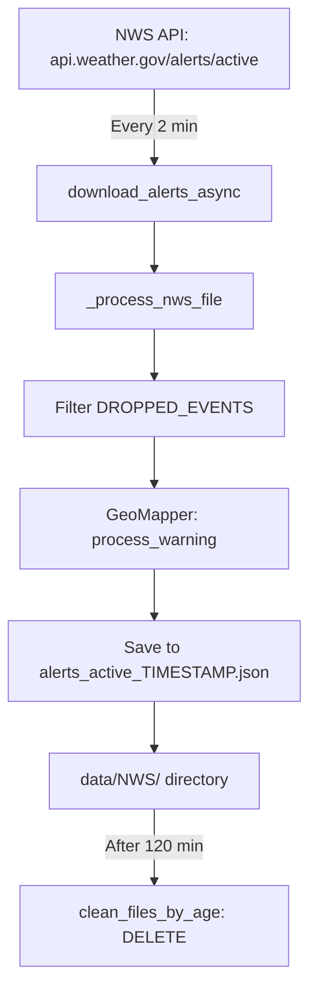
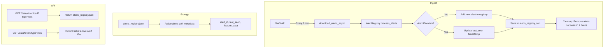

# NWS Alert Deduplication Implementation Plan

## Problem Statement

NWS alerts are downloaded every 2 minutes from `https://api.weather.gov/alerts/active`. This endpoint returns ALL currently active alerts, causing the same alert to be saved repeatedly across multiple timestamped files. An alert active for 30 minutes will appear in 15+ files, leading to:

1. **Duplicate Processing**: Downstream systems process the same alert multiple times
2. **Storage Inefficiency**: Redundant data storage
3. **API Confusion**: Clients receive duplicate alerts when querying NWS data

## Current Architecture



### Key Files
- [`src/EdgeWARN/core/ingest/nws/main.py`](src/EdgeWARN/core/ingest/nws/main.py) - Alert download and processing
- [`src/EdgeWARN/core/ingest/nws/geomapper.py`](src/EdgeWARN/core/ingest/nws/geomapper.py) - Zone-to-polygon mapping
- [`src/util/file.py`](src/util/file.py) - File cleanup utilities
- [`src/EdgeWARN/api/routes/data/download.js`](src/EdgeWARN/api/routes/data/download.js) - API endpoint

### NWS Alert Structure
Each alert from the NWS API contains:
- `id`: Unique alert identifier (URL like `https://api.weather.gov/alerts/urn:oid:2.49.0.1.840.0...`)
- `properties.event`: Event type (e.g., "Severe Thunderstorm Warning")
- `properties.effective`: When alert became effective
- `properties.expires`: When alert expires
- `properties.geocode.UGC`: Zone codes for the affected area

---

## Proposed Solution: Alert Registry Pattern

### Architecture Overview



### Data Model

#### Alert Registry Structure
```json
{
  "last_updated": "2026-02-23T03:40:00Z",
  "alerts": {
    "urn:oid:2.49.0.1.840.0.2406210827.1": {
      "id": "https://api.weather.gov/alerts/urn:oid:2.49.0.1.840.0.2406210827.1",
      "first_seen": "2026-02-23T02:00:00Z",
      "last_seen": "2026-02-23T03:40:00Z",
      "expires": "2026-02-23T04:00:00Z",
      "feature": {
        "type": "Feature",
        "geometry": {...},
        "properties": {
          "event": "Severe Thunderstorm Warning",
          "headline": "...",
          ...
        },
        "Polygon": [...]
      }
    }
  }
}
```

#### Active Alert IDs Response
```json
{
  "type": "nws",
  "count": 5,
  "last_updated": "2026-02-23T03:40:00Z",
  "alert_ids": [
    "urn:oid:2.49.0.1.840.0.2406210827.1",
    "urn:oid:2.49.0.1.840.0.2406210827.2",
    ...
  ]
}
```

---

## Implementation Plan

### Phase 1: Create Alert Registry Module

#### Task 1.1: Create AlertRegistry Class
**File**: `src/EdgeWARN/core/ingest/nws/registry.py`

```python
class AlertRegistry:
    """
    Manages unique NWS alerts with deduplication and expiration tracking.
    
    Features:
    - Stores alerts by unique ID
    - Tracks first_seen and last_seen timestamps
    - Removes alerts not seen within configurable TTL (default 2 hours)
    - Thread-safe operations for async compatibility
    """
    
    def __init__(self, registry_path: Path, ttl_hours: float = 2.0):
        self.registry_path = registry_path
        self.ttl_hours = ttl_hours
        self._lock = asyncio.Lock()
        self._registry = self._load_registry()
    
    def _load_registry(self) -> Dict:
        """Load existing registry from disk or create new."""
        
    def save(self) -> None:
        """Persist registry to disk."""
        
    def process_alert(self, feature: Dict, current_time: datetime) -> bool:
        """
        Process a single alert feature.
        Returns True if alert is new, False if updated existing.
        """
        
    def process_alerts(self, features: List[Dict], current_time: datetime) -> Tuple[int, int]:
        """
        Process multiple alerts.
        Returns (new_count, updated_count).
        """
        
    def cleanup_expired(self, current_time: datetime) -> int:
        """
        Remove alerts not seen within TTL.
        Returns count of removed alerts.
        """
        
    def get_active_alerts(self) -> List[Dict]:
        """Return list of all active alert features."""
        
    def get_active_ids(self) -> List[str]:
        """Return list of active alert IDs only."""
```

#### Task 1.2: Modify NWS Ingest to Use Registry
**File**: `src/EdgeWARN/core/ingest/nws/main.py`

Changes:
1. Replace timestamped file output with registry-based storage
2. Initialize AlertRegistry at module level
3. Update `_process_nws_file()` to use registry
4. Remove `clean_files_by_age()` call (replaced by registry TTL)

```python
# Before
def _process_nws_file(input_path, output_path):
    # ... writes to timestamped file

# After
def _process_nws_file(input_path, registry: AlertRegistry, current_time: datetime):
    features = ijson.items(infile, 'features.item')
    new_count, updated_count = registry.process_alerts(features, current_time)
    removed_count = registry.cleanup_expired(current_time)
    registry.save()
    return new_count + updated_count
```

### Phase 2: Update API Endpoints

#### Task 2.1: Modify NWS Data Download Endpoint
**File**: `src/EdgeWARN/api/routes/data/download.js`

Changes:
1. For `type=nws`, return the alerts registry JSON
2. Remove timestamp requirement for NWS (optional parameter)
3. Add `alert_id` parameter to fetch specific alert

```javascript
// New endpoint behavior
// GET /data/download?type=nws -> Returns full registry
// GET /data/download?type=nws&alert_id=... -> Returns specific alert
```

#### Task 2.2: Modify NWS Data Fetch Endpoint
**File**: `src/EdgeWARN/api/routes/data/fetch.js`

Changes:
1. For `type=nws`, return list of active alert IDs
2. Include last_updated timestamp

```javascript
// Response format
{
  "type": "nws",
  "count": 5,
  "last_updated": "2026-02-23T03:40:00Z",
  "alert_ids": ["urn:oid:...", ...]
}
```

### Phase 3: File System Changes

#### Task 3.1: Update File Paths
**File**: `src/util/file.py`

Changes:
1. Add `NWS_REGISTRY_PATH = MRMS_NWS_DIR / "alerts_registry.json"`
2. Export new path constant

#### Task 3.2: Remove Old Timestamped Files
Create migration script or handle in code:
- On first run with new system, delete old `alerts_active_*.json` files
- Or keep them for historical purposes in separate archive directory

### Phase 4: Testing

#### Task 4.1: Unit Tests
**File**: `tests/core/ingest/nws/test_registry.py`

Test cases:
- New alert is added to registry
- Existing alert updates last_seen timestamp
- Expired alerts are removed during cleanup
- Registry persists correctly to disk
- Thread-safe concurrent access

#### Task 4.2: Integration Tests
**File**: `tests/integration/test_nws_dedup.py`

Test cases:
- Full ingest cycle with deduplication
- API endpoints return correct data
- Cleanup works correctly over time

---

## Configuration Options

```yaml
# config/nws.yaml (new file)
nws:
  registry:
    ttl_hours: 2.0          # Remove alerts not seen in 2 hours
    auto_cleanup: true      # Run cleanup on each ingest
  api:
    url: "https://api.weather.gov/alerts/active"
    user_agent: "(EdgeWARN/1.0, contact@edgewarn.com)"
```

---

## Migration Strategy

### Option A: Clean Break (Recommended)
1. Deploy new code
2. Old timestamped files are ignored
3. Registry starts fresh on first ingest
4. Old files cleaned up by existing 120-minute TTL

### Option B: One-Time Migration
1. Read all existing `alerts_active_*.json` files
2. Merge into new registry format
3. Delete old files after successful migration

---

## Benefits

1. **No Duplicate Alerts**: Each unique alert stored once
2. **Efficient Storage**: Single file instead of multiple timestamped files
3. **Clear API Contract**: Clients can query active alerts without deduplication logic
4. **Audit Trail**: `first_seen` and `last_seen` timestamps track alert lifecycle
5. **Configurable TTL**: Adjust retention period as needed

---

## Risks and Mitigations

| Risk | Mitigation |
|------|------------|
| Registry file corruption | Atomic writes with temp file + rename pattern |
| Concurrent access issues | asyncio.Lock for thread safety |
| Large number of active alerts | Consider SQLite backend for >1000 concurrent alerts |
| API breaking change | Version the API or maintain backward compatibility |

---

## Implementation Checklist

- [ ] Create `AlertRegistry` class in `src/EdgeWARN/core/ingest/nws/registry.py`
- [ ] Update `src/EdgeWARN/core/ingest/nws/main.py` to use registry
- [ ] Add `NWS_REGISTRY_PATH` to `src/util/file.py`
- [ ] Update `src/EdgeWARN/api/routes/data/download.js` for new response format
- [ ] Update `src/EdgeWARN/api/routes/data/fetch.js` for alert ID listing
- [ ] Create unit tests for AlertRegistry
- [ ] Create integration tests for full flow
- [ ] Update documentation in `docs/Ingest_Module.md`
- [ ] Update API documentation in `docs/API.md`
- [ ] Test with real NWS data in staging environment
