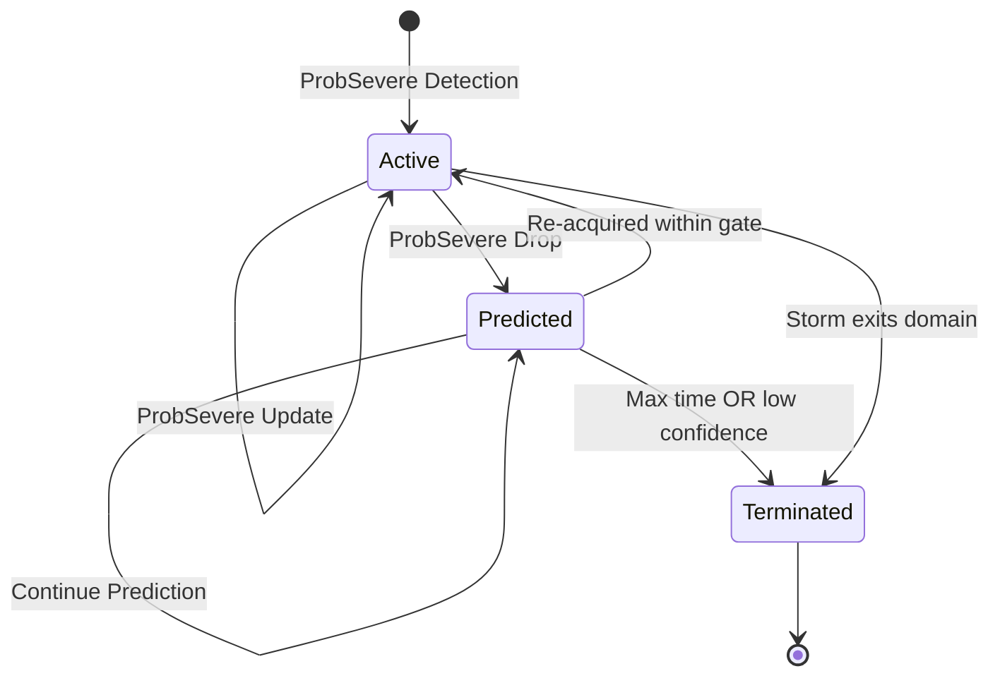
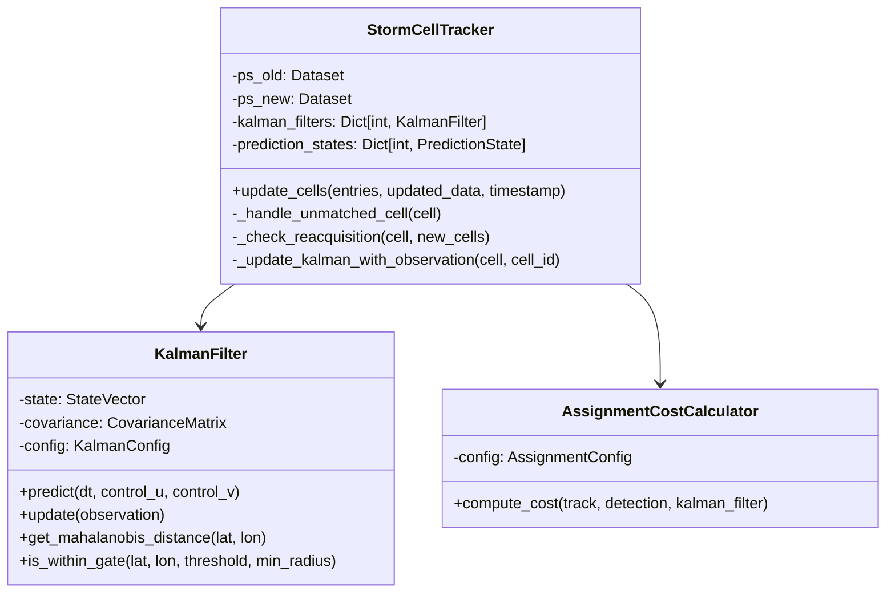

# Product Requirements Document: Storm Cell Kalman Tracking System

## Comprehensive Specification for Kalman Filter and Measurement Assignment

---

## Document Information

| Field | Value |
|-------|-------|
| **Title** | Storm Cell Kalman Tracking System |
| **Author** | EdgeWARN Team |
| **Date** | 2026-02-18 |
| **Status** | Verified |
| **Version** | 2.1 (Hybrid Assignment) |
| **Supersedes** | PRD_StormCell_KalmanFilter.md, PRD_Measurement_Assignment_Improvements.md |

---

## Table of Contents

1. [Executive Summary](#1-executive-summary)
2. [Problem Statement](#2-problem-statement)
3. [Goals and Objectives](#3-goals-and-objectives)
4. [Technical Requirements - Kalman Filter](#4-technical-requirements---kalman-filter)
5. [Technical Requirements - Measurement Assignment](#5-technical-requirements---measurement-assignment)
6. [Algorithm Analysis](#6-algorithm-analysis)
7. [Implementation Architecture](#7-implementation-architecture)
8. [Configuration](#8-configuration)
9. [API Specifications](#9-api-specifications)
10. [Testing Plan](#10-testing-plan)
11. [Migration and Rollback](#11-migration-and-rollback)
12. [Risks and Mitigations](#12-risks-and-mitigations)

---

## 1. Executive Summary

This document defines the comprehensive requirements for the Storm Cell Kalman Tracking System, which consists of two major components:

1. **Kalman Filter Continuity Tracking**: Maintains storm cell tracking even when ProbSevere temporarily fails to detect them, preventing premature termination and maintaining warning continuity.

2. **Advanced Measurement Assignment**: Replaces the simple greedy nearest-neighbor approach with a global optimal assignment using the Hungarian Algorithm and Mahalanobis gating to robustly handle complex tracking scenarios including storm splits, mergers, and dense clusters.

The combined system ensures:
- Storm cells remain tracked for up to 10 minutes during temporary detection drops
- Identity switches during storm interactions are minimized
- Physics-aware matching using velocity and shape consistency
- Graceful degradation with confidence metrics

---

## 2. Problem Statement

### 2.1 Kalman Filter Issue

The current storm tracking system removes cells from tracking when they are not present in the updated ProbSevere data:

```python
# Cell not found in updated_data
# Remove from tracking
unused_ids += 1
```

**Impact**:
- Loss of storm history and trajectory data
- Disrupted warning continuity
- Potential missed warnings for ongoing severe weather
- User confusion from storms "disappearing" and "reappearing" with new IDs

### 2.2 Measurement Assignment Issue

The current re-acquisition logic in `StormCellTracker._check_reacquisition` uses a simple greedy approach:
1. For each new detection, find all predicted tracks within a fixed 5 km radius
2. Assign to the closest track based on Euclidean (Haversine) distance

**Failure Modes**:
- **Ambiguous Assignment**: If a new cell is equidistant between two predicted tracks, it may be assigned to the wrong one, causing identity swaps
- **Crowding**: In a cluster of storms, a single new detection might be "claimed" by multiple tracks, or a single track might have multiple valid candidates
- **Directional Ignorance**: A cell 4 km "upstream" (consistent with motion) is physically more likely than a cell 3 km "sideways"

---

## 3. Goals and Objectives

### 3.1 Primary Goals

1. **Maintain Storm Continuity**: Keep tracking storms for up to 10 minutes after ProbSevere drops detection using StormCast motion prediction
2. **Enable Re-acquisition**: Automatically merge Kalman-predicted storms with re-detected ProbSevere cells, preserving original storm ID
3. **Degrade Gracefully**: Provide confidence metrics that decrease over time, terminating when confidence drops below threshold
4. **Eliminate Greedy Failures**: Replace local nearest-neighbor logic with a global assignment optimization
5. **Physics-Aware Gating**: Use the Kalman filter's covariance to define dynamic, directionally-aware search gates (Mahalanobis distance)

### 3.2 Success Metrics

| Metric | Target |
|--------|--------|
| False positive rate (tracking non-existent storms) | < 5% |
| Successful re-acquisition rate | > 80% |
| Mean position error vs actual re-detection | < 3 km |
| Warning continuity improvement | > 90% of temporary drop cases |
| ID switching reduction | < 5% in storm interaction scenarios |

---

## 4. Technical Requirements - Kalman Filter

### 4.1 Kalman Filter State Model

#### State Vector

The Kalman filter tracks a 6-dimensional state vector:

```
x = [lat, lon, u, v, a_lat, a_lon]^T
```

| Component | Description | Units |
|-----------|-------------|-------|
| lat | Latitude position | degrees |
| lon | Longitude position | degrees |
| u | Eastward velocity | m/s |
| v | Northward velocity | m/s |
| a_lat | Latitude acceleration | m/s² |
| a_lon | Longitude acceleration | m/s² |

#### State Transition Model

```
x(k+1) = F * x(k) + w(k)
```

Where F is the state transition matrix incorporating constant acceleration model:

```
F = [1, 0, dt, 0, 0.5*dt², 0    ]
    [0, 1, 0, dt, 0,    0.5*dt²]
    [0, 0, 1, 0, dt,    0      ]
    [0, 0, 0, 1, 0,    dt      ]
    [0, 0, 0, 0, 1,     0      ]
    [0, 0, 0, 0, 0,     1      ]
```

#### Observation Model

When ProbSevere provides observations:

```
z = H * x + v(k)
```

Where H observes position only:

```
H = [1, 0, 0, 0, 0, 0]
    [0, 1, 0, 0, 0, 0]
```

### 4.2 Tracking Modes



| Mode | Description | Data Source |
|------|-------------|-------------|
| **Active** | Normal tracking with ProbSevere observations | ProbSevere + Kalman correction |
| **Predicted** | Kalman-only prediction mode | Kalman prediction only |
| **Terminated** | Storm removed from tracking | N/A |

### 4.3 Confidence Model

```
confidence = base_confidence * decay_factor^scans_in_prediction * motion_consistency_factor
```

| Parameter | Value | Description |
|-----------|-------|-------------|
| base_confidence | 1.0 | Initial confidence when entering prediction mode |
| decay_factor | 0.7 | Per-scan decay multiplier |
| motion_consistency_factor | 0.8-1.0 | Based on velocity variance in history |

#### Confidence Thresholds

| Threshold | Value | Action |
|-----------|-------|--------|
| High | > 0.7 | Continue prediction |
| Medium | 0.4 - 0.7 | Continue with warning flag |
| Low | < 0.4 | Terminate tracking |

---

## 5. Technical Requirements - Measurement Assignment

### 5.1 Covariance-Based Gating (Mahalanobis Distance)

Instead of a fixed `reacquisition_radius_km`, we use the **Mahalanobis distance** ($d_M$), which measures how many standard deviations away a point is from the predicted distribution.

$$d_M(\mathbf{z}) = \sqrt{(\mathbf{z} - \mathbf{H}\hat{\mathbf{x}})^T \mathbf{S}^{-1} (\mathbf{z} - \mathbf{H}\hat{\mathbf{x}})}$$

Where:
- $\mathbf{z}$ is the measurement vector (new cell centroid)
- $\mathbf{H}\hat{\mathbf{x}}$ is the predicted measurement (predicted centroid)
- $\mathbf{S} = \mathbf{H}\mathbf{P}\mathbf{H}^T + \mathbf{R}$ is the innovation covariance matrix

**Requirement**:
- Implement `get_mahalanobis_distance(measurement)` in `KalmanFilter`
- Reject any candidate where $d_M > G$ (Gating Threshold, e.g., $\chi^2_{2, 0.95} \approx 5.99$)
- Implement hybrid gating with minimum radius fallback for collapsed covariance

### 5.2 Cost Function Design

The cost $C_{ij}$ for assigning Track $i$ to Detection $j$ is a weighted sum:

$$C_{ij} = w_1 \cdot d_{M,ij} + w_2 \cdot d_{vel,ij} + w_3 \cdot d_{shape,ij}$$

1. **Positional Cost ($d_M$)**: Mahalanobis distance (scale-normalized)
2. **Velocity Consistency ($d_{vel}$)**:
   - Compute implied velocity: $\mathbf{v}_{implied} = (\mathbf{pos}_{new} - \mathbf{pos}_{old}) / \Delta t$
   - Compare direction with Kalman predicted velocity
   - Penalty: $1 - \cos(\theta)$ (angular deviation)
3. **Shape Cost ($d_{shape}$)**: 
   - Difference in `max_reflectivity` and `num_gates` (log-scale)

### 5.3 Global Assignment (Hybrid Approach)

The assignment algorithm uses a **two-stage hybrid approach** that combines fixed-radius pre-filtering with Hungarian algorithm optimization:

#### Stage 1: Fixed Radius Pre-Filtering

1. **Spatial Pre-Filter**: For each track, identify candidate detections within a fixed radius (default: 10 miles / 16 km)
2. **Complexity Reduction**: This reduces the cost matrix from $N \times M$ to typically $N \times K$ where $K \ll M$
3. **Early Exit**: If only one candidate exists for a track, assign immediately (no optimization needed)

#### Stage 2: Hungarian Algorithm for Filtered Candidates

1. **Construct Cost Matrix**: Build a reduced cost matrix for pre-filtered candidates only
   - Entries exceeding Mahalanobis gating threshold = $\infty$
2. **Solve Assignment**: Use `scipy.optimize.linear_sum_assignment` to minimize $\sum C_{ij}$
3. **Process Assignments**:
   - Matched $(i, j)$: Update Track $i$ with Detection $j$
   - Unmatched Track $i$: Increment prediction count, check termination
   - Unmatched Detection $j$: Initialize as new storm cell

#### Benefits of Hybrid Approach

| Benefit | Description |
|---------|-------------|
| **Reduced Complexity** | O(k³) where k is filtered candidates, typically k << n |
| **Global Optimality** | Still achieves optimal assignment within local region |
| **Physics-Aware** | Mahalanobis gating considers velocity and uncertainty |
| **Predictable Performance** | Fixed radius provides upper bound on matrix size |

---

## 6. Algorithm Analysis

### 6.1 Current Algorithm: Greedy Nearest-Neighbor

**Complexity**: O(n × m) where n = detections, m = tracks

**Failure Mode Example**:
```
Track A at position (0,0) moving East -> predicts (10,0)
Track B at position (0,5) moving West -> predicts (10,5)

Detection 1 at (10, 1) - closer to A
Detection 2 at (10, 4) - closer to B

Greedy assigns: Detection 1 -> A, Detection 2 -> B
Optimal might be: Detection 1 -> B, Detection 2 -> A (if velocity considered)
```

### 6.2 Proposed Algorithm: Hybrid Pre-Filter + Hungarian

**Algorithm Flow**:
```
1. For each track, find detections within 10 mi of predicted position
2. If single candidate: assign directly (O(1))
3. If multiple candidates: build cost matrix and run Hungarian (O(k³))
4. Process matched/unmatched tracks and detections
```

**Benefits**:
- Global optimality within local region
- Reduced complexity vs full Hungarian (O(k³) vs O(n³))
- Deterministic - same input produces same output
- Physics-aware gating using covariance
- Handles splits/mergers robustly

**Complexity**: O(n × m) for pre-filtering + O(k³) for Hungarian where k is average candidates per track

### 6.3 Alternative Algorithms Considered

| Algorithm | Recommendation | Rationale |
|-----------|---------------|-----------|
| JPDA | ❌ Not recommended | Overkill for typical storm counts |
| MHT | ❌ Not recommended | Exponential complexity, too complex |
| Deep Learning | ❌ Not recommended | Requires training data, not interpretable |
| Pure Greedy | ⚠️ Fallback option | Simpler but not globally optimal |
| Full Hungarian | ⚠️ Acceptable | Higher complexity, no benefit over hybrid |

### 6.4 Gating Strategy Comparison

| Strategy | Benefits | Drawbacks |
|----------|----------|-----------|
| Fixed Radius Only | Simple, predictable | Ignores direction, not adaptive |
| Mahalanobis Only | Physics-aware, adaptive | Can over-gate with collapsed covariance |
| **Hybrid Pre-Filter + Hungarian (Recommended)** | Best of both worlds - reduced complexity with global optimality | Slightly more complex |

---

## 7. Implementation Architecture

### 7.1 Module Structure

```
src/EdgeWARN/core/process/detect/
├── kalman/
│   ├── __init__.py
│   ├── filter.py          # KalmanFilter class
│   ├── state.py           # StateVector and Covariance classes
│   ├── config.py          # Configuration parameters
│   ├── confidence.py      # Confidence calculation
│   └── assignment.py      # AssignmentCostCalculator, build_cost_matrix
├── track.py               # Modified StormCellTracker
└── main.py                # Modified main entry point
```

### 7.2 Class Design



---

## 8. Configuration

### 8.1 Kalman Filter Parameters

```yaml
kalman_filter:
  process_noise:
    position: 0.1      # degrees
    velocity: 0.5     # m/s
    acceleration: 0.1 # m/s²
  measurement_noise:
    position: 0.5     # km
```

### 8.2 Tracking Parameters

```yaml
tracking:
  max_prediction_time_minutes: 10
  reacquisition_radius_km: 5.0  # Legacy - replaced by gating
  confidence_threshold: 0.4
  confidence_decay_factor: 0.7
```

### 8.3 Assignment Parameters

```yaml
assignment:
  # Pre-filtering (Stage 1)
  prefilter_radius_km: 16.0       # 10 miles - spatial pre-filter radius
  
  # Gating parameters (Stage 2)
  gating_threshold: 6.0           # Chi-squared 95% confidence
  min_gating_radius_km: 2.0       # Floor for collapsed covariance
  
  # Cost function weights
  weights:
    position: 1.0                 # Mahalanobis distance
    velocity_direction: 2.0       # High penalty for backward motion
    size_similarity: 0.5          # Lower weight - more variable
  
  # Algorithm selection (for A/B testing)
  method: hybrid                  # 'hybrid' (recommended), 'hungarian', or 'greedy'
  
  # Numerical stability
  covariance_regularization: 1e-6
```

---

## 9. API Specifications

### 9.1 KalmanFilter Extensions

```python
def get_innovation_covariance(self, regularization: float = 1e-6) -> np.ndarray:
    """
    Compute innovation covariance S = H * P * H^T + R.
    """
    P = self.covariance.to_array()
    S = self._H @ P @ self._H.T + self._R
    S += np.eye(2) * regularization
    return S

def get_mahalanobis_distance(self, lat: float, lon: float) -> float:
    """
    Calculate Mahalanobis distance to a measurement.
    """
    x = self.state.to_array()
    z_pred = self._H @ x
    z = np.array([lat, lon])
    y = z - z_pred
    S = self.get_innovation_covariance()
    d_m = np.sqrt(y.T @ np.linalg.inv(S) @ y)
    return float(d_m)

def is_within_gate(self, lat: float, lon: float, 
                   threshold: float = 6.0,
                   min_radius_km: float = 2.0) -> bool:
    """
    Check if measurement is within validation gate.
    Uses Mahalanobis with minimum radius fallback.
    """
    d_m = self.get_mahalanobis_distance(lat, lon)
    if d_m <= threshold:
        return True
    
    # Fallback for collapsed covariance
    pred_lat, pred_lon = self.state.get_position()
    euclidean_dist = haversine_distance(lat, lon, pred_lat, pred_lon)
    return euclidean_dist <= min_radius_km
```

### 9.2 Assignment Module

```python
@dataclass
class AssignmentConfig:
    # Pre-filtering (Stage 1)
    prefilter_radius_km: float = 16.0  # 10 miles
    
    # Gating parameters (Stage 2)
    gating_threshold: float = 6.0
    min_gating_radius_km: float = 2.0
    
    # Cost function weights
    weight_position: float = 1.0
    weight_velocity: float = 2.0
    weight_shape: float = 0.5
    
    # Algorithm selection
    method: str = "hybrid"  # 'hybrid', 'hungarian', or 'greedy'
    
    # Numerical stability
    covariance_regularization: float = 1e-6

class AssignmentCostCalculator:
    def __init__(self, config: AssignmentConfig):
        self.config = config
    
    def compute_cost(self, track: Dict, detection: Dict, 
                     kalman_filter: KalmanFilter) -> float:
        # Position cost (Mahalanobis)
        d_pos = kalman_filter.get_mahalanobis_distance(
            detection['centroid'][0], detection['centroid'][1]
        )
        
        # Velocity cost (angular deviation)
        d_vel = self._compute_velocity_cost(track, detection)
        
        # Shape cost
        d_shape = self._compute_shape_cost(track, detection)
        
        return (self.config.weight_position * d_pos +
                self.config.weight_velocity * d_vel +
                self.config.weight_shape * d_shape)
    
    def prefilter_candidates(self, track: Dict, detections: List[Dict]) -> List[Dict]:
        """Stage 1: Filter detections within prefilter_radius_km."""
        pred_lat, pred_lon = track['kalman_state']['lat'], track['kalman_state']['lon']
        candidates = []
        for det in detections:
            dist = haversine_distance(pred_lat, pred_lon, 
                                      det['centroid'][0], det['centroid'][1])
            if dist <= self.config.prefilter_radius_km:
                candidates.append(det)
        return candidates
```

### 9.3 Updated StormCellTracker.update_cells()

```python
def update_cells(self, entries, updated_data, timestamp=None, dt_seconds=120.0):
    # 1. Separate Active vs. Predicted tracks
    all_tracks = [e for e in entries if e.get('tracking_mode') in ('active', 'predicted')]
    
    # 2. Stage 1: Pre-filter candidates for each track
    track_candidates = {}
    for track in all_tracks:
        candidates = self.assignment_calculator.prefilter_candidates(track, updated_data)
        track_candidates[track['id']] = candidates
    
    # 3. Stage 2: Build reduced cost matrix and solve
    cost_matrix = build_filtered_cost_matrix(
        all_tracks, track_candidates, 
        self._kalman_filters, self.assignment_config
    )
    row_inds, col_inds = linear_sum_assignment(cost_matrix)
    
    # 4. Process Assignments
    # ... (matched/unmatched handling)
    
    return updated_entries
```

---

## 10. Testing Plan

### 10.1 Unit Tests

| Test Case | Description |
|-----------|-------------|
| `test_kalman_predict` | Verify state prediction without observation |
| `test_kalman_update` | Verify state update with observation |
| `test_confidence_decay` | Verify confidence decreases over scans |
| `test_mahalanobis_gating` | Verify points outside ellipse rejected |
| `test_prefilter_radius` | Verify pre-filtering returns only nearby detections |
| `test_hungarian_assignment` | Verify crossed paths handled correctly |
| `test_hybrid_assignment` | Verify hybrid approach combines pre-filter + Hungarian |
| `test_split_scenario` | One track, two detections |

### 10.2 Integration Tests

| Test Case | Description |
|-----------|-------------|
| `test_tracking_continuity` | Storm remains tracked through temporary drop |
| `test_reacquisition_merge` | Merge when cell re-detected nearby |
| `test_termination_after_timeout` | Verify removal after max scans |
| `test_storm_split_merge` | Handle splitting/merging scenarios |
| `test_historical_replay` | Run on known storm events |

### 10.3 Acceptance Criteria

| Criterion | Pass Condition |
|-----------|----------------|
| Kalman filter stability | Predictions within 3km of actual |
| Re-acquisition rate | > 80% successful |
| ID switching | < 5% in test cases |
| Performance | < 200ms for 100 tracks |
| Mahalanobis gating | Points outside ellipse rejected |

---

## 11. Migration and Rollback

### 11.1 Feature Flag

```yaml
assignment:
  method: hybrid  # 'hybrid' (recommended), 'hungarian', or 'greedy'
```

```python
def update_cells(self, entries, updated_data, ...):
    method = self.assignment_config.method
    if method == 'hybrid':
        return self._update_cells_hybrid(entries, updated_data, ...)
    elif method == 'hungarian':
        return self._update_cells_hungarian(entries, updated_data, ...)
    else:
        return self._update_cells_greedy(entries, updated_data, ...)
```

### 11.2 Rollback Procedure

1. **Immediate**: Change `method: greedy` in config
2. **No Data Migration**: All methods use same data structures
3. **State Preservation**: Kalman filter state is method-agnostic

### 11.3 Gradual Rollout

| Phase | Configuration | Validation |
|-------|---------------|------------|
| 1 | `method: greedy` | Baseline metrics |
| 2 | `method: hungarian` with logging | Compare decisions |
| 3 | `method: hungarian` production | Monitor ID switching |

---

## 12. Risks and Mitigations

| Risk | Impact | Likelihood | Mitigation |
|------|--------|------------|------------|
| Tracking non-existent storms | High | Medium | Confidence decay + max scan limit |
| Position drift during prediction | Medium | Medium | Use StormCast as control input |
| False re-acquisition | High | Low | Motion consistency + tight gating |
| Over-gating (collapsed covariance) | Medium | Medium | Hybrid gating with min radius |
| Hungarian performance | Low | Low | n < 100 typical, acceptable |
| Numerical instability | Medium | Low | Regularization in S computation |

---

## Appendix A: Data Structure Extensions

### Storm Cell Entry Extensions

```json
{
  "id": 151282,
  "tracking_mode": "active",
  "prediction_count": 0,
  "confidence": 1.0,
  "kalman_state": {
    "lat": 33.45,
    "lon": 275.82,
    "u": 12.5,
    "v": -6.7,
    "a_lat": 0.001,
    "a_lon": -0.002,
    "P": "6x6 covariance matrix"
  },
  "kalman_history": [
    {
      "timestamp": "2026-01-10T16:58:41",
      "mode": "active",
      "predicted_position": [33.45, 275.82],
      "observed_position": [33.45, 275.82],
      "innovation": [0.0, 0.0]
    }
  ]
}
```

### New Data Keys

| Key | Type | Description |
|-----|------|-------------|
| tracking_mode | string | "active", "predicted", or "terminated" |
| prediction_count | int | Consecutive scans in prediction mode |
| confidence | float | Current tracking confidence (0.0-1.0) |
| kalman_state | object | Current Kalman filter state |
| kalman_history | array | History of predictions and corrections |

---

## Appendix B: Dependencies

### Internal Dependencies
- StormCast module - Motion prediction for velocity initialization
- CellDataSaver - Data persistence

### External Dependencies
- numpy - Matrix operations
- scipy - Linear sum assignment, statistical functions

---

*Document Version: 2.0*
*Last Updated: 2026-02-18*
