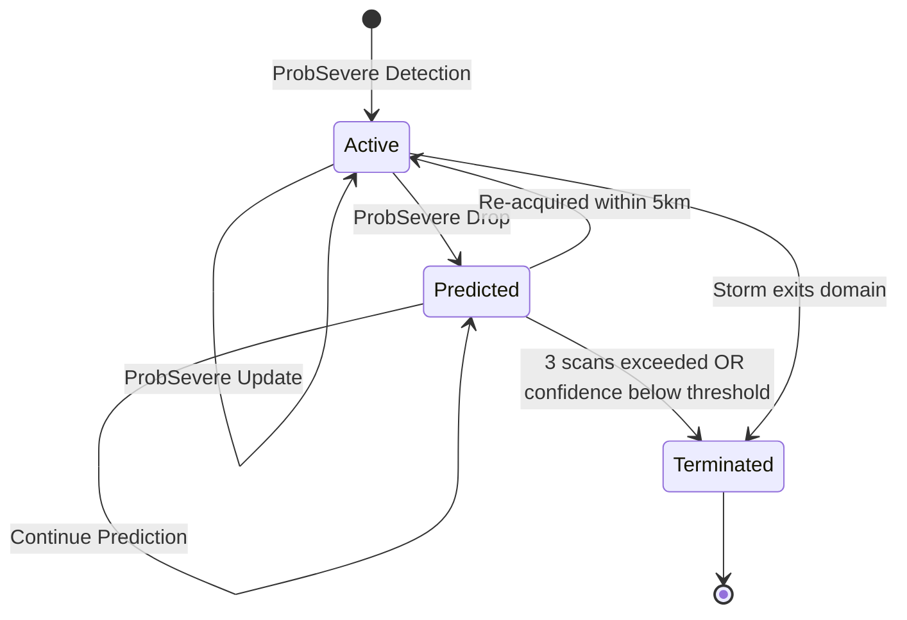
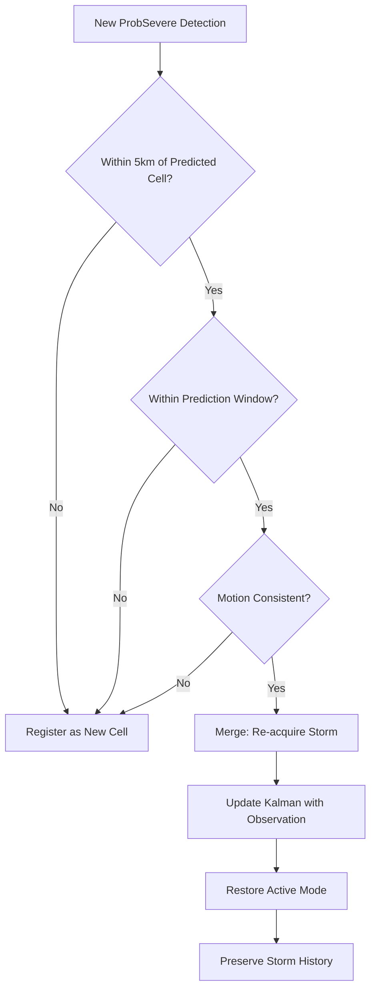
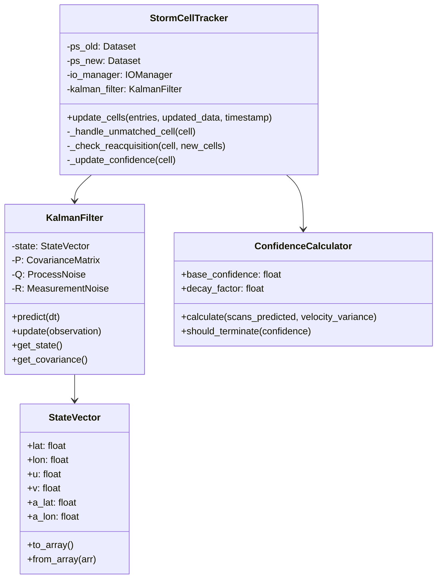

# Product Requirements Document: Storm Cell Kalman Filter

## Document Information

| Field | Value |
|-------|-------|
| **Title** | Storm Cell Kalman Filter for Continuity Tracking |
| **Author** | EdgeWARN Team |
| **Date** | 2026-02-16 |
| **Status** | Draft |
| **Version** | 1.0 |

---

## 1. Executive Summary

This PRD defines the requirements for implementing a Kalman Filter-based storm cell tracking continuity system. The feature ensures that storm cells remain tracked even when ProbSevere temporarily fails to detect them, preventing premature storm termination and maintaining warning continuity.

---

## 2. Problem Statement

### 2.1 Current Behavior

The current storm tracking system in [`StormCellTracker.update_cells()`](src/EdgeWARN/core/process/detect/track.py:7) removes cells from tracking when they are not present in the updated ProbSevere data:

```python
# Cell not found in updated_data
# Remove from tracking
unused_ids += 1
# Do NOT append to updated_entries
```

### 2.2 Issue

ProbSevere data can intermittently fail to detect a storm cell due to:
- Temporary radar artifacts or noise
- Storm intensity fluctuations near detection thresholds
- Data processing delays or gaps
- Merging/splitting storm cells with ambiguous ID assignments

When this occurs, the storm is immediately dropped from tracking, causing:
- Loss of storm history and trajectory data
- Disrupted warning continuity
- Potential missed warnings for ongoing severe weather

### 2.3 Impact

- **Warning Gaps**: Active warnings may be prematurely terminated
- **Data Discontinuity**: Storm history is lost, affecting downstream analysis
- **User Confusion**: End-users see storms "disappear" and "reappear" with new IDs

---

## 3. Goals and Objectives

### 3.1 Primary Goals

1. **Maintain Storm Continuity**: Keep tracking storms for up to 10 minutes after ProbSevere drops detection using StormCast motion prediction
2. **Enable Re-acquisition**: Automatically merge Kalman-predicted storms with re-detected ProbSevere cells, preserving the original storm ID
3. **Degrade Gracefully**: Provide confidence metrics that decrease over time, terminating when confidence drops below threshold

### 3.2 Success Metrics

| Metric | Target |
|--------|--------|
| False positive rate (tracking non-existent storms) | < 5% |
| Successful re-acquisition rate | > 80% |
| Mean position error vs actual re-detection | < 3 km |
| Warning continuity improvement | > 90% of temporary drop cases |

---

## 4. Technical Requirements

### 4.1 Kalman Filter State Model

#### State Vector

The Kalman filter will track a 6-dimensional state vector:

```
x = [lat, lon, u, v, a_lat, a_lon]^T
```

| Component | Description | Units |
|-----------|-------------|-------|
| lat | Latitude position | degrees |
| lon | Longitude position | degrees |
| u | Eastward velocity | m/s |
| v | Northward velocity | m/s |
| a_lat | Latitude acceleration | m/s² |
| a_lon | Longitude acceleration | m/s² |

#### State Transition Model

```
x(k+1) = F * x(k) + w(k)
```

Where F is the state transition matrix incorporating constant acceleration model:

```
F = [1, 0, dt, 0, 0.5*dt², 0    ]
    [0, 1, 0, dt, 0,    0.5*dt²]
    [0, 0, 1, 0, dt,    0      ]
    [0, 0, 0, 1, 0,    dt      ]
    [0, 0, 0, 0, 1,     0      ]
    [0, 0, 0, 0, 0,     1      ]
```

#### Observation Model

When ProbSevere provides observations:

```
z = H * x + v(k)
```

Where H observes position only:

```
H = [1, 0, 0, 0, 0, 0]
    [0, 1, 0, 0, 0, 0]
```

### 4.2 Tracking Modes



#### Mode Descriptions

| Mode | Description | Data Source |
|------|-------------|-------------|
| **Active** | Normal tracking with ProbSevere observations | ProbSevere + Kalman correction |
| **Predicted** | Kalman-only prediction mode | Kalman prediction only |
| **Terminated** | Storm removed from tracking | N/A |

### 4.3 Confidence Model

#### Confidence Calculation

```
confidence = base_confidence * decay_factor^scans_in_prediction * motion_consistency_factor
```

| Parameter | Value | Description |
|-----------|-------|-------------|
| base_confidence | 1.0 | Initial confidence when entering prediction mode |
| decay_factor | 0.7 | Per-scan decay multiplier |
| motion_consistency_factor | 0.8-1.0 | Based on velocity variance in history |

#### Confidence Thresholds

| Threshold | Value | Action |
|-----------|-------|--------|
| High | > 0.7 | Continue prediction |
| Medium | 0.4 - 0.7 | Continue with warning flag |
| Low | < 0.4 | Terminate tracking |

### 4.4 Re-acquisition Logic

#### Matching Criteria

When a new ProbSevere cell is detected, check for re-acquisition:

1. **Spatial Proximity**: Predicted position within 5 km of new detection
2. **Temporal Consistency**: Detection within valid prediction window (≤ 3 scans)
3. **Motion Consistency**: New cell motion vector within 2σ of predicted velocity

#### Merge Process



---

## 5. Data Structure Changes

### 5.1 Storm Cell Entry Extensions

Add the following fields to each storm cell entry:

```json
{
  "id": 151282,
  "tracking_mode": "active",
  "prediction_count": 0,
  "confidence": 1.0,
  "kalman_state": {
    "lat": 33.45,
    "lon": 275.82,
    "u": 12.5,
    "v": -6.7,
    "a_lat": 0.001,
    "a_lon": -0.002,
    "P": "6x6 covariance matrix"
  },
  "kalman_history": [
    {
      "timestamp": "2026-01-10T16:58:41",
      "mode": "active",
      "predicted_position": [33.45, 275.82],
      "observed_position": [33.45, 275.82],
      "innovation": [0.0, 0.0]
    }
  ]
}
```

### 5.2 New Data Keys

| Key | Type | Description |
|-----|------|-------------|
| tracking_mode | string | "active", "predicted", or "terminated" |
| prediction_count | int | Number of consecutive scans in prediction mode |
| confidence | float | Current tracking confidence (0.0-1.0) |
| kalman_state | object | Current Kalman filter state |
| kalman_history | array | History of Kalman predictions and corrections |

---

## 6. Implementation Architecture

### 6.1 Module Structure

```
src/EdgeWARN/core/process/detect/
├── kalman/
│   ├── __init__.py
│   ├── filter.py          # KalmanFilter class
│   ├── state.py           # StateVector and Covariance classes
│   ├── config.py          # Configuration parameters
│   └── confidence.py      # Confidence calculation logic
├── track.py               # Modified StormCellTracker
└── main.py                # Modified main entry point
```

### 6.2 Class Design



### 6.3 Integration Points

#### Modified [`StormCellTracker.update_cells()`](src/EdgeWARN/core/process/detect/track.py:7)

```python
def update_cells(self, entries, updated_data, timestamp=None):
    updated_map = {int(cell['id']): cell for cell in updated_data}
    used_ids = set()
    updated_entries = []
    
    for cell in entries:
        cell_id = int(cell['id'])
        if cell_id in updated_map:
            # Normal update with ProbSevere observation
            updated = updated_map[cell_id]
            self._update_with_observation(cell, updated, timestamp)
            cell['tracking_mode'] = 'active'
            cell['prediction_count'] = 0
            cell['confidence'] = 1.0
            used_ids.add(cell_id)
            updated_entries.append(cell)
        else:
            # Cell not found - enter prediction mode
            handled = self._handle_unmatched_cell(cell, timestamp)
            if handled:
                updated_entries.append(cell)
    
    # Check for re-acquisition of predicted cells
    # ... (new cells handling with re-acquisition check)
    
    return updated_entries
```

---

## 7. Configuration Parameters

### 7.1 Kalman Filter Parameters

| Parameter | Default | Description |
|-----------|---------|-------------|
| process_noise_position | 0.1 | Process noise for position states |
| process_noise_velocity | 0.5 | Process noise for velocity states |
| process_noise_acceleration | 0.1 | Process noise for acceleration states |
| measurement_noise_position | 0.5 km | Measurement noise for position observations |

### 7.2 Tracking Parameters

| Parameter | Default | Description |
|-----------|---------|-------------|
| max_prediction_time_minutes | 10 | Maximum time in prediction mode (minutes) |
| reacquisition_radius_km | 5.0 | Maximum distance for re-acquisition |
| confidence_threshold | 0.4 | Minimum confidence before termination |
| confidence_decay_factor | 0.7 | Per-scan confidence decay |

### 7.3 Configuration File

```yaml
# config/kalman.yaml
kalman_filter:
  process_noise:
    position: 0.1
    velocity: 0.5
    acceleration: 0.1
  measurement_noise:
    position: 0.5

tracking:
  max_prediction_time_minutes: 10
  reacquisition_radius_km: 5.0
  confidence_threshold: 0.4
  confidence_decay_factor: 0.7
```

---

## 8. API Changes

### 8.1 New Output Fields

Storm cell JSON output will include Kalman tracking metadata:

```json
{
  "features": [
    {
      "id": 151282,
      "tracking_mode": "active",
      "prediction_count": 0,
      "confidence": 1.0,
      "centroid": [33.45, 275.82],
      "kalman_predicted_centroid": [33.45, 275.82],
      "modules": { ... }
    },
    {
      "id": 151285,
      "tracking_mode": "predicted",
      "prediction_count": 2,
      "confidence": 0.49,
      "centroid": [33.52, 275.90],
      "kalman_predicted_centroid": [33.52, 275.90],
      "modules": { ... }
    }
  ]
}
```

### 8.2 Backward Compatibility

- New fields are optional and will not break existing consumers
- `tracking_mode` defaults to "active" for cells with ProbSevere observations
- `prediction_count` and `confidence` are only present when relevant

---

## 9. Testing Requirements

### 9.1 Unit Tests

| Test Case | Description |
|-----------|-------------|
| `test_kalman_predict` | Verify state prediction without observation |
| `test_kalman_update` | Verify state update with observation |
| `test_confidence_decay` | Verify confidence decreases over scans |
| `test_reacquisition` | Verify merge when cell re-detected nearby |
| `test_termination` | Verify removal after max scans or low confidence |

### 9.2 Integration Tests

| Test Case | Description |
|-----------|-------------|
| `test_tracking_continuity` | Storm remains tracked through temporary drop |
| `test_false_positive_prevention` | Non-existent storms are not perpetually tracked |
| `test_storm_split_merge` | Handle storm splitting/merging scenarios |
| `test_boundary_conditions` | Storms near domain boundaries |

### 9.3 Validation Dataset

Create test dataset with known ProbSevere drop scenarios:
- Simulated radar gaps
- Intensity fluctuations
- Storm merger/split events

---

## 10. Risks and Mitigations

| Risk | Impact | Likelihood | Mitigation |
|------|--------|------------|------------|
| Tracking non-existent storms | High | Medium | Confidence decay + max scan limit |
| Position drift during prediction | Medium | Medium | Use StormCast motion vectors as additional input |
| False re-acquisition (wrong storm) | High | Low | Motion consistency check + tight radius |
| Performance overhead | Low | Medium | Optimize matrix operations, cache calculations |

---

## 11. Dependencies

### 11.1 Internal Dependencies

- [`StormCast`](src/EdgeWARN/core/ctam/modules/StormCast/__init__.py) - Motion prediction for velocity initialization
- [`StormVectorCalculator`](src/EdgeWARN/core/process/detect/tools/vecmath.py) - Historical motion vectors
- [`CellDataSaver`](src/EdgeWARN/core/process/detect/tools/save.py) - Data persistence

### 11.2 External Dependencies

- `numpy` - Matrix operations
- `scipy` - Kalman filter implementation (optional, can use custom)

---

## 12. Timeline and Milestones

| Phase | Deliverables |
|-------|--------------|
| Phase 1 | Core Kalman filter implementation |
| Phase 2 | Integration with StormCellTracker |
| Phase 3 | Re-acquisition logic |
| Phase 4 | Confidence model and termination |
| Phase 5 | Testing and validation |
| Phase 6 | Documentation and deployment |

---

## 13. Design Decisions

| Question | Decision | Rationale |
|----------|----------|-----------|
| Should Kalman filter use StormCast predictions as control input? | **Yes** | StormCast provides physics-based motion prediction using environmental winds. Use StormCast velocity as the primary motion predictor for up to 10 minutes of prediction. |
| How to handle storm intensity changes during prediction? | **Terminate on low confidence** | If confidence drops below threshold, terminate the cell similar to current implementation. No special handling for intensity changes during prediction. |
| Should predicted storms trigger warnings? | **No - terminate instead** | Predicted storms should not trigger new warnings. If confidence gets low enough, terminate the cell like the current implementation. |

### 13.1 StormCast Integration for Motion Prediction

The Kalman filter will leverage StormCast module output for velocity estimation:

1. **Initial Velocity**: Use StormCast `u`, `v` components when available
2. **Prediction Mode**: Continue using StormCast motion vectors for up to 10 minutes
3. **Fallback**: If StormCast unavailable, use historical motion from `dx`, `dy`, `dt`

### 13.2 Re-acquisition Merge Logic

When a ProbSevere cell is detected near a Kalman-predicted cell:

1. **ID Assignment**: New cell receives the old cell's ID (preserves storm history)
2. **History Preservation**: All `storm_history` entries are retained
3. **Mode Transition**: Cell returns to "active" mode with confidence reset to 1.0

---

## 14. Appendix

### A. Kalman Filter Mathematics

#### Prediction Step

```
x̂(k|k-1) = F * x̂(k-1|k-1)
P(k|k-1) = F * P(k-1|k-1) * F^T + Q
```

#### Update Step

```
K = P(k|k-1) * H^T * (H * P(k|k-1) * H^T + R)^-1
x̂(k|k) = x̂(k|k-1) + K * (z(k) - H * x̂(k|k-1))
P(k|k) = (I - K * H) * P(k|k-1)
```

### B. Coordinate System Considerations

- Position: Use meters in local tangent plane for Kalman calculations
- Convert lat/lon to meters using reference point (storm centroid)
- Account for Earth curvature for large domain tracking

### C. References

- ProbSevere Documentation: NWS Storm Prediction Center
- Kalman Filtering: Welch & Bishop, "An Introduction to the Kalman Filter"
- Storm Tracking: Johnson et al., "Storm Cell Tracking Algorithms"
