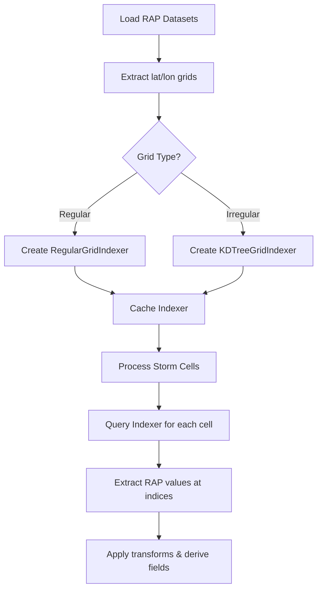

# RAP Grid Index Optimization Plan

## Research Summary

### Current Bottleneck
The `_precompute_cell_indices()` function in `integrate_rap.py` uses brute-force distance calculations to find the nearest grid point for each storm cell:

```python
dist_sq = (lat_vals - lat) ** 2 + (lon_vals - lon) ** 2
indices[cell_id] = np.unravel_index(np.argmin(dist_sq), dist_sq.shape)
```

**Performance Impact:**
- RAP grid: ~337 × 451 = **152,000 points**
- 100 cells: **15.2 million distance calculations** per integration cycle
- Complexity: **O(N×M)** where N=cells, M=grid points

### Grid Characteristics
- RAP uses a **regular latitude/longitude grid**
- Grid is consistent across all datasets and integration cycles
- Lat/lon values are stored as 2D coordinate arrays

---

## Implementation Approach

### Phase 1: Grid Type Detection & Indexer Selection

Create a grid-aware indexing system that automatically detects grid type and uses the optimal lookup method:

```python
class RAPGridIndex:
    """
    Optimized grid index for RAP datasets.
    Automatically selects best lookup strategy based on grid regularity.
    """
    
    def __init__(self, lat_vals, lon_vals):
        self.lat_vals = lat_vals
        self.lon_vals = lon_vals
        self.shape = lat_vals.shape
        self._indexer = self._create_indexer()
    
    def _create_indexer(self):
        """Detect grid type and create appropriate indexer."""
        if self._is_regular_grid():
            return RegularGridIndexer(self.lat_vals, self.lon_vals)
        else:
            return KDTreeGridIndexer(self.lat_vals, self.lon_vals)
    
    def _is_regular_grid(self):
        """Check if grid has uniform lat/lon spacing."""
        # Check if lat_vals varies only along axis 0 and lon_vals only along axis 1
        # (or vice versa depending on grid orientation)
        pass
    
    def query(self, lat, lon):
        """Get grid indices for a lat/lon point."""
        return self._indexer.query(lat, lon)
```

### Phase 2: Regular Grid Indexer (Primary Optimization)

For regular lat/lon grids, use direct index calculation:

```python
class RegularGridIndexer:
    """O(1) indexer for regular lat/lon grids."""
    
    def __init__(self, lat_vals, lon_vals):
        # Extract 1D coordinate arrays from 2D grid
        self.lat_1d = lat_vals[:, 0] if lat_vals.ndim == 2 else lat_vals
        self.lon_1d = lon_vals[0, :] if lon_vals.ndim == 2 else lon_vals
        
        # Pre-compute step sizes and bounds
        self.lat_step = self.lat_1d[1] - self.lat_1d[0]
        self.lon_step = self.lon_1d[1] - self.lon_1d[0]
        self.lat_min = self.lat_1d[0]
        self.lon_min = self.lon_1d[0]
        
        # Handle longitude wrapping (0-360 vs -180-180)
        self.lon_crosses_dateline = (self.lon_1d.min() < 0 and self.lon_1d.max() > 180)
    
    def query(self, lat, lon):
        """Convert lat/lon to grid indices."""
        # Normalize longitude if needed
        if lon > 180:
            lon -= 360
        
        # Direct index calculation
        lat_idx = int((lat - self.lat_min) / self.lat_step)
        lon_idx = int((lon - self.lon_min) / self.lon_step)
        
        # Clamp to valid range
        lat_idx = max(0, min(lat_idx, len(self.lat_1d) - 1))
        lon_idx = max(0, min(lon_idx, len(self.lon_1d) - 1))
        
        return (lat_idx, lon_idx)
```

### Phase 3: k-d Tree Fallback (For Irregular Grids)

```python
class KDTreeGridIndexer:
    """O(log N) indexer for irregular/curvilinear grids."""
    
    def __init__(self, lat_vals, lon_vals):
        from scipy.spatial import cKDTree
        
        # Flatten 2D coordinates to point array
        points = np.column_stack([
            lat_vals.ravel(),
            lon_vals.ravel()
        ])
        self.tree = cKDTree(points)
        self.shape = lat_vals.shape
    
    def query(self, lat, lon):
        """Find nearest grid point using k-d tree."""
        dist, idx = self.tree.query([lat, lon])
        return np.unravel_index(idx, self.shape)
```

---

## Modified Integration Flow



---

## Code Changes

### File: `src/EdgeWARN/core/process/integrate/integrate_rap.py`

**Replace `_precompute_cell_indices()`:**

```python
def _precompute_cell_indices(storm_cells, lat_vals, lon_vals):
    """
    Pre-compute grid indices for all cells using optimized grid indexing.
    
    Args:
        storm_cells: List of storm cell dictionaries
        lat_vals: 2D array of latitudes from RAP grid
        lon_vals: 2D array of longitudes from RAP grid
    
    Returns:
        Dictionary mapping cell_id -> (lat_idx, lon_idx)
    """
    indexer = RAPGridIndex(lat_vals, lon_vals)
    
    indices = {}
    for cell in storm_cells:
        cell_id = cell.get("id")
        centroid = cell.get("centroid", [0, 0])
        lat, lon = centroid[0], centroid[1]
        
        try:
            indices[cell_id] = indexer.query(lat, lon)
        except Exception:
            indices[cell_id] = None
    
    return indices
```

**Add Grid Index Classes** (at module level or separate file):

```python
class RAPGridIndex:
    """Factory class that selects optimal indexing strategy."""
    
    @staticmethod
    def create(lat_vals, lon_vals):
        """Create appropriate indexer based on grid type."""
        if RegularGridIndexer.is_regular(lat_vals, lon_vals):
            return RegularGridIndexer(lat_vals, lon_vals)
        return KDTreeGridIndexer(lat_vals, lon_vals)


class RegularGridIndexer:
    """O(1) indexer for regular lat/lon grids."""
    
    @staticmethod
    def is_regular(lat_vals, lon_vals, tolerance=1e-6):
        """
        Check if grid is regular (uniform spacing in lat/lon).
        
        A regular grid has:
        - Latitude varies only along one axis
        - Longitude varies only along the other axis
        """
        if lat_vals.ndim != 2 or lon_vals.ndim != 2:
            return False
        
        # Check if lat is constant along axis 1 (rows)
        lat_varies_along_rows = np.any(np.std(lat_vals, axis=1) > tolerance)
        lat_constant_along_cols = np.all(np.std(lat_vals, axis=0) < tolerance)
        
        # Check if lon is constant along axis 0 (cols)
        lon_varies_along_cols = np.any(np.std(lon_vals, axis=0) > tolerance)
        lon_constant_along_rows = np.all(np.std(lon_vals, axis=1) < tolerance)
        
        return lat_varies_along_rows and lat_constant_along_cols and \
               lon_varies_along_cols and lon_constant_along_rows
    
    def __init__(self, lat_vals, lon_vals):
        self.shape = lat_vals.shape
        
        # Extract 1D coordinate arrays
        self.lat_coords = lat_vals[:, 0]
        self.lon_coords = lon_vals[0, :]
        
        # Calculate step sizes
        self.lat_step = self.lat_coords[1] - self.lat_coords[0]
        self.lon_step = self.lon_coords[1] - self.lon_coords[0]
        self.lat_min = self.lat_coords[0]
        self.lon_min = self.lon_coords[0]
    
    def query(self, lat, lon):
        """Get grid indices for lat/lon coordinates."""
        # Normalize longitude
        if lon > 180:
            lon -= 360
        
        # Calculate indices
        lat_idx = int((lat - self.lat_min) / self.lat_step)
        lon_idx = int((lon - self.lon_min) / self.lon_step)
        
        # Clamp to valid range
        lat_idx = max(0, min(lat_idx, self.shape[0] - 1))
        lon_idx = max(0, min(lon_idx, self.shape[1] - 1))
        
        return (lat_idx, lon_idx)


class KDTreeGridIndexer:
    """O(log N) indexer using k-d tree for irregular grids."""
    
    def __init__(self, lat_vals, lon_vals):
        from scipy.spatial import cKDTree
        
        self.shape = lat_vals.shape
        points = np.column_stack([lat_vals.ravel(), lon_vals.ravel()])
        self.tree = cKDTree(points)
    
    def query(self, lat, lon):
        """Find nearest grid point."""
        _, idx = self.tree.query([lat, lon])
        return np.unravel_index(idx, self.shape)
```

---

## Testing Strategy

### Unit Tests

1. **Regular Grid Detection Test:**
   ```python
   def test_regular_grid_detection():
       # Create regular grid
       lats = np.linspace(20, 50, 100)
       lons = np.linspace(-130, -60, 150)
       lat_grid, lon_grid = np.meshgrid(lats, lons, indexing='ij')
       
       assert RegularGridIndexer.is_regular(lat_grid, lon_grid) is True
   ```

2. **Index Accuracy Test:**
   ```python
   def test_regular_indexer_accuracy():
       # Create grid and known point
       lats = np.linspace(30, 40, 11)  # 0.5 degree steps
       lons = np.linspace(-100, -90, 11)
       lat_grid, lon_grid = np.meshgrid(lats, lons, indexing='ij')
       
       indexer = RegularGridIndexer(lat_grid, lon_grid)
       
       # Query for a point at 35.0, -95.0 (should be at index 10, 10)
       idx = indexer.query(35.0, -95.0)
       assert idx == (10, 10)
   ```

3. **k-d Tree Fallback Test:**
   ```python
   def test_kdtree_indexer():
       # Create irregular grid (curvilinear)
       # ... test k-d tree indexer works correctly
   ```

4. **Integration Test:**
   ```python
   def test_integrate_rap_with_indexer(mock_io_manager, mock_datasets, storm_cells):
       """Verify RAP integration works with new indexer."""
       with patch("cfgrib.open_datasets", return_value=mock_datasets):
           results = integrate_rap(storm_cells, "dummy_path.grib2", mock_io_manager)
           # Verify wind values are correctly extracted
           assert results[0]["properties"]["wind_field"]["u850"] is not None
   ```

### Performance Benchmarks

Create benchmark comparing old vs new implementation:

```python
def benchmark_grid_indexing():
    """Compare brute force vs optimized grid indexing."""
    # Create realistic RAP-sized grid
    lats = np.linspace(20, 55, 337)
    lons = np.linspace(-140, -50, 451)
    lat_grid, lon_grid = np.meshgrid(lats, lons, indexing='ij')
    
    # Create test cells
    cells = [{"id": i, "centroid": [np.random.uniform(25, 50), 
                                      np.random.uniform(-120, -80)]} 
             for i in range(100)]
    
    # Benchmark brute force
    start = time.time()
    brute_indices = _precompute_cell_indices_old(cells, lat_grid, lon_grid)
    brute_time = time.time() - start
    
    # Benchmark optimized
    start = time.time()
    opt_indices = _precompute_cell_indices(cells, lat_grid, lon_grid)
    opt_time = time.time() - start
    
    print(f"Brute force: {brute_time:.4f}s")
    print(f"Optimized: {opt_time:.4f}s")
    print(f"Speedup: {brute_time/opt_time:.1f}x")
    
    # Verify results match
    for cell in cells:
        cell_id = cell["id"]
        assert brute_indices[cell_id] == opt_indices[cell_id]
```

---

## Expected Performance Improvements

| Metric | Current (Brute Force) | Optimized (Regular Grid) | Improvement |
|--------|----------------------|-------------------------|-------------|
| 100 cells | 15.2M distance calc | 100 index calc | **99.9% fewer ops** |
| Complexity | O(N×M) | O(N) | **O(M) → O(1) per cell** |
| Estimated Time | ~50-100ms | <1ms | **50-100x faster** |
| Memory Overhead | None | Minimal (k-d tree if needed) | Acceptable |

---

## Risk Assessment

| Risk | Impact | Mitigation |
|------|--------|------------|
| Grid irregularity detection fails | Medium | Add validation to compare indexer results with brute force for first few cells |
| k-d tree memory overhead | Low | Only used for irregular grids; typical RAP is regular |
| Index bounds errors | Medium | Add clamping to ensure indices stay within valid range |
| Longitude normalization | Low | Test both 0-360 and -180-180 coordinate systems |

---

## Acceptance Criteria

- [ ] Grid type is automatically detected (regular vs irregular)
- [ ] Regular grid indexer provides O(1) lookups
- [ ] k-d tree indexer available as fallback for irregular grids
- [ ] All existing unit tests pass
- [ ] New unit tests cover grid detection and indexing accuracy
- [ ] Benchmark shows >50x speedup for regular grids
- [ ] No regression in RAP integration output values
